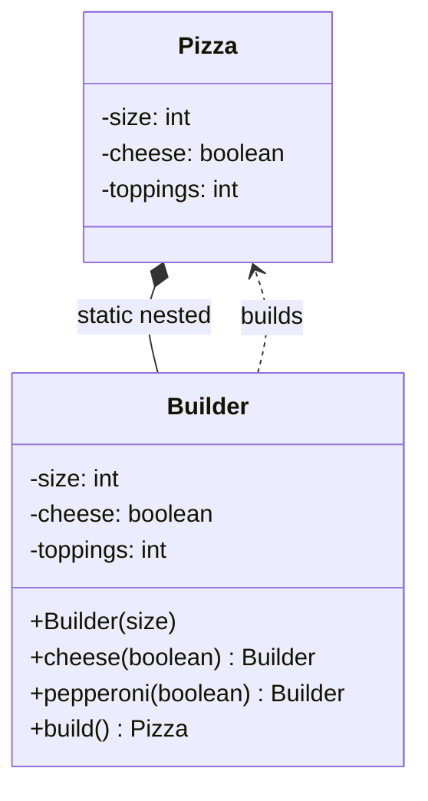

**Builder** separates the construction of a complex object from its representation, so the same
process can build different results. In Java it most often means a **fluent API** that assembles an
immutable object one readable step at a time.

## The telescoping-constructor problem

When a class has many optional fields, constructors multiply into an unreadable mess. Which `0` is
which? Builder fixes this with named, chained setters.

````tabs
tabs:
  - label: Telescoping constructor (bad)
    body: |
      A wall of positional arguments — unreadable and easy to transpose.
      ```java
      // Which argument is which?
      Pizza p = new Pizza(12, true, false, true, 0, 2);
      // ...and a constructor overload for every combination of optionals.
      Pizza(int size) { ... }
      Pizza(int size, boolean cheese) { ... }
      Pizza(int size, boolean cheese, boolean pepperoni) { ... }
      ```
  - label: Builder (good)
    body: |
      Each field is named; only what you need is set; the result is immutable.
      ```java
      Pizza p = new Pizza.Builder(12)
          .cheese(true)
          .pepperoni(true)
          .extraSauce(2)
          .build();
      ```
````

## Structure



A typical static-nested builder returning `this` for chaining:

```java
public final class Pizza {
  private final int size;
  private final boolean cheese;
  private Pizza(Builder b) { this.size = b.size; this.cheese = b.cheese; }

  public static class Builder {
    private final int size;          // required
    private boolean cheese = false;  // optional, defaulted
    public Builder(int size) { this.size = size; }
    public Builder cheese(boolean c) { this.cheese = c; return this; } // fluent
    public Pizza build() { return new Pizza(this); }
  }
}
```

## When to use Builder

| Reach for Builder when | Skip it when |
|--|--|
| Many constructor parameters, several optional | 1–3 required fields — a constructor is clearer |
| You want an **immutable** result | The object is a mutable bag of setters anyway |
| Parameters share a type (easy to transpose) | Overhead of a nested class isn't justified |
| Construction happens in steps / needs validation | Simple value creation |

## Real JDK examples

- `StringBuilder` — the canonical mutable builder; `append(...).append(...).toString()`.
- `Stream.Builder<T>` — `Stream.builder().add(a).add(b).build()`.
- `StringBuilder`'s cousin `StringBuffer`; also `Calendar.Builder`, `Locale.Builder`,
  `HttpRequest.newBuilder()` (java.net.http), and `Stream.of(...)` internals.

:::tip
Effective Java (Item 2) recommends Builder for classes with more than a handful of parameters,
especially when many are optional — it beats both telescoping constructors and JavaBeans setters.
:::

:::gotcha
A plain fluent builder can leave an object **half-built** if `build()` skips validation. Validate
required invariants inside `build()` (and copy mutable fields) so a constructed object is always
consistent.
:::

## Check yourself

```quiz
title: Builder check
questions:
  - q: 'What problem does the Builder pattern primarily solve?'
    options:
      - 'Ensuring only one instance exists'
      - text: 'The telescoping-constructor problem — many (often optional) parameters'
        correct: true
      - 'Cloning existing objects cheaply'
    explain: 'Builder replaces a combinatorial explosion of constructors with readable, named, chainable steps.'
  - q: 'What does a fluent builder method typically return to enable chaining?'
    options:
      - 'The finished product'
      - text: '`this` (the builder itself)'
        correct: true
      - '`void`'
    explain: 'Returning `this` lets calls chain: `.cheese(true).pepperoni(true)`. The final `build()` returns the product.'
  - q: 'Which JDK class is a well-known Builder?'
    options:
      - text: '`StringBuilder`'
        correct: true
      - '`ArrayList`'
      - '`Optional`'
    explain: '`StringBuilder` accumulates state via chained `append` calls and produces the result with `toString()`.'
```

:::key
Builder = **step-by-step, fluent construction** of a (usually immutable) object; the antidote to
telescoping constructors. Validate in `build()`. Remember `StringBuilder` and `Stream.Builder`.
:::
