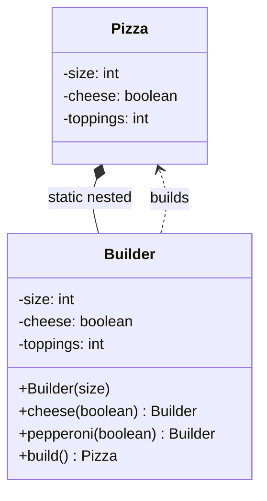

**Builder** separates the construction of a complex object from its representation, so the same
process can build different results. In Java it most often means a **fluent API** that assembles an
immutable object one readable step at a time.

## The telescoping-constructor problem

When a class has many optional fields, constructors multiply into an unreadable mess. Which `0` is
which? Builder fixes this with named, chained setters.

````tabs
tabs:
  - label: Telescoping constructor (bad)
    body: |
      A wall of positional arguments — unreadable and easy to transpose.
      ```java
      // Which argument is which?
      Pizza p = new Pizza(12, true, false, true, 0, 2);
      // ...and a constructor overload for every combination of optionals.
      Pizza(int size) { ... }
      Pizza(int size, boolean cheese) { ... }
      Pizza(int size, boolean cheese, boolean pepperoni) { ... }
      ```
  - label: Builder (good)
    body: |
      Each field is named; only what you need is set; the result is immutable.
      ```java
      Pizza p = new Pizza.Builder(12)
          .cheese(true)
          .pepperoni(true)
          .extraSauce(2)
          .build();
      ```
````

## Structure



A typical static-nested builder returning `this` for chaining:

```java
public final class Pizza {
  private final int size;
  private final boolean cheese;
  private Pizza(Builder b) { this.size = b.size; this.cheese = b.cheese; }

  public static class Builder {
    private final int size;          // required
    private boolean cheese = false;  // optional, defaulted
    public Builder(int size) { this.size = size; }
    public Builder cheese(boolean c) { this.cheese = c; return this; } // fluent
    public Pizza build() { return new Pizza(this); }
  }
}
```

## Step through a chained build

Each fluent call returns the **builder itself**, accumulating state; only `build()` produces the
product. Watch the state grow:

```walkthrough
title: Builder — what each chained call does
code: |
  Pizza p = new Pizza.Builder(12)
      .cheese(true)
      .pepperoni(true)
      .extraSauce(2)
      .build();
steps:
  - text: '`new Pizza.Builder(12)` allocates the **builder**, not the pizza. The required field (size=12) is captured in the builder''s constructor — you cannot even start without it.'
    line: 1
  - text: '`.cheese(true)` sets the builder''s `cheese` field and **returns `this`** — the same builder object. State so far: size=12, cheese=true.'
    line: 2
  - text: '`.pepperoni(true)` — same builder again. Optional fields you skip keep their defaults. No `Pizza` exists yet; a half-configured builder is harmless.'
    line: 3
  - text: '`.extraSauce(2)` — order of these calls does not matter, another win over positional constructor arguments.'
    line: 4
  - text: '`.build()` runs **validation** (are the invariants consistent?), then calls the private `Pizza(Builder b)` constructor exactly once. The result is a complete, immutable object — no observable half-built state.'
    line: 5
```

## When to use Builder

| Reach for Builder when | Skip it when |
|--|--|
| Many constructor parameters, several optional | 1–3 required fields — a constructor is clearer |
| You want an **immutable** result | The object is a mutable bag of setters anyway |
| Parameters share a type (easy to transpose) | Overhead of a nested class isn't justified |
| Construction happens in steps / needs validation | Simple value creation |

## Real JDK examples

- `StringBuilder` — the canonical mutable builder; `append(...).append(...).toString()`.
- `Stream.Builder<T>` — `Stream.builder().add(a).add(b).build()`.
- **`HttpRequest.newBuilder()`** (java.net.http, Java 11) — the modern showcase:

```java
HttpRequest request = HttpRequest.newBuilder()
    .uri(URI.create("https://api.example.com/orders"))
    .timeout(Duration.ofSeconds(5))
    .header("Accept", "application/json")
    .POST(HttpRequest.BodyPublishers.ofString(json))
    .build();                       // immutable, reusable request object
```

- Also `Calendar.Builder`, `Locale.Builder`, `ProcessBuilder`, and every `UriComponentsBuilder` /
  `ResponseEntity.status(...)` chain in Spring. Lombok's `@Builder` generates exactly the
  static-nested shape above.

:::tip
Effective Java (Item 2) recommends Builder for classes with more than a handful of parameters,
especially when many are optional — it beats both telescoping constructors and JavaBeans setters.
:::

## Builders and records

A `record` gives you an immutable carrier with a compact constructor for validation — for **up to
roughly four components** that usually beats a builder. Builders re-enter the picture when:

- there are **many optional** components (a record still forces all of them positionally);
- construction is **staged** across code (accumulate, then freeze);
- you want **`toBuilder()`**-style copies: build a near-duplicate with one field changed.

A common modern combo is a record *product* with a hand-written or generated builder for ergonomics.

## When NOT to use it

- **1–3 required fields, nothing optional** — a constructor (or record) is shorter, and the
  compiler enforces completeness, which a builder cannot: forget a `.field()` call and you find out
  at runtime, not compile time.
- **The object is mutable anyway** — a builder in front of a setter-bag adds nothing; the
  "builder" is just deferred setters.
- **Performance-critical hot paths** allocating millions of objects — the extra builder allocation
  is measurable (this is why `StringBuilder` itself exists: to *avoid* intermediate `String`s).

:::gotcha
A plain fluent builder can leave an object **half-built** if `build()` skips validation. Validate
required invariants inside `build()` (and copy mutable fields) so a constructed object is always
consistent.
:::

## Check yourself

```quiz
title: Builder check
questions:
  - q: 'What problem does the Builder pattern primarily solve?'
    options:
      - 'Ensuring only one instance exists'
      - text: 'The telescoping-constructor problem — many (often optional) parameters'
        correct: true
      - 'Cloning existing objects cheaply'
    explain: 'Builder replaces a combinatorial explosion of constructors with readable, named, chainable steps.'
  - q: 'What does a fluent builder method typically return to enable chaining?'
    options:
      - 'The finished product'
      - text: '`this` (the builder itself)'
        correct: true
      - '`void`'
    explain: 'Returning `this` lets calls chain: `.cheese(true).pepperoni(true)`. The final `build()` returns the product.'
  - q: 'Which JDK class is a well-known Builder?'
    options:
      - text: '`StringBuilder`'
        correct: true
      - '`ArrayList`'
      - '`Optional`'
    explain: '`StringBuilder` accumulates state via chained `append` calls and produces the result with `toString()`.'
```

:::key
Builder = **step-by-step, fluent construction** of a (usually immutable) object; the antidote to
telescoping constructors. Validate in `build()`. Remember `StringBuilder` and `Stream.Builder`.
:::
