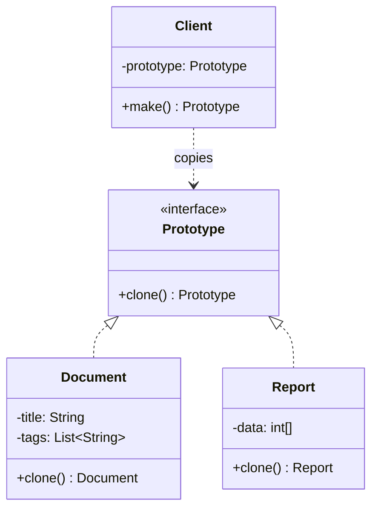
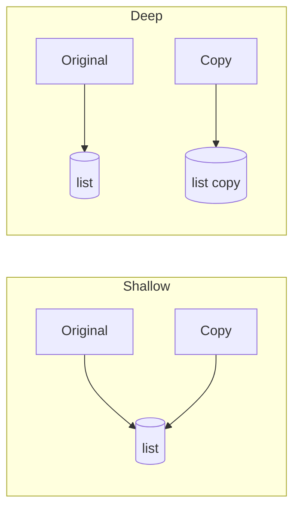

Sometimes constructing an object is the expensive part: it loads defaults from disk, parses a
template, or was configured through a dozen runtime steps you cannot repeat. When you need many
near-identical copies of such an object — game entities, document templates, pre-configured
clients — re-running construction for each one is wasteful, and the code doing the copying often
cannot even *name* the concrete class it should instantiate. **Prototype** creates new objects by
**copying an existing instance** (the prototype) rather than building from scratch: the copy comes
out pre-configured, and the caller never touches a constructor.

## Structure



The client holds a registered prototype and calls `clone()` — it never needs to know the concrete
class or its constructor.

```java
interface Prototype<T> { T clone(); }

class Document implements Prototype<Document> {
  String title;
  List<String> tags;
  public Document clone() {
    Document d = new Document();
    d.title = this.title;
    d.tags  = new ArrayList<>(this.tags); // deep-copy the mutable field
    return d;
  }
}
```

## The shallow-vs-deep-copy gotcha

This is the interview trap. A **shallow** copy duplicates the top object but **shares** its
referenced sub-objects; a **deep** copy duplicates the whole graph.

| | Shallow copy | Deep copy |
|--|--|--|
| Primitive/immutable fields | Copied (independent) | Copied (independent) |
| Mutable reference fields | **Shared** — same object | New, independent copies |
| Risk | Mutating the copy mutates the original | Safe but more work |
| `Object.clone()` default | This — field-by-field shallow | You must implement it |



:::gotcha
`Object.clone()` makes a **shallow** copy — the clone's mutable fields point at the *same* objects
as the original. Change one, you change both. Deep-copy every mutable field yourself.
:::

## `clone()` caveats in Java

Java's built-in `Cloneable`/`clone()` mechanism is widely considered broken:

- `Cloneable` is a **marker interface** with no `clone()` method — `clone()` lives on `Object` and is
  `protected`, so you must override and widen it.
- It **bypasses constructors**, so invariants and `final` fields are awkward.
- It throws checked `CloneNotSupportedException`.

Prefer a **copy constructor** or **static copy factory** instead:

```java
public Document(Document other) {          // copy constructor
  this.title = other.title;
  this.tags  = new ArrayList<>(other.tags);
}
// or: static Document copyOf(Document d) { ... }
```

:::senior
Effective Java (Item 13) advises avoiding `Cloneable` entirely in new code — use a copy constructor
or copy factory. The Prototype *pattern* is still valid; just don't implement it via the language's
`clone()` plumbing. Serialization-based deep copy works but is slow and fragile.
:::

## A prototype registry

The pattern's production form: a registry of named, pre-configured prototypes. Client code asks by
key and receives a fresh copy — creation without `new`, without knowing the concrete type, and
without re-doing the configuration.

```java
class DocumentRegistry {
  private final Map<String, Document> prototypes = new HashMap<>();

  void register(String key, Document proto) { prototypes.put(key, proto); }

  Document create(String key) {
    Document proto = prototypes.get(key);
    if (proto == null) throw new IllegalArgumentException(key);
    return new Document(proto);       // copy constructor — fresh, independent instance
  }
}

// Startup: configure once — the expensive parse happens ONCE.
registry.register("invoice", loadTemplate("invoice.xml"));
// Runtime: stamp out copies cheaply.
Document doc = registry.create("invoice");
```

This is where Prototype beats the factory patterns: a factory would re-run the expensive
construction on every call; the registry amortizes it to one parse plus cheap copies.

## Modern Java: records and with-style copies

Immutability changes the game — if nothing is mutable, **sharing is safe and copying is trivial**.
With records, "copy with one field changed" is a one-line derivation:

```java
record Order(String id, String status, List<String> lines) {
  Order withStatus(String s) { return new Order(id, s, lines); }  // components are immutable — share them
}
Order shipped = order.withStatus("SHIPPED");   // prototype-style derivation, no clone()
```

For that to be safe, components must genuinely be immutable — store `List.copyOf(lines)` in the
canonical constructor so no caller retains a mutable alias.

## When NOT to use it

- **Construction is cheap and stateless** — `new` is clearer; a prototype layer only obscures it.
- **The object graph is deep and mutable** — a correct deep copy of a tangled graph (cycles,
  shared sub-objects) is genuinely hard; consider making the type immutable instead, or rebuilding
  via a Builder.
- **You need *varied* objects, not near-identical ones** — that is Factory/Builder territory;
  Prototype shines only when copies start from a meaningful configured baseline.

## Check yourself

```quiz
title: Prototype check
questions:
  - q: 'What does the Prototype pattern use to produce new objects?'
    options:
      - 'A subclass override of a factory method'
      - text: 'Cloning an existing instance'
        correct: true
      - 'A single shared global instance'
    explain: 'Prototype copies an existing configured object, avoiding costly construction and concrete-type coupling.'
  - q: 'What does the default `Object.clone()` produce?'
    options:
      - 'A deep copy of the whole object graph'
      - text: 'A shallow copy — mutable reference fields are shared with the original'
        correct: true
      - 'A compile error'
    explain: 'The default is field-by-field shallow: the clone shares referenced sub-objects, so mutating one affects both.'
  - q: 'What does Effective Java recommend instead of `Cloneable`?'
    options:
      - 'Always use `clone()`'
      - text: 'A copy constructor or static copy factory'
        correct: true
      - 'Reflection'
    explain: '`Cloneable` is a broken marker interface that bypasses constructors; a copy constructor or copy factory is clearer and safer.'
```

:::key
Prototype = create by **cloning** a configured instance. Beware: `Object.clone()` is **shallow** —
deep-copy mutable fields. Prefer a **copy constructor** over `Cloneable`.
:::
