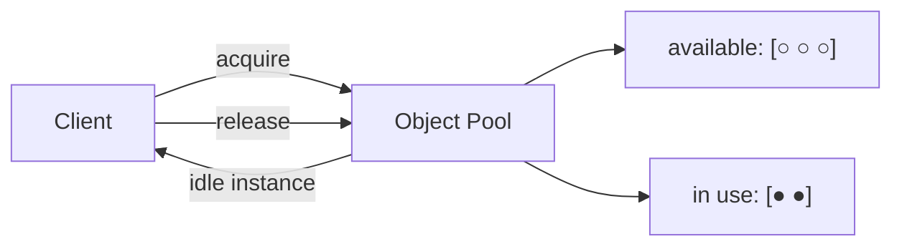

Some objects are **expensive to create** — a database connection (TCP + auth handshake), a thread (OS resources), a large buffer. When you need many of them, briefly, over and over, creating and destroying each time is wasteful. The **Object Pool** keeps a set of ready-to-use instances and hands them out on loan.

## Intent

Maintain a pool of initialized objects; **acquire** one when needed, **release** it back when done — instead of `new` / garbage-collect on every use. It trades **memory** (idle objects sitting ready) for **latency and allocation cost**.



## A minimal pool

```java
class ConnectionPool {
    private final Queue<Connection> idle = new ConcurrentLinkedQueue<>();
    private final int max;
    private int created = 0;

    synchronized Connection acquire() {
        Connection c = idle.poll();
        if (c == null && created < max) { c = open(); created++; }   // grow to cap
        if (c == null) throw new IllegalStateException("pool exhausted");
        return c;
    }

    void release(Connection c) {
        c.reset();                 // CRUCIAL: clear per-use state before reuse
        idle.offer(c);
    }
}
```

## Enforcing the release

A pool is only as safe as its return path. Wrap the loan in an `AutoCloseable` lease so
try-with-resources guarantees the return even on exceptions:

```java
class PooledConnection implements AutoCloseable {
    private final Connection conn;
    private final ConnectionPool pool;
    PooledConnection(Connection c, ConnectionPool p) { this.conn = c; this.pool = p; }

    Connection get() { return conn; }
    @Override public void close() { pool.release(conn); }   // return, not destroy
}

try (PooledConnection lease = pool.acquireLease()) {
    lease.get().prepareStatement("...").execute();
}   // released here — even if the statement throws
```

This is exactly what JDBC `DataSource` pools do: the `Connection` your code closes is a **proxy**
whose `close()` returns the real connection to the pool instead of tearing down the TCP session —
Object Pool and Proxy composed.

## Sizing the pool

The knob interviewers actually probe. Both directions fail:

| Pool too small | Pool too large |
|--|--|
| Callers queue for a resource — latency spikes under load | Idle memory + exhausted DB/OS limits |
| Deadlock risk when one task holds a resource while waiting for a second | More connections ≠ more throughput once the DB is saturated |

HikariCP's guidance is famously counter-intuitive: a small fixed pool (about
`cores * 2 + spindles`) outperforms a large one, because beyond hardware parallelism extra
connections only add context-switching and lock contention on the database side. Start small,
measure wait time, grow only on evidence. Also set an **acquire timeout** — blocking forever on an
exhausted pool turns one leak into a full-service outage.

## Where it shows up

- **Database connection pools** (HikariCP, HikariCP is *the* canonical example) — see [JDBC & transactions](/java/topic/frameworks/transactions-and-jdbc).
- **Thread pools** (`ExecutorService`) — reuse worker threads across tasks.
- **Buffer / byte-array pools** in high-throughput I/O and games.

## The traps

:::gotcha
The dangerous bug is **state leakage**: an object returned to the pool still carrying data from its last use is handed to the next caller. Always **reset** an object on release (or on acquire). This is the same root cause as the [`ThreadLocal` pooled-thread leak](/multithreading/topic/shared-state/threadlocal) — reused resources must be cleaned. Also: a caller that **forgets to release** starves the pool (a "connection leak"); enforce return with try-with-resources/`finally`. And the pool itself must be **thread-safe**.
:::

:::senior
Object Pool is one of the few patterns that is often an **anti-pattern for plain objects**: modern JVM allocation and generational GC make pooling ordinary short-lived objects *slower* and more bug-prone than just allocating them. Reserve it for genuinely scarce/expensive resources — connections, threads, sockets, large off-heap buffers — where the creation cost or a hard external limit (max DB connections) justifies it. In interviews, name the reset-on-return requirement and pool sizing (too small → contention, too large → resource exhaustion) as the real design concerns.
:::

Object Pool is sometimes grouped with the GoF creational patterns even though it isn't one of the original 23 — it's a widely-used creational *technique* about **reuse** rather than construction.

## Creational recap — one-line intents

You have now seen the whole creational family. Drill the intents:

```flashcards
title: Creational patterns → intent
cards:
  - front: '**Singleton**'
    back: 'Guarantee **one instance** with a global access point — prefer `enum` or a DI-managed bean.'
  - front: '**Factory Method**'
    back: 'Defer instantiation to a **subclass-overridden hook** — the creator codes against the product interface.'
  - front: '**Abstract Factory**'
    back: 'One factory object creates a whole **matching family** of products.'
  - front: '**Builder**'
    back: 'Assemble a complex (usually immutable) object **step by step** with named, chained calls.'
  - front: '**Prototype**'
    back: 'Create new objects by **copying a configured instance** — beware shallow copies.'
  - front: '**Object Pool** (non-GoF)'
    back: '**Reuse** expensive instances via acquire/release — reset on return, enforce release.'
```

## Check yourself

```quiz
title: Object pool check
questions:
  - q: 'What is the primary reason to use an object pool?'
    options:
      - text: 'To reuse objects whose creation is expensive (connections, threads, large buffers) instead of constantly allocating and destroying them'
        correct: true
      - 'To guarantee only one instance exists'
      - 'To convert an incompatible interface'
    explain: 'The pool amortizes expensive setup by keeping initialized instances ready to loan out; it trades idle memory for lower per-use latency.'
  - q: 'What is the classic correctness bug in an object pool?'
    options:
      - text: 'Not resetting an object on release, so leftover state from the previous user leaks to the next'
        correct: true
      - 'Creating too few objects'
      - 'Using an interface'
    explain: 'Reused objects carry their old state unless cleared; always reset on release/acquire. A caller forgetting to release also starves the pool.'
  - q: 'Why is pooling ordinary short-lived objects often a bad idea on the JVM?'
    options:
      - text: 'Modern allocation + generational GC make pooling plain objects slower and more error-prone than just allocating them'
        correct: true
      - 'The JVM forbids object pools'
      - 'Pools cannot be made thread-safe'
    explain: 'Cheap young-gen allocation usually beats the bookkeeping and leak risk of a pool. Reserve pooling for scarce/expensive resources like DB connections and threads.'
```

:::key
**Object Pool** reuses a capped set of **expensive** objects (connections, threads, buffers) via **acquire/release** instead of create/destroy — trading memory for latency. It underpins connection and thread pools. The killer bug is **state leakage** (always **reset** on return) and **leaks** (enforce release with try-with-resources). Don't pool cheap short-lived objects — the JVM's GC beats you.
:::
