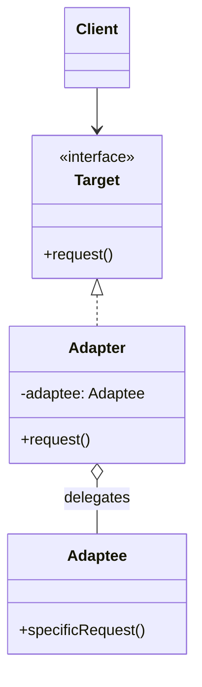

The code you must call and the interface your code expects rarely match: a payment SDK exposes
`legacyGet()`, your service layer speaks `fetch()`; a vendor returns `Enumeration`, your code wants
`List`. You cannot edit the vendor's class, and rewriting your own call sites couples them to the
vendor forever. **Adapter** converts the interface of a class into another interface clients
expect. It lets two otherwise-incompatible types work together — the software equivalent of a
travel plug adapter: same electricity, different pin shape.

## Structure



The **Adapter** implements the `Target` the client wants, then translates each call into the
`Adaptee`'s existing `specificRequest()`.

## Object adapter vs class adapter

There are two flavours. In Java the **object adapter** wins because Java has no multiple
inheritance of classes.

| | Object adapter | Class adapter |
|--|--|--|
| Mechanism | **Composition** — holds an adaptee field | **Inheritance** — extends the adaptee |
| Java support | Always works | Needs the adaptee to be a non-final class |
| Adapts subclasses? | Yes — any subtype of the adaptee | No — bound to one concrete class |
| Can override adaptee behaviour? | No, only delegate | Yes, via overriding |

````tabs
tabs:
  - label: Object adapter (preferred)
    body: |
      Holds the adaptee and delegates — flexible, works with any subtype.
      ```java
      interface Target { String fetch(); }

      class LegacyService {           // the Adaptee
        String legacyGet() { return "data"; }
      }

      class ServiceAdapter implements Target {
        private final LegacyService adaptee;
        ServiceAdapter(LegacyService a) { this.adaptee = a; }
        public String fetch() { return adaptee.legacyGet(); }
      }
      ```
  - label: Class adapter
    body: |
      Extends the adaptee — only possible when it is a subclassable class.
      ```java
      interface Target { String fetch(); }

      class LegacyService {
        String legacyGet() { return "data"; }
      }

      class ServiceAdapter extends LegacyService implements Target {
        public String fetch() { return legacyGet(); }
      }
      ```
````

## In the JDK

Adapter is one of the most common patterns in `java.io` and the collections framework:

- **`InputStreamReader`** — adapts a byte-oriented `InputStream` to the character-oriented
  `Reader` interface (`OutputStreamWriter` is the mirror image).
- **`Arrays.asList(T...)`** — adapts a plain array to the `List` interface. It is a fixed-size
  **view**: `set()` works and writes through to the array, but `add()`/`remove()` throw
  `UnsupportedOperationException`.
- **`Collections.list(Enumeration)`** / **`Collections.enumeration(Collection)`** — adapt between
  the legacy `Enumeration` world and modern collections, in both directions.
- **`Executors.callable(Runnable)`** — adapts a `Runnable` to the `Callable` interface an executor
  API expects.

```java
// Bytes in, characters out — the adapter bridges the two worlds.
Reader r = new InputStreamReader(System.in, StandardCharsets.UTF_8);

List<String> view = Arrays.asList("a", "b");  // array adapted to List
view.set(0, "z");                             // fine — writes through
// view.add("c");                             // UnsupportedOperationException — fixed size
```

:::note
Adapter changes an interface **without adding behaviour**. If you find yourself adding new
responsibilities while wrapping, you are writing a **Decorator**, not an Adapter.
:::

## The wrapper family at a glance

Four patterns wrap an object; interviews hinge on *why* you wrap:

| Pattern | Interface | Behaviour | One-line intent |
|--|--|--|--|
| **Adapter** | **Changed** — converts A to B | Unchanged | Make the wrong shape fit |
| **Decorator** | Same | **Added** | Enrich what it already does |
| **Proxy** | Same | Same, but **gated** | Control when/whether you reach it |
| **Facade** | **New, simpler** — over many classes | Orchestrated | One door into a subsystem |

The one-question test: *does the wrapper's type match the wrappee's?* No → Adapter (one class) or
Facade (a subsystem). Yes → Decorator (adds) or Proxy (controls).

## When NOT to use it

- **You own both sides.** If you can change the adaptee's interface, do that — an adapter between
  two classes you control is accidental complexity that hides the real fix.
- **The mismatch is semantic, not syntactic.** An adapter can rename methods and convert types; it
  cannot reconcile different transaction models or error semantics. Pretending it can produces
  adapters full of business logic — a bug factory.
- **Adapter chains.** `AdapterA(AdapterB(AdapterC(x)))` means your abstractions disagree; fix the
  interfaces rather than stacking translations, since each layer adds latency and stack depth to
  every call.

:::senior
Adapters are how you quarantine a nasty third-party or legacy API behind a clean interface your
code owns. The rest of the codebase depends only on `Target`; the ugliness lives in one class you
can rewrite when the dependency changes.
:::

## Check yourself

```quiz
title: Adapter check
questions:
  - q: 'What is the core intent of the Adapter pattern?'
    options:
      - text: 'Convert one interface into another that clients expect'
        correct: true
      - 'Add new behaviour to an object at runtime'
      - 'Provide a simplified front over a complex subsystem'
    explain: 'Adapter is about interface conversion. Adding behaviour is Decorator; simplifying a subsystem is Facade.'
  - q: 'Why is the object adapter usually preferred over the class adapter in Java?'
    options:
      - 'It is faster at runtime'
      - text: 'It uses composition, so it works with any subtype and does not need to extend a class'
        correct: true
      - 'It requires less memory'
    explain: 'Composition avoids Java single-inheritance limits and lets the adapter wrap any subclass of the adaptee.'
  - q: 'Which JDK class adapts a byte stream to a character stream?'
    options:
      - 'BufferedReader'
      - text: 'InputStreamReader'
        correct: true
      - 'StringReader'
    explain: '`InputStreamReader` adapts an `InputStream` (bytes) to the `Reader` (characters) interface.'
```

:::key
Adapter = **interface conversion** via a wrapper. Prefer the **object adapter** (composition).
It does not change behaviour — that is Decorator's job. Canonical JDK example:
**`InputStreamReader`**.
:::
