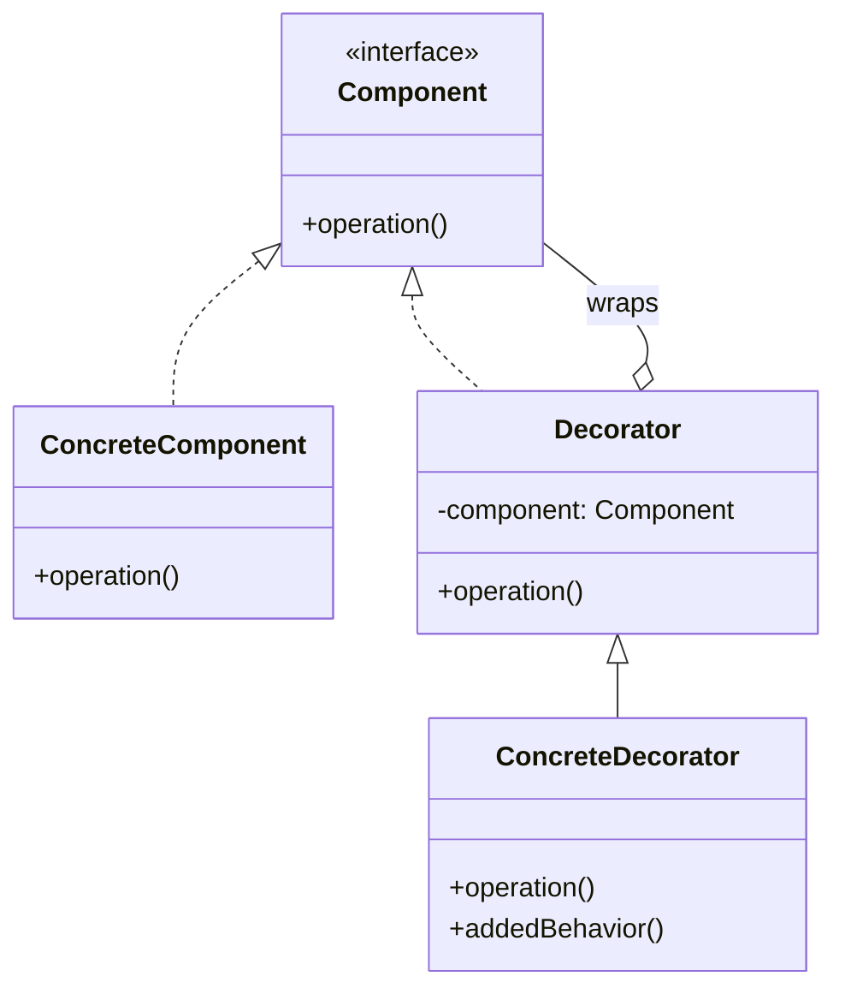

**Decorator** attaches new responsibilities to an object dynamically by wrapping it in another
object with the **same interface**. It is a flexible alternative to subclassing for extending
behaviour.

## Structure



Because the `Decorator` **is-a** `Component` *and* **has-a** `Component`, you can stack decorators
recursively — each one delegates to the wrapped object and adds a little more.

## The canonical `java.io` example

Every Java developer has typed this without realising it is textbook Decorator. Each stream *is* a
`Reader`/`InputStream` and *wraps* another one:

````tabs
tabs:
  - label: Wrapping (Decorator)
    body: |
      Buffering is added by wrapping, not by a `BufferedFileReader` subclass.
      ```java
      Reader r = new BufferedReader(   // adds buffering
                   new InputStreamReader( // adapts bytes->chars
                     new FileInputStream("data.txt")));
      // Mix and match: buffering, char decoding, file source — all composable.
      ```
  - label: Subclass explosion (the problem)
    body: |
      Without decorators every combination needs its own class.
      ```java
      // BufferedFileReader, BufferedGzipReader,
      // BufferedEncryptedFileReader, GzipEncryptedReader ...
      // N features -> 2^N classes. Unmaintainable.
      class BufferedFileReader extends FileReader { /* ... */ }
      ```
````

A minimal hand-rolled decorator:

```java
interface Coffee { double cost(); }

class Espresso implements Coffee {
  public double cost() { return 2.0; }
}

// Base decorator holds a Coffee and forwards to it.
abstract class CoffeeDecorator implements Coffee {
  protected final Coffee inner;
  CoffeeDecorator(Coffee c) { this.inner = c; }
}

class Milk extends CoffeeDecorator {
  Milk(Coffee c) { super(c); }
  public double cost() { return inner.cost() + 0.5; } // add, then delegate
}

Coffee order = new Milk(new Milk(new Espresso())); // 3.0
```

## Decorator vs subclassing

| Decorator (composition) | Subclassing (inheritance) |
|--|--|
| Behaviour added **at runtime** | Behaviour fixed **at compile time** |
| Combine freely — stack in any order | Every combination is a new class (2ᴺ explosion) |
| Wrapped object need not know it is decorated | Tightly couples subclass to parent internals |
| Many small wrappers | One deep, rigid hierarchy |

:::gotcha
A decorator must implement the **same interface** as what it wraps and **delegate** to it —
otherwise clients cannot treat wrapped and unwrapped objects interchangeably. Forgetting to
forward a method silently drops behaviour.
:::

:::senior
Decorator and Adapter both wrap, but for opposite reasons: **Adapter changes the interface**
(same behaviour, new shape); **Decorator keeps the interface** (same shape, new behaviour). If the
wrapper's type matches the wrappee's type, it is a Decorator.
:::

## Check yourself

```quiz
title: Decorator check
questions:
  - q: 'How does a Decorator relate to the object it wraps?'
    options:
      - text: 'It implements the same interface and holds a reference to the wrapped object'
        correct: true
      - 'It extends the wrapped object with a new interface'
      - 'It hides the wrapped object behind a simpler API'
    explain: 'A decorator is-a Component and has-a Component, so it can add behaviour then delegate transparently.'
  - q: 'Which is the textbook Decorator example in the JDK?'
    options:
      - 'ArrayList wrapping an array'
      - text: 'BufferedReader wrapping a FileReader'
        correct: true
      - 'HashMap wrapping an array of buckets'
    explain: 'The `java.io` streams wrap each other — `new BufferedReader(new FileReader(...))` adds buffering to any Reader.'
  - q: 'What problem does Decorator solve compared to subclassing?'
    options:
      - 'It makes objects immutable'
      - text: 'It avoids the combinatorial explosion of subclasses for every feature combination'
        correct: true
      - 'It removes the need for interfaces'
    explain: 'Stacking small decorators composes features at runtime instead of creating a class per combination.'
```

:::key
Decorator = **add behaviour by wrapping**, keeping the same interface and delegating inward. It
replaces a subclass explosion with composable wrappers. The JDK proof:
**`new BufferedReader(new FileReader(...))`**.
:::
