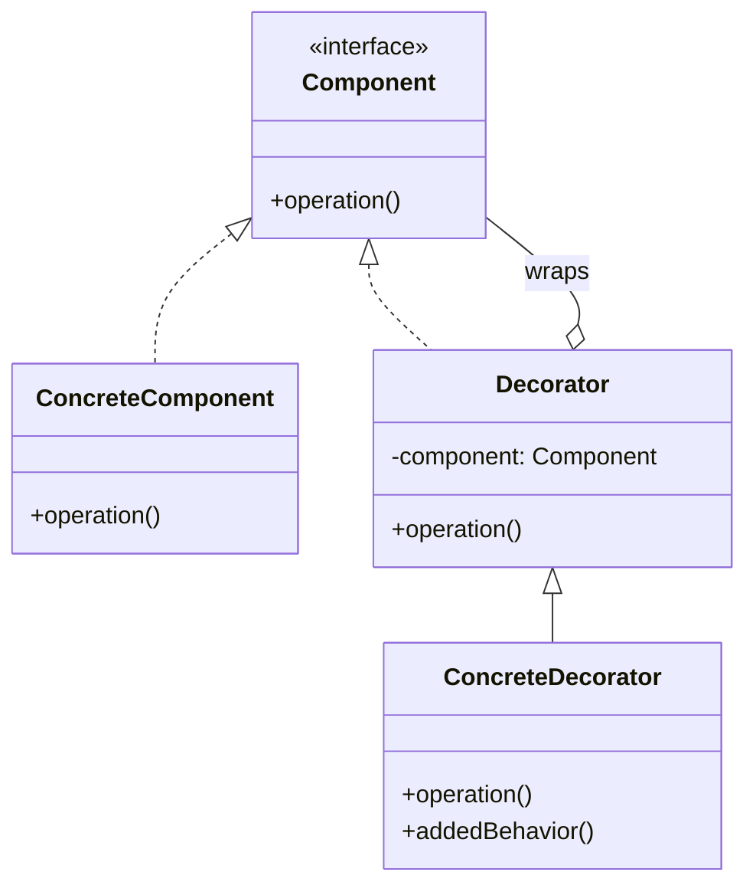

You need buffering on some streams, compression on others, and both on a few — and tomorrow
someone will ask for encryption too. Subclassing gives you `BufferedFileReader`,
`BufferedGzipEncryptedFileReader`… N features explode into 2ᴺ classes, all frozen at compile time.
**Decorator** attaches new responsibilities to an object dynamically by wrapping it in another
object with the **same interface**. Each wrapper adds one feature and delegates the rest — a
flexible, composable alternative to subclassing.

## Structure



Because the `Decorator` **is-a** `Component` *and* **has-a** `Component`, you can stack decorators
recursively — each one delegates to the wrapped object and adds a little more.

## The canonical `java.io` example

Every Java developer has typed this without realising it is textbook Decorator. Each stream *is* a
`Reader`/`InputStream` and *wraps* another one:

````tabs
tabs:
  - label: Wrapping (Decorator)
    body: |
      Buffering is added by wrapping, not by a `BufferedFileReader` subclass.
      ```java
      Reader r = new BufferedReader(   // adds buffering
                   new InputStreamReader( // adapts bytes->chars
                     new FileInputStream("data.txt")));
      // Mix and match: buffering, char decoding, file source — all composable.
      ```
  - label: Subclass explosion (the problem)
    body: |
      Without decorators every combination needs its own class.
      ```java
      // BufferedFileReader, BufferedGzipReader,
      // BufferedEncryptedFileReader, GzipEncryptedReader ...
      // N features -> 2^N classes. Unmaintainable.
      class BufferedFileReader extends FileReader { /* ... */ }
      ```
````

A minimal hand-rolled decorator:

```java
interface Coffee { double cost(); }

class Espresso implements Coffee {
  public double cost() { return 2.0; }
}

// Base decorator holds a Coffee and forwards to it.
abstract class CoffeeDecorator implements Coffee {
  protected final Coffee inner;
  CoffeeDecorator(Coffee c) { this.inner = c; }
}

class Milk extends CoffeeDecorator {
  Milk(Coffee c) { super(c); }
  public double cost() { return inner.cost() + 0.5; } // add, then delegate
}

Coffee order = new Milk(new Milk(new Espresso())); // 3.0
```

## Step through the wrapping order

Construction nests **inside-out**; calls run **outside-in**; results combine on the way back out.
This is the mechanic interviewers ask you to narrate:

```walkthrough
title: A call through a decorator stack
code: |
  Coffee order = new Milk(new Whip(new Espresso()));
  double total = order.cost();
  // Milk.cost():     return inner.cost() + 0.5;
  // Whip.cost():     return inner.cost() + 0.7;
  // Espresso.cost(): return 2.0;
steps:
  - text: 'Construction happens **inside-out**: `Espresso` is created first, `Whip` wraps it, `Milk` wraps `Whip`. The variable holds only the **outermost** wrapper — the client cannot tell it from a plain `Coffee`.'
    line: 1
  - text: 'The client calls `cost()` on the outermost decorator (`Milk`). It neither knows nor cares how many layers sit beneath.'
    line: 2
  - text: '`Milk` cannot answer alone — it first delegates `inner.cost()` **inward** to `Whip`, planning to add its own 0.5 afterwards.'
    line: 3
  - text: '`Whip` does the same: delegate inward to `Espresso`, then add 0.7. Each layer contributes exactly one feature.'
    line: 4
  - text: 'The base component returns **2.0** and the stack unwinds: Whip returns 2.7, Milk returns 3.2. Every decorator ran — order of *additive* decorators didn''t matter here, but see below for when it does.'
    line: 5
```

## When wrapping order matters

Stacking is free only when decorators are independent. When they transform data, **order changes
meaning**:

```java
// GOOD: buffer the raw file, then decompress — gzip reads big chunks from disk.
InputStream fast = new GZIPInputStream(new BufferedInputStream(fileIn));

// LEGAL BUT SLOWER: decompress unbuffered single reads from disk.
InputStream slow = new BufferedInputStream(new GZIPInputStream(fileIn));
```

Both compile and both work — the difference is *what* gets buffered (raw bytes vs decompressed
bytes). The classic design version: **compress-then-encrypt** works, **encrypt-then-compress** is
useless because encrypted bytes have no redundancy left to compress. Decorators compose, but they
are not commutative.

## Decorator vs subclassing

| Decorator (composition) | Subclassing (inheritance) |
|--|--|
| Behaviour added **at runtime** | Behaviour fixed **at compile time** |
| Combine freely — stack in any order | Every combination is a new class (2ᴺ explosion) |
| Wrapped object need not know it is decorated | Tightly couples subclass to parent internals |
| Many small wrappers | One deep, rigid hierarchy |

## The JDK's other decorators: collection wrappers

`java.io` is not the only showcase — the `Collections` utility methods return decorators too:

```java
List<String> safe = Collections.unmodifiableList(names);  // decorates: mutators now throw
List<String> sync = Collections.synchronizedList(names);  // decorates: every call synchronized
```

Each returns a same-interface wrapper around your list that intercepts calls —
`unmodifiableList` throws `UnsupportedOperationException` from mutators, `synchronizedList` locks
around every method. Note `unmodifiableList` is a **view**: changes to the underlying `names` list
still show through it (use `List.copyOf` for a true immutable snapshot).

## Decorator vs Proxy vs Adapter

| | Decorator | Proxy | Adapter |
|--|--|--|--|
| Interface | Same as wrappee | Same as wrappee | **Different** — converted |
| Purpose | **Add** behaviour | **Control** access (lazy, guard, remote) | Make shapes fit |
| Who creates the wrapped object | Caller — hands in an existing one | Often the proxy itself (lazily) | Caller |
| Stacking | Designed for it | Rarely stacked | Chains are a smell |

:::gotcha
A decorator must implement the **same interface** as what it wraps and **delegate** to it —
otherwise clients cannot treat wrapped and unwrapped objects interchangeably. Forgetting to
forward a method silently drops behaviour. Also watch **identity**: the decorated object is a
*different object* — `wrapped.equals(original)` is typically false, and code that unwraps or
compares references breaks. That is why decorating `equals`/`hashCode`-sensitive objects (map
keys) is risky.
:::

:::senior
Decorator and Adapter both wrap, but for opposite reasons: **Adapter changes the interface**
(same behaviour, new shape); **Decorator keeps the interface** (same shape, new behaviour). If the
wrapper's type matches the wrappee's type, it is a Decorator. When NOT to decorate: behaviour
needed by *every* instance belongs in the class itself, and cross-cutting concerns over many
unrelated types (logging, transactions) are better served by AOP proxies than by hand-writing a
decorator per interface.
:::

## Check yourself

```quiz
title: Decorator check
questions:
  - q: 'How does a Decorator relate to the object it wraps?'
    options:
      - text: 'It implements the same interface and holds a reference to the wrapped object'
        correct: true
      - 'It extends the wrapped object with a new interface'
      - 'It hides the wrapped object behind a simpler API'
    explain: 'A decorator is-a Component and has-a Component, so it can add behaviour then delegate transparently.'
  - q: 'Which is the textbook Decorator example in the JDK?'
    options:
      - 'ArrayList wrapping an array'
      - text: 'BufferedReader wrapping a FileReader'
        correct: true
      - 'HashMap wrapping an array of buckets'
    explain: 'The `java.io` streams wrap each other — `new BufferedReader(new FileReader(...))` adds buffering to any Reader.'
  - q: 'What problem does Decorator solve compared to subclassing?'
    options:
      - 'It makes objects immutable'
      - text: 'It avoids the combinatorial explosion of subclasses for every feature combination'
        correct: true
      - 'It removes the need for interfaces'
    explain: 'Stacking small decorators composes features at runtime instead of creating a class per combination.'
```

:::key
Decorator = **add behaviour by wrapping**, keeping the same interface and delegating inward. It
replaces a subclass explosion with composable wrappers. The JDK proof:
**`new BufferedReader(new FileReader(...))`**.
:::
