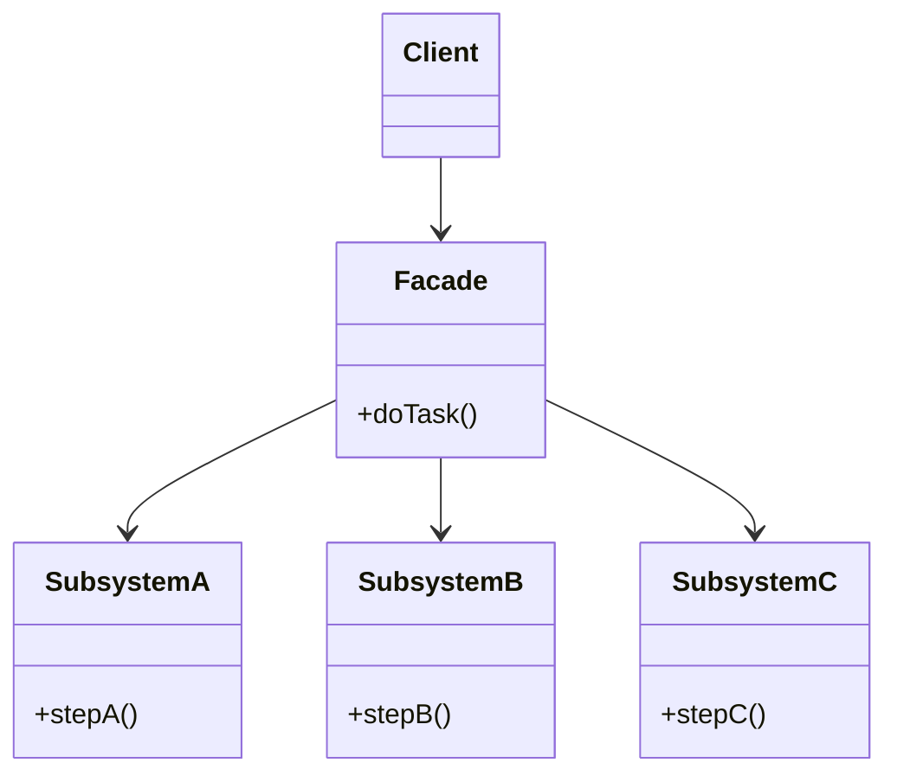

**Facade** provides a single, simplified interface to a complex subsystem. Clients talk to the
facade instead of wiring together a dozen collaborating classes themselves.

## Structure



The facade knows the right order and combination of subsystem calls. Clients get one method; the
messy orchestration stays hidden.

## Before and after

````tabs
tabs:
  - label: With Facade
    body: |
      The client calls one method; the facade orchestrates.
      ```java
      class VideoConverter {           // Facade
        String convert(String file, String fmt) {
          var f = new VideoFile(file);
          var codec = CodecFactory.extract(f);
          var buffer = BitrateReader.read(file, codec);
          var result = BitrateReader.convert(buffer, fmt);
          return AudioMixer.fix(result);
        }
      }
      // Client:
      new VideoConverter().convert("in.ogg", "mp4");
      ```
  - label: Without Facade
    body: |
      The client must know every subsystem class and the correct sequence.
      ```java
      var f = new VideoFile("in.ogg");
      var codec = CodecFactory.extract(f);
      var buffer = BitrateReader.read("in.ogg", codec);
      var result = BitrateReader.convert(buffer, "mp4");
      var out = AudioMixer.fix(result);
      // Coupling to 5 classes and their call order.
      ```
````

## Facade vs its neighbours

| Pattern | Intent | Interface change? |
|--|--|--|
| **Facade** | Simplify a **whole subsystem** behind one entry point | New, simpler interface over many classes |
| **Adapter** | Make **one** existing class fit a required interface | Converts one interface to another |
| **Decorator** | Add behaviour, keep the interface | Same interface |

## In the JDK & frameworks

- **`javax.faces.context.FacesContext`** and **`java.net.URL.openConnection()`** hide layered
  machinery behind one call.
- **SLF4J's `LoggerFactory`** fronts whatever logging backend is on the classpath.
- Spring's **`JdbcTemplate`** is a facade over the raw JDBC dance (open connection, statement,
  result set, close, handle exceptions).

:::note
A facade **does not hide** the subsystem — advanced clients can still use the subsystem classes
directly. It just offers an easier default path. Adapter, by contrast, exists because the
underlying interface is *wrong* for the client.
:::

:::senior
Keep facades thin. When a facade starts holding business rules or state, it is drifting into a
God-object. Its job is orchestration and simplification, not logic.
:::

## Check yourself

```quiz
title: Facade check
questions:
  - q: 'What does a Facade provide?'
    options:
      - text: 'A single simplified interface over a complex subsystem'
        correct: true
      - 'A stand-in that controls access to an object'
      - 'A way to add behaviour by wrapping'
    explain: 'Facade offers one higher-level entry point so clients avoid wiring the subsystem themselves.'
  - q: 'How does Facade differ from Adapter?'
    options:
      - 'They are the same pattern with different names'
      - text: 'Facade simplifies many classes into one interface; Adapter converts one class to a required interface'
        correct: true
      - 'Facade always uses inheritance'
    explain: 'Adapter fixes an incompatible interface for one type; Facade introduces a new simpler interface over a whole subsystem.'
  - q: 'Does a Facade prevent clients from using the subsystem directly?'
    options:
      - 'Yes, it fully encapsulates and hides it'
      - text: 'No, it offers an easier path but the subsystem stays accessible'
        correct: true
      - 'Only if the subsystem is final'
    explain: 'Facade reduces coupling by default but does not forbid direct access to subsystem classes when needed.'
```

:::key
Facade = **one simple front door** over a complex subsystem. It reduces coupling and orchestrates
the right calls, but does not hide the subsystem. Think **`JdbcTemplate`** or **SLF4J**.
:::
