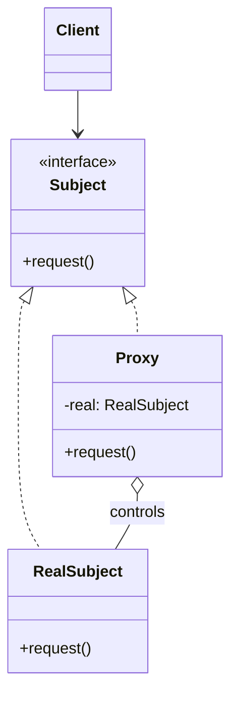

**Proxy** provides a surrogate or placeholder for another object to **control access** to it. The
proxy shares the subject's interface, so clients cannot tell they are not talking to the real
thing.

## Structure



The proxy implements the **same interface** as the `RealSubject`. On each call it can defer,
guard, log, or forward to the real object.

## Kinds of proxy

| Kind | Controls access by… | Example |
|--|--|--|
| **Virtual** | Delaying creation of an expensive object until first use | Lazy-loaded image or DB entity |
| **Protection** | Checking permissions before forwarding | Security-checked service call |
| **Remote** | Representing an object in another JVM/process | Java RMI stub |
| **Smart** | Adding bookkeeping (ref-counting, logging, caching) | Reference-counting handle |

```java
interface Image { void display(); }

class RealImage implements Image {
  RealImage(String f) { load(f); }        // expensive
  void load(String f) { /* read from disk */ }
  public void display() { /* render */ }
}

class ImageProxy implements Image {       // Virtual proxy
  private final String file;
  private RealImage real;
  ImageProxy(String f) { this.file = f; }
  public void display() {
    if (real == null) real = new RealImage(file); // lazy
    real.display();
  }
}
```

## Dynamic proxies in Java

Java can generate a proxy **at runtime** for any set of interfaces via
`java.lang.reflect.Proxy`. Every method call routes through an `InvocationHandler` — this is how
frameworks add behaviour without you writing wrapper classes.

```java
Service proxy = (Service) Proxy.newProxyInstance(
    Service.class.getClassLoader(),
    new Class<?>[]{ Service.class },
    (proxyObj, method, args) -> {
      System.out.println("before " + method.getName());
      return method.invoke(realService, args);   // delegate
    });
```

- **Spring AOP** wraps beans in dynamic proxies to apply `@Transactional`, `@Async`, and
  security advice. (JDK proxies for interfaces; **CGLIB** subclass proxies for concrete classes.)
- **Hibernate** returns proxy subclasses for lazy associations — the SQL fires only when you
  first touch a field, which is why a `LazyInitializationException` bites after the session closes.

## Proxy vs Decorator

They look identical — both wrap an object with the same interface — but the **intent** differs.

| Proxy | Decorator |
|--|--|
| **Controls access** to the subject | **Adds behaviour** to the subject |
| Usually manages the real object's **lifecycle** (creates it, may not exist yet) | Wraps an **already-existing** object handed to it |
| Same interface, same behaviour, gated | Same interface, **enhanced** behaviour |
| One proxy per subject | Stacked freely, many layers |

:::gotcha
Because Spring uses proxies, calling one `@Transactional` method **from another method in the same
bean** skips the proxy — the annotation is silently ignored. Self-invocation bypasses the
surrogate.
:::

:::senior
Proxy vs Decorator is a favourite interview trap. The code shape is the same; answer with
**intent**: a proxy *controls whether/when* you reach the real object (access, lifecycle,
location); a decorator *enriches* an object you already have. Naming a real example — Spring AOP
or Hibernate lazy loading — clinches it.
:::

## Check yourself

```quiz
title: Proxy check
questions:
  - q: 'What is the primary intent of the Proxy pattern?'
    options:
      - text: 'Provide a stand-in that controls access to the real object'
        correct: true
      - 'Add new responsibilities by wrapping'
      - 'Simplify a complex subsystem'
    explain: 'Proxy controls access — lazily creating, guarding, or remoting the real subject behind the same interface.'
  - q: 'A proxy and a decorator share the same interface. What distinguishes them?'
    options:
      - 'The proxy is always faster'
      - text: 'Intent: the proxy controls access/lifecycle; the decorator adds behaviour to an existing object'
        correct: true
      - 'The decorator cannot be stacked'
    explain: 'Structurally similar; a proxy typically manages when the real object is reached, a decorator enriches one already handed to it.'
  - q: 'How does Hibernate use proxies?'
    options:
      - 'To pool database connections'
      - text: 'It returns proxy subclasses for lazy associations, loading data only on first access'
        correct: true
      - 'To adapt JDBC to JPA interfaces'
    explain: 'Lazy fields are backed by runtime proxies; touching them after the session closes triggers LazyInitializationException.'
```

:::key
Proxy = a **same-interface stand-in that controls access** (virtual/protection/remote). Java's
**dynamic proxies** power **Spring AOP** and **Hibernate lazy loading**. It looks like Decorator —
the difference is **intent**: control access vs add behaviour.
:::
