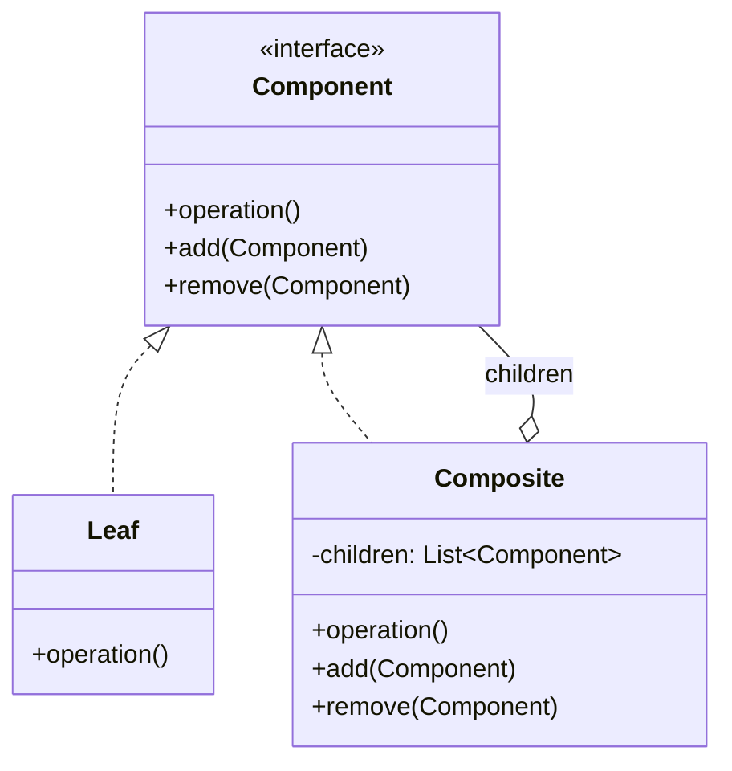

**Composite** composes objects into **tree structures** to represent part-whole hierarchies, and
lets clients treat individual objects (leaves) and compositions (branches) **uniformly** through a
shared interface.

## Structure



The key move: `Composite` **holds a collection of `Component`** — and `Component` is the same type
the composite itself implements. That self-reference is what builds the tree and enables
recursion.

## Uniform treatment

A `Composite.operation()` typically delegates to each child, recursing down the tree. The client
never checks "is this a leaf or a branch?" — it just calls `operation()`.

````tabs
tabs:
  - label: With Composite
    body: |
      One interface; recursion handles the tree. No type checks.
      ```java
      interface Node { int size(); }        // Component

      class File implements Node {          // Leaf
        private final int bytes;
        File(int b) { this.bytes = b; }
        public int size() { return bytes; }
      }

      class Folder implements Node {        // Composite
        private final List<Node> children = new ArrayList<>();
        void add(Node n) { children.add(n); }
        public int size() {
          return children.stream().mapToInt(Node::size).sum();
        }
      }
      ```
  - label: Without Composite
    body: |
      Client must branch on type at every level — brittle and repetitive.
      ```java
      int size(Object node) {
        if (node instanceof File f) return f.bytes;
        if (node instanceof Folder folder) {
          int total = 0;
          for (Object child : folder.children) total += size(child);
          return total;
        }
        throw new IllegalStateException();
      }
      ```
````

## In the JDK

Composite is everywhere trees appear:

- **Swing/AWT** — a `Container` is a `Component` that holds child `Component`s; `JPanel` inside
  `JPanel` inside `JFrame`. Calling `paint()` cascades down.
- **`java.io.File`** — a file or a directory of files, uniform API.
- **JSF `UIComponent`** and the **DOM** tree in web frameworks.

## Design tension: transparency vs safety

Where do `add()`/`remove()` live?

| Approach | `add`/`remove` declared on… | Trade-off |
|--|--|--|
| **Transparent** (GoF default) | The `Component` interface | Uniform — but calling `add()` on a leaf must throw or no-op |
| **Safe** | Only on `Composite` | Type-safe — but client must downcast to manage children |

:::gotcha
The transparent design puts child-management methods on leaves that cannot have children. You must
decide: throw `UnsupportedOperationException` or silently do nothing. Neither is free — that is the
cost of uniformity.
:::

:::senior
Composite pairs naturally with **Visitor** (to run operations over the tree without bloating each
node) and with **Iterator** (to traverse it). If your recursion logic grows, that is the signal to
reach for Visitor.
:::

## Check yourself

```quiz
title: Composite check
questions:
  - q: 'What does the Composite pattern let clients do?'
    options:
      - text: 'Treat individual objects and compositions of objects uniformly'
        correct: true
      - 'Control access to an expensive object'
      - 'Convert one interface to another'
    explain: 'Leaves and composites share one interface, so clients call the same method regardless of tree position.'
  - q: 'What is the defining structural feature of a Composite?'
    options:
      - 'It extends the Leaf class'
      - text: 'The Composite holds a collection of the same Component type it implements'
        correct: true
      - 'It hides children behind a facade'
    explain: 'The self-referential collection of Components is what forms the tree and enables recursion.'
  - q: 'Which is a real JDK example of Composite?'
    options:
      - 'InputStreamReader'
      - text: 'Swing Container holding child Components'
        correct: true
      - 'Integer.valueOf caching'
    explain: 'A Swing Container is itself a Component and contains child Components, forming a UI tree.'
```

:::key
Composite = **part-whole trees** where leaves and branches share one interface, so clients recurse
uniformly. The `Composite` holds a list of `Component`. JDK proof: **Swing containers** and
**`java.io.File`** trees.
:::
