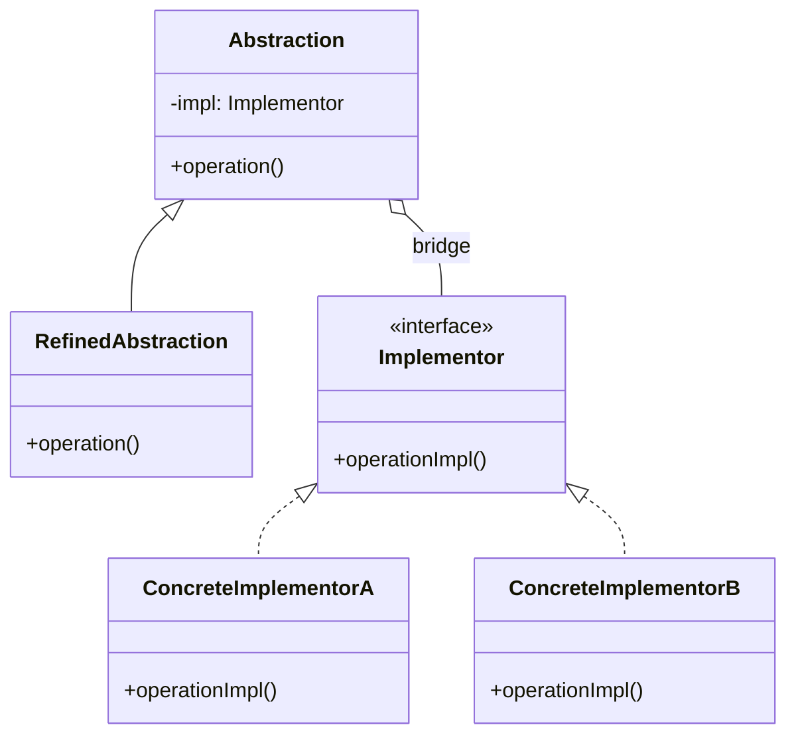

**Bridge** decouples an abstraction from its implementation so the two can vary **independently**.
It replaces a combinatorial inheritance grid with two parallel hierarchies joined by composition —
the "bridge".

## The problem it solves

Say you have `Shape`s (Circle, Square) that can be drawn by different `Renderer`s (Vector,
Raster). Inheritance forces one class per combination: `VectorCircle`, `RasterCircle`,
`VectorSquare`, `RasterSquare`… Add one shape or one renderer and the grid explodes (M × N).

## Structure



The `Abstraction` **holds** an `Implementor` (the bridge) and delegates the low-level work to it.
Now shapes and renderers grow separately: M + N classes, not M × N.

````tabs
tabs:
  - label: With Bridge
    body: |
      Two hierarchies, joined by composition. Add a shape OR a renderer freely.
      ```java
      interface Renderer {                 // Implementor
        void drawCircle(double r);
      }
      class VectorRenderer implements Renderer {
        public void drawCircle(double r) { /* svg */ }
      }
      class RasterRenderer implements Renderer {
        public void drawCircle(double r) { /* pixels */ }
      }

      abstract class Shape {               // Abstraction
        protected final Renderer renderer; // the bridge
        Shape(Renderer r) { this.renderer = r; }
        abstract void draw();
      }
      class Circle extends Shape {
        private final double radius;
        Circle(Renderer r, double rad) { super(r); this.radius = rad; }
        void draw() { renderer.drawCircle(radius); }
      }
      // new Circle(new VectorRenderer(), 5).draw();
      ```
  - label: Without Bridge
    body: |
      Every shape x renderer pair is its own class. M x N explosion.
      ```java
      class VectorCircle extends Shape { /* ... */ }
      class RasterCircle extends Shape { /* ... */ }
      class VectorSquare extends Shape { /* ... */ }
      class RasterSquare extends Shape { /* ... */ }
      // add Triangle -> +2 classes; add 3D renderer -> +3 classes
      ```
````

## Bridge vs Adapter

Both use composition and delegation, so they get confused. The decider is **when** and **why**.

| Bridge | Adapter |
|--|--|
| Designed **up front** to let two dimensions vary | Applied **after the fact** to fix a mismatch |
| Both sides designed together to fit | Wraps an existing, unchangeable interface |
| Intent: **avoid a class explosion / separate concerns** | Intent: **make incompatible interfaces work** |
| Two hierarchies evolve in parallel | One-off translation layer |

## In the JDK

- **JDBC** — the `java.sql` interfaces (`Connection`, `Statement`) are the abstraction; each
  vendor's **`Driver`** is the implementation. Your code and the drivers vary independently.
- **`java.util.logging`** — `Logger` (abstraction) delegates to `Handler` (implementation).
- **AWT** — the old `Component` / `peer` split delegated to native platform widgets.

:::note
Adapter and Bridge are structurally cousins. The interview answer is intent and timing: **Bridge
is planned, Adapter is a patch**. Bridge separates two things you *know* will change; Adapter
reconciles two things that *already* clash.
:::

:::senior
The GoF one-liner: "prefer composition over inheritance." Bridge is that principle made concrete —
whenever you see a class name that is a Cartesian product of two ideas (`ThreadSafeSortedList`,
`EncryptedGzipStream`), a bridge probably wants to split those dimensions apart.
:::

## Check yourself

```quiz
title: Bridge check
questions:
  - q: 'What is the intent of the Bridge pattern?'
    options:
      - text: 'Decouple an abstraction from its implementation so both can vary independently'
        correct: true
      - 'Make two incompatible interfaces work together'
      - 'Add behaviour to an object by wrapping it'
    explain: 'Bridge splits one hierarchy into two joined by composition, avoiding an M x N class explosion.'
  - q: 'How does Bridge differ from Adapter?'
    options:
      - 'Bridge uses inheritance, Adapter uses composition'
      - text: 'Bridge is designed up front to let two dimensions vary; Adapter patches an existing interface mismatch after the fact'
        correct: true
      - 'They are identical'
    explain: 'Both delegate, but Bridge is planned to separate concerns while Adapter reconciles interfaces that already clash.'
  - q: 'How does Bridge tame a combinatorial class explosion?'
    options:
      - 'By caching instances'
      - text: 'By turning an M x N grid of subclasses into M + N classes across two hierarchies'
        correct: true
      - 'By making all classes final'
    explain: 'Abstractions and implementations grow in separate hierarchies joined by a composition bridge, so you add M + N classes, not M x N.'
```

:::key
Bridge = **separate an abstraction from its implementation** into two hierarchies joined by
composition, so both vary freely (M + N, not M × N). Versus Adapter: **Bridge is planned, Adapter
patches**. JDK proof: **JDBC** `Connection`/`Driver`.
:::
