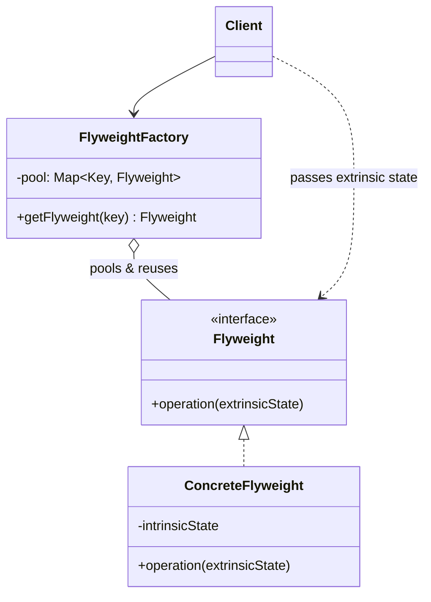

**Flyweight** minimizes memory use by **sharing** as much data as possible between many
fine-grained objects. It works by separating an object's state into what can be shared and what
cannot.

## Intrinsic vs extrinsic state

This split is the whole pattern:

| State | Meaning | Where it lives |
|--|--|--|
| **Intrinsic** | Shared, context-independent, immutable | Stored **inside** the flyweight, shared across all uses |
| **Extrinsic** | Varies per use, context-dependent | Passed **in by the client** on each call, never stored |

Example: a text editor's glyph. The character shape and font metrics of `'a'` are **intrinsic**
(one shared `'a'` flyweight); its position on the page is **extrinsic** (passed per render).

## Structure



A **factory** owns a pool and hands back a shared instance for a given intrinsic key — creating one
only if it does not yet exist.

````tabs
tabs:
  - label: With Flyweight
    body: |
      One shared object per character; colour/position passed in.
      ```java
      class Glyph {                        // Flyweight
        private final char symbol;         // intrinsic (shared)
        Glyph(char s) { this.symbol = s; }
        void draw(int x, int y) { /* symbol + extrinsic pos */ }
      }

      class GlyphFactory {
        private final Map<Character, Glyph> pool = new HashMap<>();
        Glyph get(char c) {
          return pool.computeIfAbsent(c, Glyph::new); // reuse
        }
      }
      // 10,000 'a's on screen share ONE Glyph object.
      ```
  - label: Without Flyweight
    body: |
      Each character allocates its own object — memory blows up.
      ```java
      class Glyph {
        char symbol; int x, y;   // position baked in
        Glyph(char s, int x, int y) { /* ... */ }
      }
      // 10,000 characters -> 10,000 Glyph objects.
      ```
````

## In the JDK

The JVM ships two famous flyweight pools:

- **`Integer.valueOf(int)`** caches boxed values **−128 to 127**. Two autoboxed `Integer`s in that
  range are the *same object* — which is why `==` surprises people.
- **String pool** — string literals are interned and shared; identical literals are one object.
- Also **`Boolean.valueOf`**, `Character`/`Long`/`Short` caches, and `Byte`.

```java
Integer a = 127, b = 127;
System.out.println(a == b);   // true  -> same cached Flyweight
Integer c = 128, d = 128;
System.out.println(c == d);   // false -> outside cache, new objects
```

:::gotcha
The `Integer` cache is exactly why you must compare boxed numbers with `.equals()`, not `==`. It
works by accident for small values and breaks silently above 127.
:::

:::warning
Flyweights **must be immutable** in their intrinsic state — they are shared across the whole
program, so a mutation would corrupt every user. All varying state stays extrinsic, passed in per
call.
:::

:::senior
Flyweight is a memory-vs-compute trade and only pays off with *huge* numbers of similar objects
where intrinsic state dominates. Measure first — for a few hundred objects the factory and lookup
overhead outweighs the savings.
:::

## Check yourself

```quiz
title: Flyweight check
questions:
  - q: 'What is the difference between intrinsic and extrinsic state?'
    options:
      - text: 'Intrinsic is shared and stored in the flyweight; extrinsic varies per use and is passed in by the client'
        correct: true
      - 'Intrinsic is mutable; extrinsic is immutable'
      - 'Intrinsic is public; extrinsic is private'
    explain: 'Sharing works because context-independent (intrinsic) state is stored once, while context-dependent (extrinsic) state is supplied per call.'
  - q: 'Why does `Integer.valueOf(127) == Integer.valueOf(127)` return true but 128 does not?'
    options:
      - '127 is a prime edge case'
      - text: 'The Integer flyweight cache shares instances for -128..127; 128 is outside it, so new objects are created'
        correct: true
      - 'Autoboxing is disabled above 127'
    explain: 'The cache returns the same shared object in range, so `==` is true; outside the range new objects are allocated.'
  - q: 'Why must a flyweight''s intrinsic state be immutable?'
    options:
      - 'To make it faster'
      - text: 'Because the instance is shared across many contexts, so mutating it would corrupt all users'
        correct: true
      - 'Because Java requires shared objects to be final'
    explain: 'Shared intrinsic state cannot change per context; all varying data must be extrinsic and passed in.'
```

:::key
Flyweight = **share fine-grained objects to save memory** by splitting **intrinsic** (shared,
immutable) from **extrinsic** (per-use, passed in) state, via a pooling factory. JDK proof: the
**`Integer` cache (−128..127)** and the **String pool**.
:::
