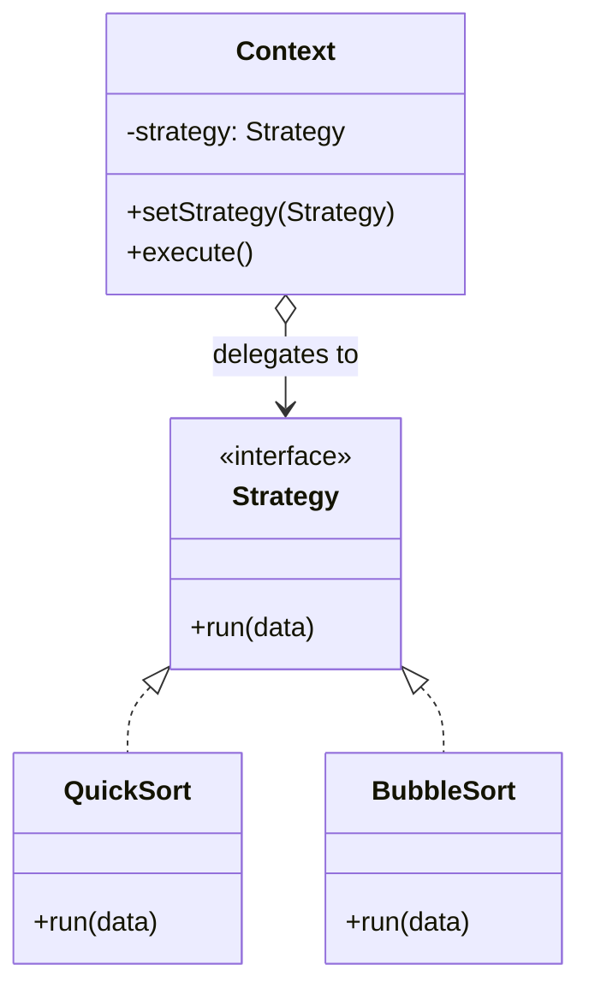

**Strategy** captures a family of algorithms, puts each behind a common interface, and lets the
client pick one at runtime. The algorithm varies independently of the code that uses it — so a
growing `if/else` or `switch` over "which behaviour" becomes a set of small, testable classes.

## Structure



The **Context** holds a reference to a `Strategy` and delegates the varying work to it. Concrete
strategies implement the interface; the context never knows which one it has.

## From branching to strategies

````tabs
tabs:
  - label: Before — if/else
    body: |
      Every new algorithm edits this method and risks breaking the others.
      ```java
      class Payment {
        void pay(String type, int cents) {
          if (type.equals("card"))      { /* card logic */ }
          else if (type.equals("paypal")) { /* paypal logic */ }
          else if (type.equals("crypto")) { /* crypto logic */ }
          else throw new IllegalArgumentException(type);
        }
      }
      ```
  - label: After — Strategy
    body: |
      Each algorithm is isolated; adding one means adding a class, not editing existing code (Open/Closed).
      ```java
      interface PayStrategy { void pay(int cents); }

      class CardPay   implements PayStrategy { public void pay(int c) { /* ... */ } }
      class PayPalPay implements PayStrategy { public void pay(int c) { /* ... */ } }

      class Payment {
        private PayStrategy strategy;
        void setStrategy(PayStrategy s) { this.strategy = s; }
        void pay(int cents) { strategy.pay(cents); }
      }
      ```
````

## Lambdas: strategies without the boilerplate

When a strategy is a single method, its interface is a **functional interface** — so a lambda *is*
the concrete strategy. No named class needed.

```java
PayStrategy card = cents -> System.out.println("Charged card: " + cents);
Payment p = new Payment();
p.setStrategy(card);
p.pay(1999);
```

## Strategy vs the alternatives

| Concern | Strategy | State | Template Method |
|--|--|--|--|
| What varies | A whole algorithm, chosen by the client | Behaviour driven by internal state transitions | A few *steps* inside a fixed algorithm |
| Who selects | External caller sets it | The object switches itself | Subclass overrides hook steps |
| Mechanism | Composition (delegates to an object) | Composition (states) | Inheritance |

## JDK example: `Comparator`

`Comparator` is Strategy in the standard library — `sort` is the context, and each comparator is a
pluggable ordering algorithm.

```java
List<String> names = new ArrayList<>(List.of("bb", "a", "ccc"));
names.sort(Comparator.comparingInt(String::length));   // one strategy
names.sort(Comparator.reverseOrder());                 // swap it out
```

`Collections.sort`, `Stream.sorted`, and `TreeSet` all accept a `Comparator` — you inject the
comparison strategy without touching the sort implementation.

:::senior
Favour composition over inheritance: Strategy lets you change behaviour at runtime and unit-test
each algorithm in isolation. In modern Java, prefer passing a lambda or method reference over
declaring a class per strategy unless the strategy carries state or needs a name.
:::

## Check yourself

```quiz
title: Strategy check
questions:
  - q: 'What problem does Strategy primarily solve?'
    options:
      - 'Guaranteeing a single instance of a class'
      - text: 'Selecting one of several interchangeable algorithms at runtime without conditionals'
        correct: true
      - 'Adding responsibilities to an object dynamically'
    explain: 'Strategy encapsulates each algorithm behind a shared interface so the client can swap them at runtime, replacing branching logic.'
  - q: 'Why can a lambda serve as a concrete strategy in Java?'
    options:
      - 'Lambdas are compiled to anonymous inner classes only'
      - text: 'A single-method Strategy interface is a functional interface, so a lambda implements it'
        correct: true
      - 'Because lambdas run faster than classes'
    explain: 'When the Strategy interface has exactly one abstract method it is a functional interface, so a lambda or method reference is a valid implementation.'
  - q: 'Which JDK type is a real-world Strategy?'
    options:
      - text: '`Comparator` passed to `List.sort`'
        correct: true
      - '`java.lang.Runtime`'
      - '`StringBuilder`'
    explain: '`Comparator` is a pluggable ordering algorithm injected into the sort context — textbook Strategy.'
```

:::key
Strategy = a family of interchangeable algorithms behind one interface, chosen by the client at
runtime via **composition**. Replaces `if/else`, honours Open/Closed, and collapses to a **lambda**
when the interface is functional. JDK: **`Comparator`**.
:::
