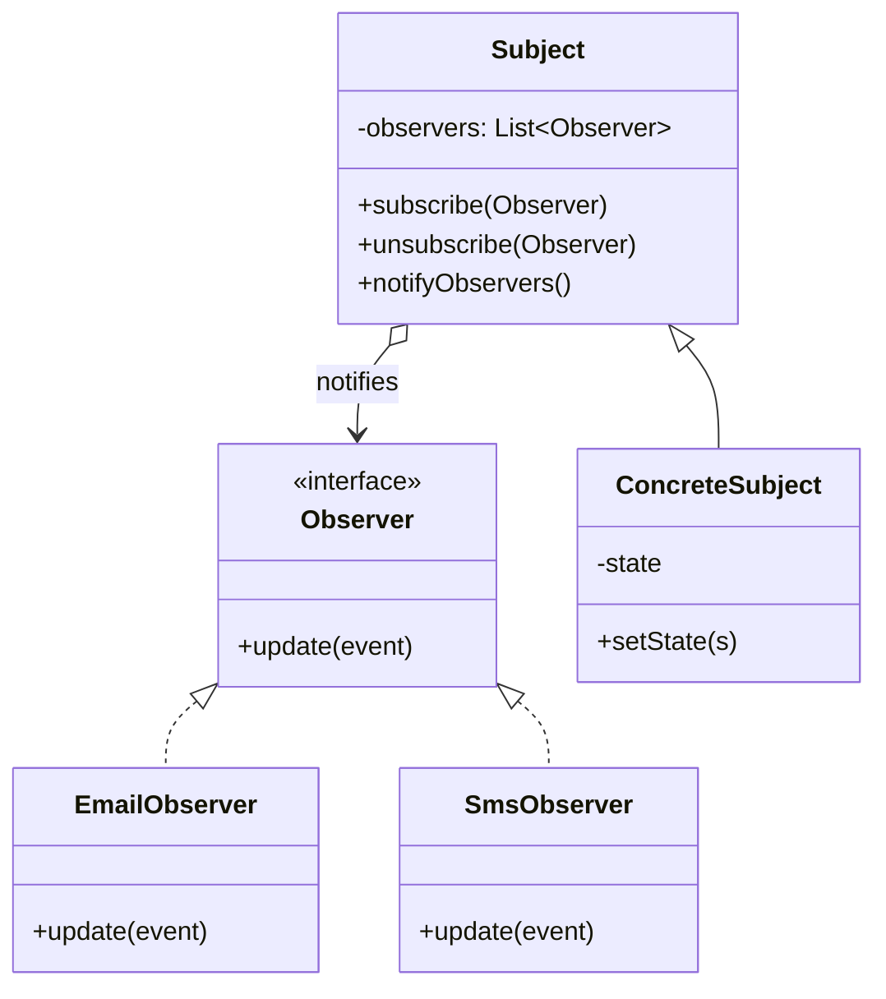
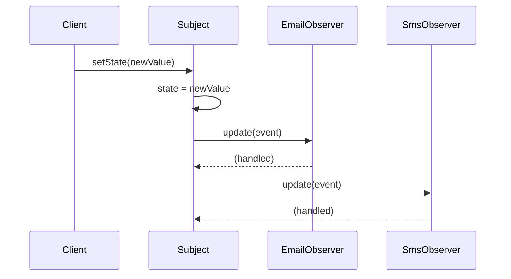

**Observer** lets a **subject** maintain a list of **observers** and notify them automatically
whenever its state changes. It decouples the thing that changes from the things that react — the
subject knows only the observer *interface*, never the concrete listeners.

## Structure



## The notify fan-out

When state changes, the subject loops over its registered observers and pushes the update to each
one. Observers can join or leave at any time.



## Minimal implementation

```java
interface Observer { void update(String event); }

class NewsAgency {
  private final List<Observer> observers = new ArrayList<>();
  public void subscribe(Observer o)   { observers.add(o); }
  public void unsubscribe(Observer o) { observers.remove(o); }

  public void publish(String headline) {
    for (Observer o : observers) o.update(headline);   // fan-out
  }
}

// Observer o = System.out::println;   // functional interface → lambda
```

## Observer vs Publish/Subscribe

Interviewers love this distinction: classic Observer is **direct**; pub/sub adds a **broker**.

| Aspect | Observer | Publish/Subscribe |
|--|--|--|
| Coupling | Subject holds direct references to observers | Publisher and subscriber know only a broker/topic |
| Delivery | Subject calls observers synchronously | Broker routes, often async, via a message queue |
| Awareness | Subject knows its observers exist | Publisher is unaware of subscribers |
| Scope | In-process | Often cross-process / distributed |

:::gotcha
The classic **lapsed-listener** memory leak: an observer that forgets to `unsubscribe` is kept
alive by the subject's list forever. Provide clear unsubscription, or hold observers via
`WeakReference` where appropriate.
:::

## JDK example: listeners and `PropertyChangeListener`

Swing/AWT event listeners (`ActionListener`, `MouseListener`) are Observer, and
`java.beans.PropertyChangeSupport` is a ready-made subject:

```java
class Stock {
  private final PropertyChangeSupport pcs = new PropertyChangeSupport(this);
  private double price;

  public void addListener(PropertyChangeListener l) { pcs.addPropertyChangeListener(l); }

  public void setPrice(double p) {
    double old = this.price;
    this.price = p;
    pcs.firePropertyChange("price", old, p);   // notifies all listeners
  }
}
```

:::note
The old `java.util.Observable`/`Observer` types were **deprecated in Java 9** — they weren't
`Serializable`, weren't thread-safe, and only supported one event type. Use listeners,
`PropertyChangeListener`, or reactive streams (`Flow.Publisher`) instead.
:::

## Check yourself

```quiz
title: Observer check
questions:
  - q: 'What relationship does Observer establish?'
    options:
      - 'One-to-one delegation between two objects'
      - text: 'A one-to-many dependency where subscribers are notified on state change'
        correct: true
      - 'A parent/child inheritance hierarchy'
    explain: 'One subject notifies many observers automatically whenever its state changes.'
  - q: 'How does classic Observer differ from Publish/Subscribe?'
    options:
      - 'They are identical'
      - text: 'Pub/Sub introduces a broker so publisher and subscriber never reference each other directly'
        correct: true
      - 'Observer is always asynchronous, pub/sub is always synchronous'
    explain: 'In Observer the subject holds direct references to its observers; pub/sub decouples them through a broker/topic, often across processes.'
  - q: 'What causes the lapsed-listener leak?'
    options:
      - 'Calling notify too often'
      - text: 'An observer never unsubscribes, so the subject keeps it alive'
        correct: true
      - 'Using a lambda as an observer'
    explain: 'The subject strongly references its observers; one that fails to unsubscribe cannot be garbage-collected.'
```

:::key
Observer = one subject, many observers, automatic notification on state change via a common
interface. Distinguish it from **pub/sub** (adds a broker). Watch for the **lapsed-listener leak**.
JDK: **event listeners**, **`PropertyChangeListener`** (the old `Observable` is deprecated).
:::
