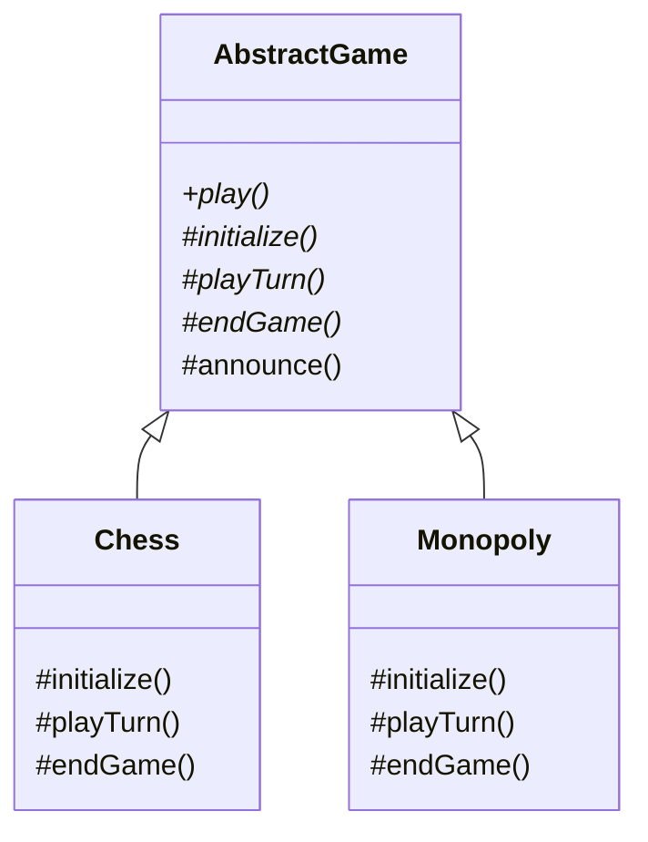

**Template Method** puts the invariant **skeleton** of an algorithm in a base-class method and
defers the varying steps to subclasses. The overall sequence is fixed and defined once; subclasses
fill in the blanks by overriding specific step methods.

## Structure



The `play()` template is `final` and orchestrates the steps; abstract steps (`initialize`,
`playTurn`, `endGame`) are the subclass's job. `announce()` is a **hook** — a step with a default
(often empty) body that subclasses *may* override.

## The template + hooks

```java
abstract class DataImporter {
  // The template method: fixed skeleton, made final so the order can't change.
  public final void importData(String file) {
    open(file);
    var rows = parse();       // varies per subclass
    if (shouldValidate())     // hook with a default
      validate(rows);
    save(rows);               // varies per subclass
    close();
  }

  protected abstract List<Row> parse();       // required step
  protected abstract void save(List<Row> r);  // required step

  protected boolean shouldValidate() { return true; }  // hook: overridable default
  protected void validate(List<Row> r) { /* ... */ }
  private void open(String f)  { /* ... */ }
  private void close()         { /* ... */ }
}

class CsvImporter extends DataImporter {
  protected List<Row> parse()      { /* split on commas */ return List.of(); }
  protected void save(List<Row> r) { /* insert rows */ }
}
```

The **Hollywood Principle** applies: "don't call us, we'll call you." The subclass never invokes the
skeleton; the base class calls *down* into the subclass's steps.

## Template Method vs Strategy

| Aspect | Template Method | Strategy |
|--|--|--|
| Mechanism | **Inheritance** — subclass overrides steps | **Composition** — inject an algorithm object |
| Granularity | Varies a few *steps* of a fixed algorithm | Varies the *whole* algorithm |
| Binding | Compile-time (subclass chosen) | Runtime (strategy swapped) |
| Reuse | Skeleton reused, steps specialized | Algorithms reused across contexts |

## JDK examples

- **`java.util.AbstractList`** implements `iterator()`, `indexOf()`, etc. in terms of the abstract
  `get(int)` and `size()` — you override two methods and inherit the rest.
- **`HttpServlet.service()`** is the template: it inspects the HTTP method and dispatches to the
  hooks `doGet()`, `doPost()`, `doPut()`… which you override.

```java
class HelloServlet extends HttpServlet {
  @Override protected void doGet(HttpServletRequest req, HttpServletResponse res)
      throws IOException {
    res.getWriter().write("Hello");   // just fill in one step
  }
}
```

Also: `AbstractMap`, `InputStream.read(byte[])` (delegates to the abstract `read()`), and
`Collections.sort` calling your `Comparable.compareTo`.

:::gotcha
Never let subclasses override the template method itself — mark it **`final`**. And keep the number
of abstract steps small: a template with a dozen abstract methods becomes a fragile,
hard-to-implement base class.
:::

## Check yourself

```quiz
title: Template Method check
questions:
  - q: 'What lives in the base class vs the subclass?'
    options:
      - text: 'The base class holds the fixed algorithm skeleton; subclasses override individual steps'
        correct: true
      - 'The base class holds the steps; the subclass holds the skeleton'
      - 'Both hold complete, independent algorithms'
    explain: 'The invariant sequence is defined once in the base template method; subclasses only supply the varying steps.'
  - q: 'What is a hook method?'
    options:
      - 'A step that must be overridden'
      - text: 'A step with a default (often empty) body that subclasses may optionally override'
        correct: true
      - 'The template method itself'
    explain: 'A hook provides a sensible default and gives subclasses an optional extension point.'
  - q: 'Which is a JDK Template Method?'
    options:
      - text: '`HttpServlet.service()` dispatching to `doGet`/`doPost`'
        correct: true
      - '`ArrayList.add`'
      - '`Optional.of`'
    explain: '`service()` defines the request-handling skeleton and calls the `doXxx` hooks you override.'
```

:::key
Template Method = a `final` skeleton method in a base class that calls abstract steps and optional
**hooks** overridden by subclasses (Hollywood Principle). It uses **inheritance** where Strategy
uses **composition**. JDK: **`AbstractList`**, **`HttpServlet.service`**.
:::
