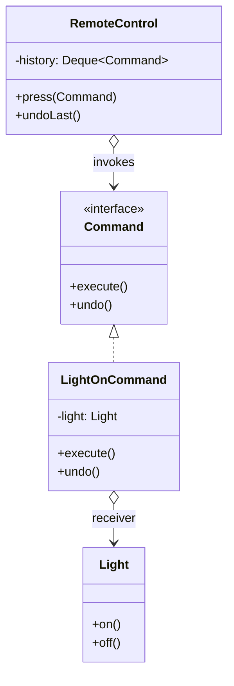
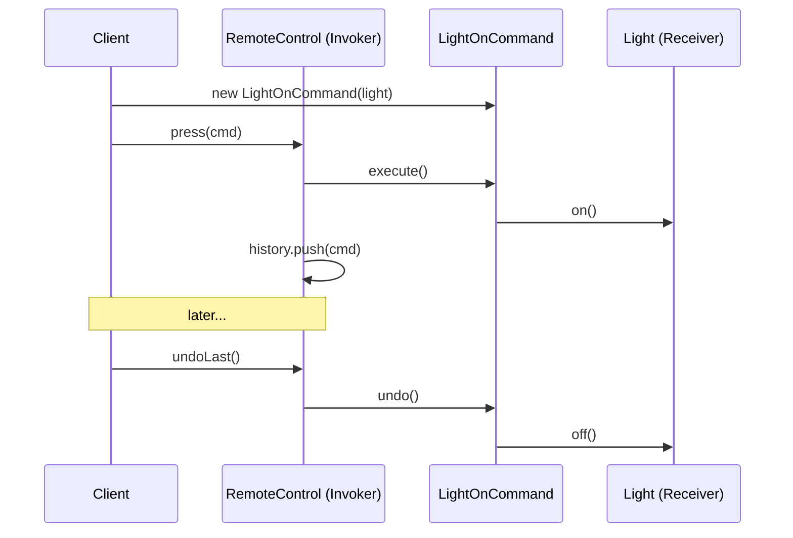

**Command** turns a request into a standalone object carrying everything needed to perform it. That
object can be passed around, stored, queued, logged, and — crucially — **undone**. It decouples the
**invoker** (what triggers the action) from the **receiver** (what does the work).

## Structure



Four roles: **Command** (interface), **ConcreteCommand** (binds a receiver to an action),
**Receiver** (does the real work), and **Invoker** (holds and triggers commands).

## The invoke → command → receiver flow



## Implementation with undo

```java
interface Command {
  void execute();
  void undo();
}

class LightOnCommand implements Command {
  private final Light light;
  LightOnCommand(Light light) { this.light = light; }
  public void execute() { light.on(); }
  public void undo()    { light.off(); }
}

class RemoteControl {                    // Invoker
  private final Deque<Command> history = new ArrayDeque<>();
  public void press(Command c) { c.execute(); history.push(c); }
  public void undoLast() { if (!history.isEmpty()) history.pop().undo(); }
}
```

Because a command is just an object, you can put it on a queue for a thread pool, serialize it to a
log for replay, or stack executed commands to build multi-level **undo/redo**.

## What Command buys you

| Capability | How Command enables it |
|--|--|
| Undo / redo | Each command knows how to reverse itself; keep a history stack |
| Queuing / scheduling | Commands are objects — enqueue and run later on a worker |
| Logging / replay | Serialize executed commands; re-run to rebuild state |
| Macro commands | A composite command that runs a list of commands |
| Decoupling | Invoker triggers work without knowing the receiver's API |

## JDK examples

- **`java.lang.Runnable`** is Command at its purest: `run()` is `execute()`, and an
  `ExecutorService` is the invoker that queues and runs it.
- **`javax.swing.Action`** (and `AbstractAction`) wraps a UI action as a reusable command shared by
  a button, menu item, and keystroke.

```java
Runnable task = () -> System.out.println("work");   // a command
ExecutorService pool = Executors.newFixedThreadPool(2);
pool.submit(task);   // invoker queues and executes it
```

Also: `Callable<V>` (a command that returns a result) and `TimerTask`.

:::senior
Command is the backbone of the event/action layer in editors, IDEs, and task queues. Pair it with a
`Deque` for undo/redo, and make each command self-contained (capture the state needed to reverse it
at construction time) so replay and undo don't depend on mutable external state.
:::

## Check yourself

```quiz
title: Command check
questions:
  - q: 'What is the core idea of Command?'
    options:
      - text: 'Encapsulate a request as an object so it can be stored, queued, logged, and undone'
        correct: true
      - 'Ensure a class has only one instance'
      - 'Notify many observers when state changes'
    explain: 'Command reifies a request into an object carrying the receiver and the action, enabling undo, queuing, and logging.'
  - q: 'Which role actually performs the work?'
    options:
      - 'The invoker'
      - text: 'The receiver'
        correct: true
      - 'The client'
    explain: 'The concrete command delegates to the receiver, which contains the real business logic; the invoker just triggers execute().'
  - q: 'Why is `Runnable` considered a Command?'
    options:
      - 'It guarantees thread safety'
      - text: 'It packages an action as an object that an executor can queue and run later'
        correct: true
      - 'It always returns a value'
    explain: '`run()` is the execute() of a command; an ExecutorService is the invoker that stores and runs it.'
```

:::key
Command = a request as an object binding a **receiver** to an action, triggered by an **invoker**.
Enables **undo/redo** (history stack), queuing, logging, and macros. JDK: **`Runnable`** (with
`ExecutorService`), **`Action`**.
:::
