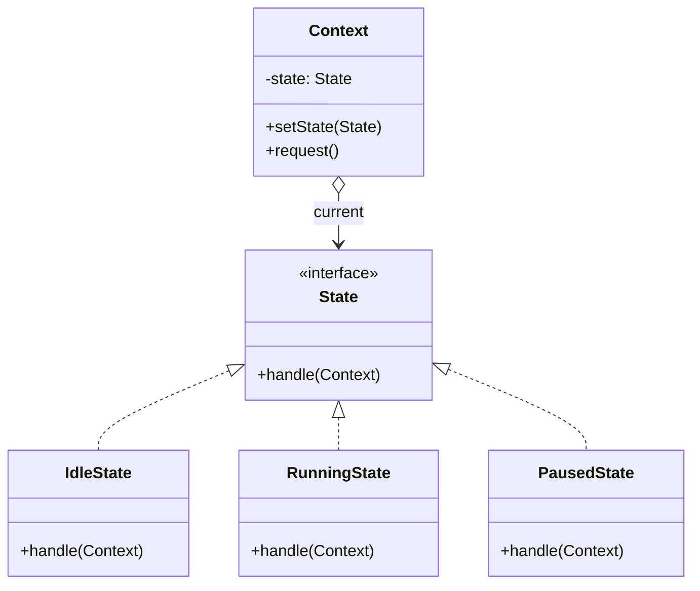

**State** lets an object change its behaviour when its internal state changes — it appears to change
class. Each state becomes its own object implementing a common interface; the **context** delegates
to its current state and lets that state decide the next one. It replaces a sprawling
`switch (this.state)` with polymorphism.

## Structure



Each concrete state implements the behaviour for that state **and** the legal transitions out of it,
typically by calling `context.setState(next)`.

## A media player state machine

```java
interface PlayerState { void press(Player p); }

class Stopped implements PlayerState {
  public void press(Player p) { System.out.println("play"); p.setState(new Playing()); }
}
class Playing implements PlayerState {
  public void press(Player p) { System.out.println("pause"); p.setState(new Paused()); }
}
class Paused implements PlayerState {
  public void press(Player p) { System.out.println("resume"); p.setState(new Playing()); }
}

class Player {                       // Context
  private PlayerState state = new Stopped();
  void setState(PlayerState s) { this.state = s; }
  void pressPlay() { state.press(this); }   // behaviour depends on current state
}
```

Pressing the same button does different things depending on state — and the transition rules live
*with* each state, not in one giant conditional.

## State vs Strategy

They share an identical class diagram, which is exactly why interviewers probe the difference. The
**intent** is what separates them.

| Aspect | State | Strategy |
|--|--|--|
| Intent | Behaviour changes as internal **state** evolves | Client chooses an **algorithm** |
| Who switches | The states switch the context themselves | An external client sets the strategy |
| Transitions | States know and drive transitions to other states | Strategies are independent; no awareness of each other |
| Lifetime | Changes many times over the object's life | Usually set once, per use |
| Mental model | A finite state machine | A pluggable algorithm slot |

:::key
Both delegate to an interface via composition. The tell: **State objects transition to each other
and know their siblings; Strategy objects don't** — the client picks a Strategy, the object picks
its next State.
:::

## When to reach for it

- An object's behaviour depends on its state and it has many states with distinct rules.
- You have large multi-branch conditionals keyed on a state field, repeated across methods.
- Order/document/connection workflows: `Draft → Submitted → Approved → Shipped`, TCP connection
  states, vending machines, UI wizards.

:::gotcha
Stateless state objects can be **shared singletons** (or `enum` constants) to avoid allocating a new
instance on every transition. Only give a state its own instance if it holds per-context data.
:::

## Check yourself

```quiz
title: State check
questions:
  - q: 'What does the State pattern replace?'
    options:
      - text: 'Large conditionals that branch on a state field, spread across methods'
        correct: true
      - 'A single global instance'
      - 'Manual object construction'
    explain: 'Each state becomes a class; the context delegates, so behaviour changes by swapping the state object instead of branching.'
  - q: 'How does State differ from Strategy despite the same diagram?'
    options:
      - 'State uses inheritance, Strategy uses composition'
      - text: 'State objects drive transitions to one another; a Strategy is chosen by the client and is unaware of other strategies'
        correct: true
      - 'They are actually the same pattern'
    explain: 'Intent is the difference: State models a state machine where states know their successors; Strategy is a client-selected algorithm.'
  - q: 'When can state objects be shared as singletons?'
    options:
      - 'Never — each transition needs a new object'
      - text: 'When they are stateless (hold no per-context data)'
        correct: true
      - 'Only when using enums'
    explain: 'Stateless state objects carry no instance data, so one shared instance can serve every context safely.'
```

:::key
State = an object whose behaviour changes with its internal state, each state a class implementing a
shared interface; the context delegates and states drive their own transitions — a polymorphic
**finite state machine**. Same diagram as **Strategy**, different **intent**.
:::
