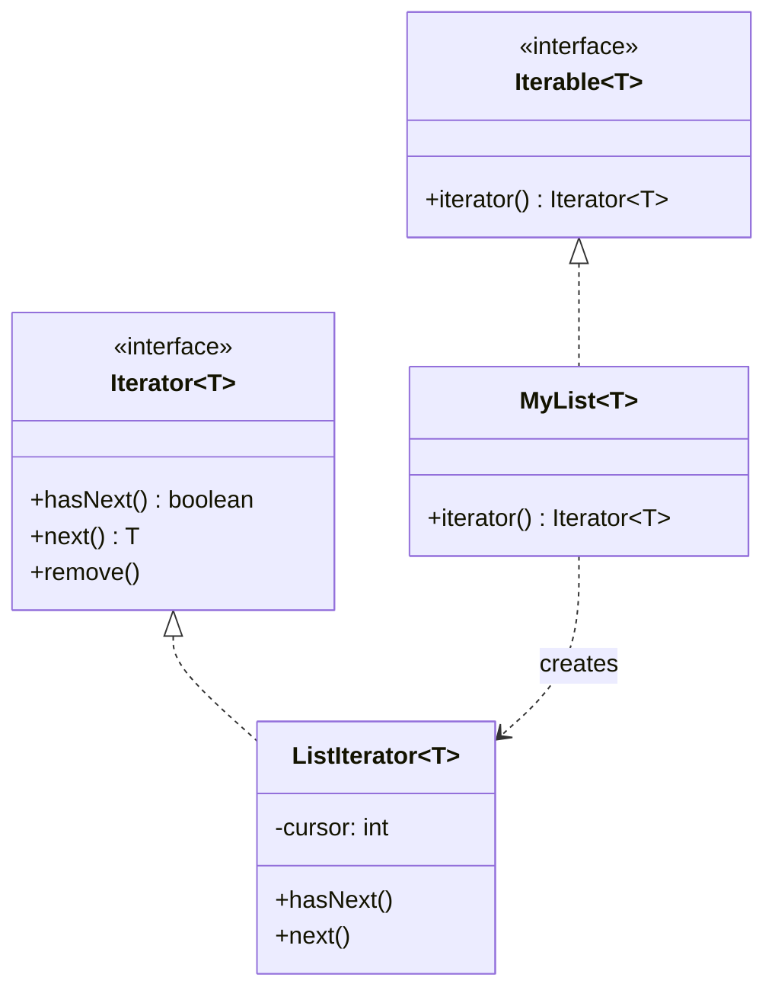

**Iterator** provides a uniform way to traverse the elements of an aggregate (list, tree, set)
**without exposing** how that aggregate stores them. The traversal logic and cursor state live in a
separate iterator object, so multiple independent traversals can run at once and the collection's
internals stay hidden.

## Structure



The **aggregate** (`Iterable`) exposes a factory method `iterator()`; the **iterator** holds the
cursor and answers `hasNext()` / `next()`. The client traverses through the interface, never the
storage.

## Rolling your own

```java
class Range implements Iterable<Integer> {
  private final int from, to;
  Range(int from, int to) { this.from = from; this.to = to; }

  public Iterator<Integer> iterator() {
    return new Iterator<>() {
      private int cur = from;
      public boolean hasNext() { return cur < to; }
      public Integer next() {
        if (!hasNext()) throw new NoSuchElementException();
        return cur++;
      }
    };
  }
}

for (int i : new Range(1, 4)) System.out.print(i);   // 123 — the for-each contract
```

Implementing `Iterable` is what makes the **enhanced `for` loop** work: the compiler desugars
`for (T x : coll)` into calls to `iterator()`, `hasNext()`, and `next()`.

## Internal vs external iterators

| Aspect | External (`Iterator`) | Internal (`forEach`, Streams) |
|--|--|--|
| Who controls the loop | The client pulls each element | The collection pushes to your lambda |
| Flexibility | Can pause, break, iterate two collections in step | Simpler, less error-prone, parallelizable |
| Example | `while (it.hasNext())` | `list.forEach(System.out::println)` |

## JDK example: `Iterator` / `Iterable` and fail-fast

The entire Collections Framework is built on `Iterable`/`Iterator`. Their iterators are
**fail-fast**: they track a `modCount`, and if the collection is structurally modified during
iteration (other than via the iterator's own `remove()`), the next `next()` throws
`ConcurrentModificationException`.

```java
List<String> list = new ArrayList<>(List.of("a", "b", "c"));
for (String s : list) {
  if (s.equals("b")) list.remove(s);   // ConcurrentModificationException!
}

// Correct: mutate through the iterator
Iterator<String> it = list.iterator();
while (it.hasNext()) {
  if (it.next().equals("b")) it.remove();   // safe
}
```

:::gotcha
Fail-fast is a **best-effort bug detector, not a guarantee** — never write logic that depends on
`ConcurrentModificationException`. For concurrent traversal use a `CopyOnWriteArrayList` or
`ConcurrentHashMap`, whose iterators are **weakly consistent** (they don't throw and reflect some,
not necessarily all, concurrent updates).
:::

## Check yourself

```quiz
title: Iterator check
questions:
  - q: 'What is the primary goal of the Iterator pattern?'
    options:
      - text: 'Traverse a collection sequentially without exposing its internal structure'
        correct: true
      - 'Guarantee a single instance of a collection'
      - 'Convert one interface into another'
    explain: 'Iterator decouples traversal from storage, so clients iterate uniformly regardless of the underlying representation.'
  - q: 'Which interface must a class implement to be used in an enhanced for loop?'
    options:
      - '`Comparable`'
      - text: '`Iterable`'
        correct: true
      - '`Cloneable`'
    explain: 'The for-each loop desugars to calls on `iterator()`, so the class must implement `Iterable`.'
  - q: 'What does a fail-fast iterator do on concurrent structural modification?'
    options:
      - 'Silently skips the modified element'
      - text: 'Throws `ConcurrentModificationException` on a best-effort basis'
        correct: true
      - 'Blocks until modification finishes'
    explain: 'It tracks modCount and throws CME when the collection changes underneath it — a best-effort check, not a guarantee.'
```

:::key
Iterator = sequential access to an aggregate without exposing its structure; the aggregate is
**`Iterable`**, the cursor is **`Iterator`** (`hasNext`/`next`). Powers the enhanced `for`. JDK
iterators are **fail-fast** (`ConcurrentModificationException`); concurrent ones are weakly
consistent.
:::
