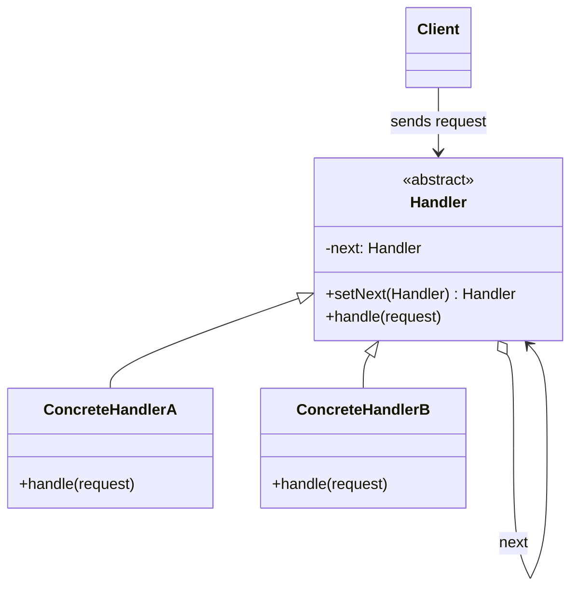
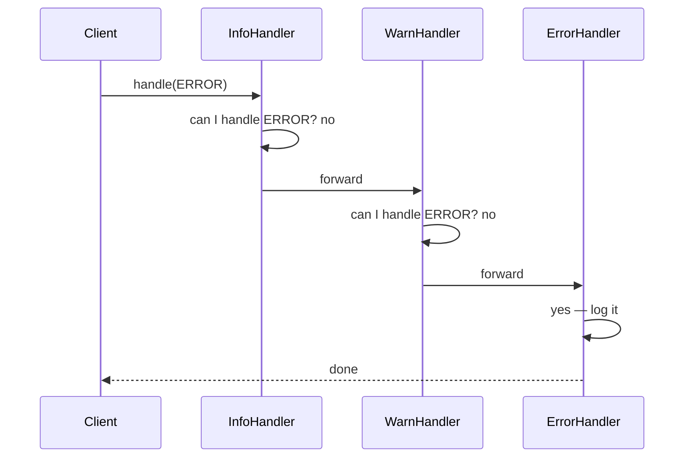

**Chain of Responsibility** lets you pass a request along a **chain of handlers**. Each handler
decides either to process the request or to forward it to the next handler. The sender never knows
*which* handler will act — it just drops the request onto the chain.

## Structure



Each handler holds a reference to the **next** link. It handles what it can, then delegates the rest.

## The request travelling the chain



## Before / after

Without the pattern the sender owns a tangle of `if/else`. With it, each concern is one small,
reorderable handler.

````tabs
tabs:
  - label: Before (nested ifs)
    body: |
      The sender knows every level and branches on all of them.
      ```java
      void log(int level, String msg) {
        if (level >= ERROR)      System.err.println(msg);
        else if (level >= WARN)  writeFile(msg);
        else if (level >= INFO)  System.out.println(msg);
      }
      ```
  - label: After (chain)
    body: |
      Each handler owns one level; the client just calls the head of the chain.
      ```java
      abstract class Logger {
        private Logger next;
        protected int level;
        Logger linkWith(Logger n) { this.next = n; return n; }
        public void log(int lvl, String msg) {
          if (lvl >= level) write(msg);
          if (next != null) next.log(lvl, msg);
        }
        protected abstract void write(String msg);
      }
      // Logger chain = info; info.linkWith(warn).linkWith(error);
      // chain.log(ERROR, "boom");
      ```
````

## Two flavours

| Flavour | Behaviour | Example |
|--|--|--|
| **Pure** — first match wins | Exactly one handler processes it, then stops | Exception dispatch, event bubbling that calls `consume()` |
| **Broadcast** — everyone gets a look | Every handler runs; request always flows to the end | Servlet filter chain, logging levels above |

## Real JDK / framework examples

- **`javax.servlet.Filter`** — `doFilter(req, res, chain)` calls `chain.doFilter(...)` to pass
  control to the next filter. Authentication, compression, and logging are separate filters on one chain.
- **`java.util.logging`** — a `Logger` delegates to its **parent logger** up the hierarchy.
- **Spring Security `FilterChainProxy`** and Netty's `ChannelPipeline` are the same idea at scale.

:::tip
The two knobs of the pattern are **order** and **whether a handler stops the chain**. Reordering
handlers or having one call `chain.next(...)` (or not) changes behaviour without touching the client.
:::

:::gotcha
A request can fall off the **end** of the chain unhandled. Decide deliberately: either guarantee a
catch-all terminal handler, or document that "no handler took it" is a valid outcome.
:::

:::senior
Chain of Responsibility is the backbone of **middleware** pipelines (Express, ASP.NET, Servlet
filters). The power is runtime composition: you build the chain from config, so adding a rate-limiter
is "insert one handler," not "edit the request path."
:::

## Check yourself

```quiz
title: Chain of Responsibility check
questions:
  - q: 'What is the defining trait of Chain of Responsibility?'
    options:
      - 'One object notifies many observers of a state change'
      - text: 'A request is passed along handlers until one (or all) handle it'
        correct: true
      - 'A single object controls creation of others'
    explain: 'The sender is decoupled from the receiver — it hands the request to the head of the chain and lets the handlers decide.'
  - q: 'Which is a real JDK example of the pattern?'
    options:
      - text: 'The `javax.servlet.Filter` chain'
        correct: true
      - '`java.util.Comparator`'
      - '`java.lang.Runnable`'
    explain: 'Each `Filter` calls `chain.doFilter(...)` to forward the request to the next filter — a broadcast chain.'
  - q: 'A request reaches the end of the chain with no handler acting. What does this signal?'
    options:
      - 'A compile error'
      - text: 'A design decision you must make explicit — add a terminal handler or accept "unhandled"'
        correct: true
      - 'The chain automatically retries from the start'
    explain: 'Nothing forces a handler to act. Either provide a catch-all terminal handler or treat unhandled as a valid, documented outcome.'
```

:::key
Chain of Responsibility = a linked list of handlers; the request flows along it until one handles it
(pure) or all do (broadcast). It decouples sender from receiver and makes the pipeline reorderable.
Canonical JDK case: the **Servlet `Filter`** chain.
:::
