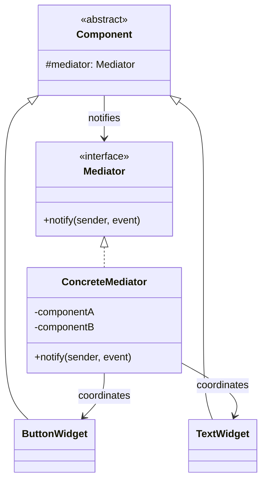

**Mediator** introduces a single object that encapsulates how a set of objects interact. Instead of
each object holding references to every other object (an `n×n` web), they all talk to **one
mediator**, which routes the messages. It turns a mesh into a hub-and-spoke.

## Structure



Colleagues know only the mediator, never each other. All cross-object logic lives in the mediator.

## Before / after

The classic case is a UI dialog whose widgets react to each other.

````tabs
tabs:
  - label: Before (mesh)
    body: |
      Every widget references every other widget — change one and you touch them all.
      ```java
      class Checkbox {
        TextField field; SubmitButton button; // knows siblings
        void onToggle(boolean on) {
          field.setEnabled(on);
          button.setEnabled(on && field.isValid());
        }
      }
      ```
  - label: After (mediator)
    body: |
      Widgets fire events at the mediator; the mediator owns all coordination.
      ```java
      interface Mediator { void notify(Component sender, String event); }

      class DialogMediator implements Mediator {
        Checkbox agree; TextField field; SubmitButton button;
        public void notify(Component sender, String event) {
          if (sender == agree) field.setEnabled(agree.isOn());
          button.setEnabled(agree.isOn() && field.isValid());
        }
      }
      // each widget: mediator.notify(this, "toggled");
      ```
````

## Mediator vs Observer

These two are often confused — both decouple objects, but the intent differs.

| | **Mediator** | **Observer** |
|--|--|--|
| Intent | Centralize **complex mutual interaction** among peers | **One-to-many** notification of state changes |
| Direction | Bidirectional — colleagues talk *through* the hub | One-way — subject → subscribers |
| Who knows whom | Colleagues know only the mediator | Observers subscribe to the subject |
| Logic location | Coordination logic lives **in the mediator** | Subject just broadcasts; observers decide what to do |
| Typical use | Dialog widgets, air-traffic control, chat room | Event listeners, model→view updates, pub/sub |

:::note
A mediator often *uses* observer internally (colleagues "notify" it). The distinction is intent:
Observer broadcasts an event; Mediator applies **rules** about how peers should react to each other.
:::

## Real JDK / framework examples

- **`java.util.concurrent.ScheduledExecutorService`** and `Executor` implementations mediate between
  task submitters and worker threads.
- **`java.util.Timer`** mediates scheduling between clients and its background thread.
- Frameworks: the Spring `ApplicationContext` mediates bean wiring; the **MediatR** library (.NET)
  and message buses generalize the idea to request routing.

:::gotcha
The mediator can rot into a **god object** — every rule for every colleague piles into one class.
When it grows unwieldy, split it (one mediator per feature) rather than letting it absorb the whole app.
:::

:::senior
Mediator trades many small couplings for one central coupling. That is a win when interaction logic
is genuinely cross-cutting (a form, a workflow) and a loss when it just relocates a mess. The health
check: does the mediator hold *coordination* rules, or has it also swallowed each colleague's *own* logic?
:::

## Check yourself

```quiz
title: Mediator check
questions:
  - q: 'What problem does Mediator primarily solve?'
    options:
      - 'Creating objects without naming their concrete class'
      - text: 'Tangled many-to-many references between interacting objects'
        correct: true
      - 'Restoring an object to a previous state'
    explain: 'It converts an n×n mesh of direct references into a hub-and-spoke, so colleagues depend only on the mediator.'
  - q: 'How does Mediator differ from Observer?'
    options:
      - 'They are identical patterns with different names'
      - text: 'Mediator centralizes complex mutual interaction; Observer is one-to-many state broadcast'
        correct: true
      - 'Observer requires a hub object; Mediator does not'
    explain: 'Observer notifies many subscribers of a change one-way. Mediator holds the rules for how peers react to each other, bidirectionally.'
  - q: 'What is the main risk of the Mediator pattern?'
    options:
      - 'It cannot be made thread-safe'
      - text: 'The mediator can become a god object holding every rule'
        correct: true
      - 'It forces colleagues to know about each other'
    explain: 'Centralizing all interaction can bloat the mediator. Split by feature when it grows unwieldy.'
```

:::key
Mediator = one hub that encapsulates how a set of colleagues interact, turning an `n×n` mesh into
hub-and-spoke. Colleagues know only the mediator. Contrast with **Observer** (one-way one-to-many
broadcast). Watch for the mediator becoming a **god object**.
:::
