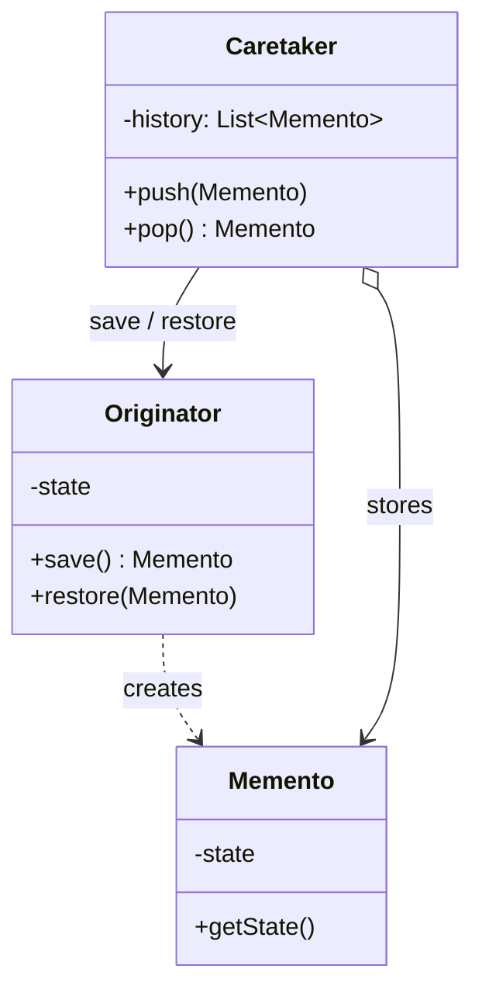
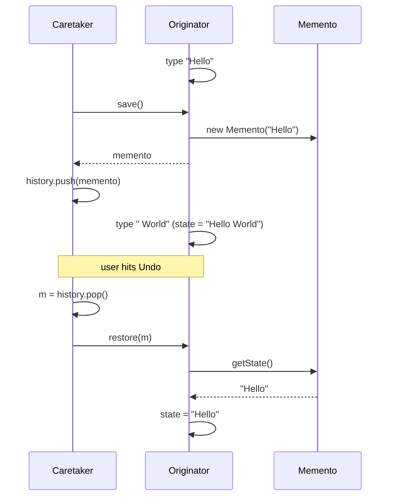

**Memento** captures an object's internal state into an opaque token so it can be restored later —
the essence of **undo** — *without* exposing that object's internals to the outside world. Three roles
collaborate: the **Originator** (owns the state), the **Memento** (the snapshot), and the
**Caretaker** (keeps mementos but never peeks inside).

## Structure



The key: only the **Originator** can read a memento's state. The **Caretaker** holds it as an opaque box.

## Save and restore over time



## Before / after

Without a memento, callers either can't undo, or they reach into the object's fields — breaking encapsulation.

````tabs
tabs:
  - label: Before (leaky)
    body: |
      The caretaker copies out raw fields — now it depends on the editor's internals.
      ```java
      // history stores raw internal state — encapsulation broken
      Deque<String> history = new ArrayDeque<>();
      history.push(editor.text);      // reaching into fields
      // undo:
      editor.text = history.pop();
      ```
  - label: After (memento)
    body: |
      The editor hands out an opaque snapshot; only it can read one back.
      ```java
      class Editor {
        private String text = "";
        void type(String s) { text += s; }
        Memento save()            { return new Memento(text); }
        void restore(Memento m)   { this.text = m.state(); }
        // Note: a record's state() accessor is implicitly public — to truly hide it,
        // make Memento a private nested class or expose only a narrow marker interface
        record Memento(String state) {}
      }

      Deque<Editor.Memento> history = new ArrayDeque<>();
      history.push(editor.save());     // opaque token
      editor.restore(history.pop());   // undo
      ```
````

## Guarding encapsulation

The whole point is that the caretaker cannot mutate or inspect the snapshot. Common techniques:

| Technique | How it hides state |
|--|--|
| **Nested class** | Memento is `private`/inner; only the enclosing Originator can call its accessors |
| **Narrow interface** | Caretaker sees an empty marker interface; Originator sees the full class |
| **Immutable snapshot** | Use a `record` / final fields so the token can't be tampered with |

:::gotcha
A memento must be a **deep enough copy**. If it stores references to mutable objects the Originator
keeps editing, "restore" will bring back the *current* values, not the saved ones. Snapshot value copies.
:::

## Real JDK examples

- **`java.util.Date`** implements `Cloneable` / is often used to snapshot a moment (value copy of time).
- **`javax.swing.undo.UndoManager`** and `UndoableEdit` are a direct, industrial Memento — each edit
  can `undo()`/`redo()` its captured state.
- Serialization (`java.io.Serializable`) is the coarse, general form: freeze full state to bytes, thaw later.

:::senior
For large state, storing a full snapshot per keystroke is wasteful. Production undo systems store
**deltas** (command-style diffs) or use structural sharing / copy-on-write, keeping only what changed.
Memento is the interface; the storage strategy behind it is a separate optimization.
:::

## Check yourself

```quiz
title: Memento check
questions:
  - q: 'What is the primary purpose of the Memento pattern?'
    options:
      - text: 'Capture and later restore an object''s state without exposing its internals'
        correct: true
      - 'Notify observers when state changes'
      - 'Choose an algorithm at runtime'
    explain: 'Memento externalizes a snapshot so it can be restored (undo) while preserving encapsulation.'
  - q: 'What is the Caretaker allowed to do with a memento?'
    options:
      - 'Read and modify its internal state'
      - text: 'Store and hand it back — but treat it as opaque'
        correct: true
      - 'Merge two mementos together'
    explain: 'Only the Originator may read a memento''s state. The Caretaker keeps it as an opaque token, preserving encapsulation.'
  - q: 'Why can storing a reference (not a copy) inside a memento cause bugs?'
    options:
      - 'It uses more memory'
      - text: 'Later edits mutate the shared object, so restore brings back current values, not the saved ones'
        correct: true
      - 'References cannot be stored in Java collections'
    explain: 'A memento must snapshot values. If it aliases mutable state the Originator keeps editing, the "restore" is meaningless.'
```

:::key
Memento = an opaque snapshot of an Originator's state, held by a Caretaker that can store but not
inspect it — enabling **undo** without breaking encapsulation. Snapshot **values**, not references.
Real example: Swing's **`UndoManager`**.
:::
