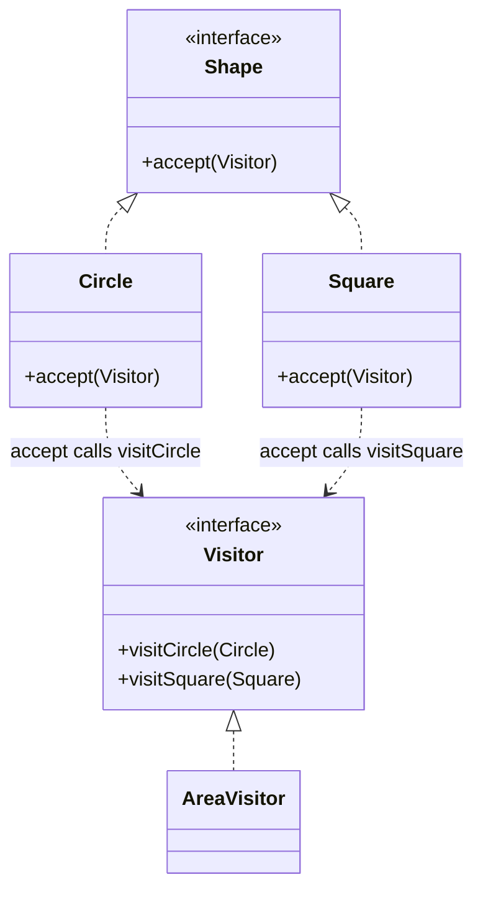

**Visitor** lets you add new operations to an existing class hierarchy **without changing those
classes**. You move the operation into a separate *visitor* object, and each element "accepts" a
visitor by calling back the method for its own type. This trick — picking the method by *both* the
element type and the visitor type — is **double dispatch**.

## Structure



## Double dispatch explained

Java dispatches a normal method call on **one** type (the receiver). Visitor chains **two** virtual
calls to resolve on both:

1. `shape.accept(v)` dispatches on the **shape's** runtime type → lands in `Circle.accept`.
2. Inside it, `v.visitCircle(this)` dispatches on the **visitor's** type → lands in `AreaVisitor.visitCircle`.

The operation chosen depends on *both* concrete types — something a single `if (shape instanceof …)`
chain fakes clumsily.

## Before / after

Say you must compute area, then later perimeter, then serialization, over many shapes.

````tabs
tabs:
  - label: Before (op in each class)
    body: |
      Every new operation edits every shape class — and mixes unrelated concerns into the model.
      ```java
      interface Shape {
        double area();
        double perimeter();   // added later — touches EVERY shape
        String toSvg();       // added later — touches EVERY shape again
      }
      ```
  - label: After (visitor)
    body: |
      Shapes are stable; each new operation is one new visitor class.
      ```java
      interface Shape { <R> R accept(Visitor<R> v); }

      interface Visitor<R> {
        R visitCircle(Circle c);
        R visitSquare(Square s);
      }

      record Circle(double r) implements Shape {
        public <R> R accept(Visitor<R> v) { return v.visitCircle(this); }
      }
      record Square(double side) implements Shape {
        public <R> R accept(Visitor<R> v) { return v.visitSquare(this); }
      }

      class AreaVisitor implements Visitor<Double> {
        public Double visitCircle(Circle c) { return Math.PI * c.r() * c.r(); }
        public Double visitSquare(Square s) { return s.side() * s.side(); }
      }
      // double a = shape.accept(new AreaVisitor());
      ```
````

## The trade-off: two axes of change

Think of the hierarchy as a grid of **element types × operations**. Visitor makes one axis cheap and
the other expensive.

| You want to add… | Cost with Visitor |
|--|--|
| A new **operation** (e.g. `PerimeterVisitor`) | **Cheap** — one new class, touch nothing else |
| A new **element type** (e.g. `Triangle`) | **Painful** — add `visitTriangle` to *every* existing visitor |

:::gotcha
Visitor **inverts** the normal cost model. If your element hierarchy changes often (new node types),
Visitor hurts: every new element breaks the compile of every visitor. Use it only when the set of
element types is **stable** but operations keep multiplying.
:::

## Real JDK examples

- **`javax.lang.model.element.ElementVisitor`** and `TypeVisitor` — the annotation-processing API
  walks program elements with visitors (`visitType`, `visitExecutable`, …).
- **`java.nio.file.FileVisitor`** — `Files.walkFileTree(...)` calls back `visitFile`, `preVisitDirectory`, etc.
- Compilers and interpreters use Visitor to run passes (type-check, optimize, codegen) over an **AST**.

:::senior
Modern Java offers a rival: **sealed interfaces + pattern-matching `switch`**. A `switch` over a
sealed `Shape` gives exhaustiveness checks and keeps the operation in one place *without* the accept
boilerplate — and adding an element type is caught at compile time. Reach for classic Visitor mainly
when you can't seal the hierarchy or must support pre-pattern-matching Java.
:::

## Check yourself

```quiz
title: Visitor check
questions:
  - q: 'What does the Visitor pattern let you add cheaply?'
    options:
      - text: 'New operations over a stable set of element types'
        correct: true
      - 'New element types to a stable set of operations'
      - 'New instances of a singleton'
    explain: 'Each new operation is one new visitor class; you never touch the element classes. Adding element *types* is the expensive direction.'
  - q: 'What is "double dispatch" in the Visitor pattern?'
    options:
      - 'Calling a method twice for safety'
      - text: 'Resolving the operation on both the element type and the visitor type via two chained virtual calls'
        correct: true
      - 'Dispatching a request across two threads'
    explain: '`element.accept(v)` dispatches on the element, then `v.visitX(this)` dispatches on the visitor — the method chosen depends on both concrete types.'
  - q: 'When does Visitor hurt the most?'
    options:
      - 'When operations are added frequently'
      - text: 'When new element types are added frequently'
        correct: true
      - 'When the hierarchy has only one element type'
    explain: 'Each new element type forces a new visit method in every existing visitor. Visitor assumes the element set is stable.'
```

:::key
Visitor = move operations out of a class hierarchy into visitor objects, using **double dispatch**
(`accept` → `visitX`) to resolve on both types. Cheap to add **operations**, painful to add
**element types**. JDK examples: `FileVisitor`, `ElementVisitor`. Sealed types + pattern-matching
`switch` is the modern alternative.
:::
