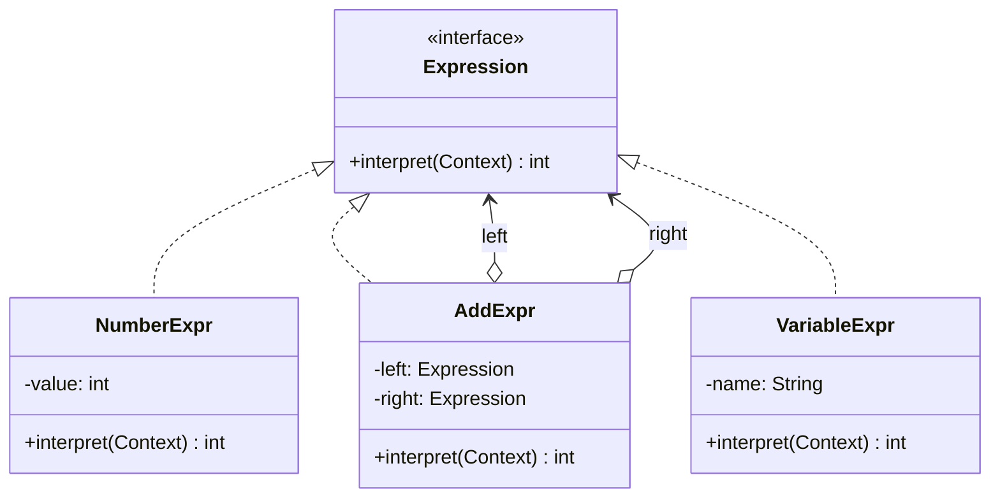

**Interpreter** defines a representation for a simple **grammar** plus an interpreter that uses the
representation to evaluate sentences in that language. Each grammar rule becomes a class; a parsed
expression becomes a **tree** of those classes, and evaluation is a recursive walk over the tree.

## Structure



**Terminal** expressions (numbers, variables) are the leaves; **non-terminal** expressions (`+`, `*`)
compose sub-expressions — a textbook **Composite** with an `interpret` operation.

## Before / after

Evaluate `"5 + x"` where `x = 3`. The tree is `Add(Number(5), Variable("x"))`.

````tabs
tabs:
  - label: The grammar classes
    body: |
      Each rule is one class; every node knows how to interpret itself.
      ```java
      interface Expr { int interpret(Map<String,Integer> ctx); }

      record Num(int value) implements Expr {
        public int interpret(Map<String,Integer> ctx) { return value; }
      }
      record Var(String name) implements Expr {
        public int interpret(Map<String,Integer> ctx) { return ctx.get(name); }
      }
      record Add(Expr left, Expr right) implements Expr {
        public int interpret(Map<String,Integer> ctx) {
          return left.interpret(ctx) + right.interpret(ctx);
        }
      }
      ```
  - label: Building and evaluating
    body: |
      Assemble the tree, supply a context, and interpret recursively.
      ```java
      Expr tree = new Add(new Num(5), new Var("x"));
      int result = tree.interpret(Map.of("x", 3)); // 8
      ```
````

## When it applies — and why it is rare

| Fits when | Reality check |
|--|--|
| The grammar is **small and stable** | Real languages need a proper parser + AST, not hand-written node classes |
| You evaluate the same expressions many times | For anything non-trivial, use a parser generator (ANTLR, JavaCC) |
| Rules map cleanly one-to-one to classes | The class-per-rule explosion gets unmanageable fast |

:::warning
Interpreter is the **least-used GoF pattern** in everyday application code. Building a real language
by hand-coding a class per rule does not scale — you reach for a parsing library or an existing
expression engine long before this pattern pays off.
:::

## Real-world examples

- **`java.util.regex.Pattern`** — a compiled regex is an internal tree of matcher nodes that
  "interpret" input; the classic cited JDK example of the pattern's spirit.
- **`java.text.Format` / `MessageFormat`** — interpret a mini format grammar.
- **Spring Expression Language (SpEL)** and expression evaluators follow the same tree-walk idea.

:::senior
The Interpreter pattern is worth *knowing* mainly to recognize its shape (a Composite tree with an
`interpret` method) and to know when **not** to build it. For DSLs, prefer a real parser and separate
the AST from evaluation — often with a **Visitor** running passes over the tree, which sidesteps
Interpreter's rigidity.
:::

## Check yourself

```quiz
title: Interpreter check
questions:
  - q: 'How does the Interpreter pattern represent a grammar?'
    options:
      - text: 'One class per grammar rule, composed into a tree that evaluates recursively'
        correct: true
      - 'A single switch statement over token strings'
      - 'A hash map from expression text to results'
    explain: 'Each rule becomes a class; terminals are leaves and non-terminals compose sub-expressions — a Composite tree walked by interpret().'
  - q: 'Why is Interpreter rarely used in practice?'
    options:
      - 'It is not thread-safe'
      - text: 'Hand-coding a class per rule does not scale; real grammars use parser generators'
        correct: true
      - 'The JVM forbids recursive evaluation'
    explain: 'For anything beyond a tiny, stable grammar, a parser library (ANTLR, JavaCC) or existing expression engine is far more practical.'
  - q: 'Which JDK type is commonly cited as embodying the Interpreter idea?'
    options:
      - '`java.util.ArrayList`'
      - text: '`java.util.regex.Pattern`'
        correct: true
      - '`java.lang.Thread`'
    explain: 'A compiled `Pattern` is an internal tree of nodes that interpret the input string — the spirit of the pattern.'
```

:::key
Interpreter = a class per grammar rule, assembled into a Composite tree that evaluates via a
recursive `interpret(context)`. It fits only **small, stable grammars** and is the **least-used** GoF
pattern — prefer a real parser for anything serious. Cited JDK example: **`java.util.regex.Pattern`**.
:::
