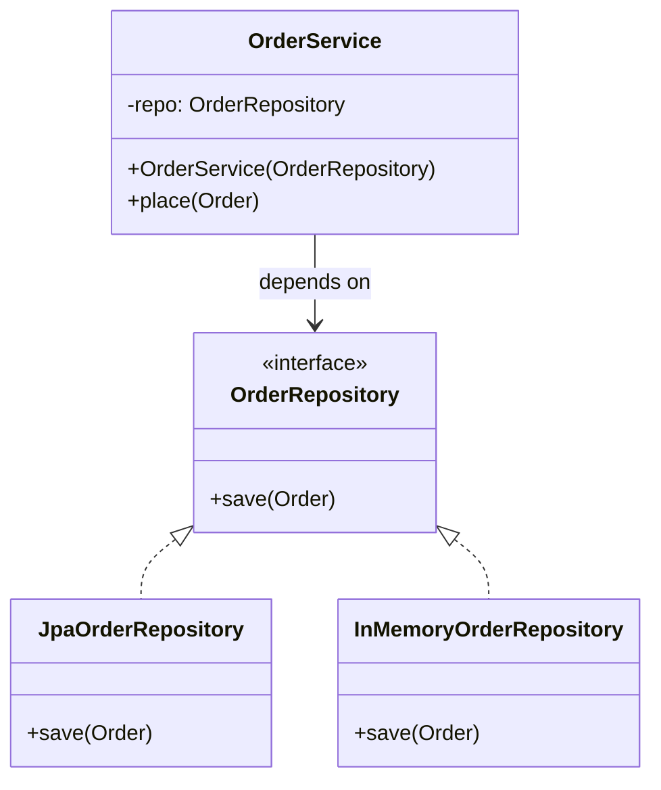
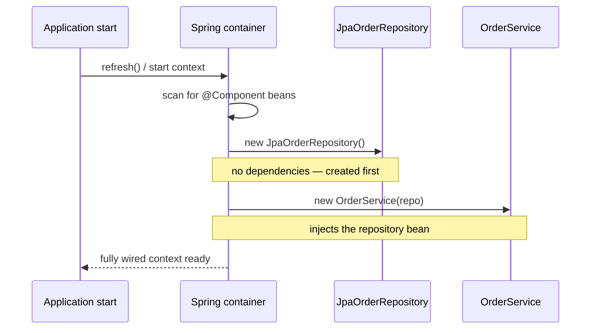

**Dependency Injection (DI)** is the practice of *giving* an object the things it depends on,
rather than letting it construct or look them up itself. It is the most common concrete form of
the broader **Inversion of Control (IoC)** principle.

## Inversion of Control, in one line

Normally *your* code calls into a library. With **IoC**, control is inverted: a framework (or
some wiring code) creates your objects and calls *you*, supplying whatever you need. DI is IoC
applied to **dependencies** — who decides which concrete collaborator a class uses.

The rule of thumb: **a class should declare what it needs, not how to get it.**

## Structure — depend on an interface, inject the implementation



`OrderService` never names a concrete repository. It depends on the **`OrderRepository`
interface**; production wires in `JpaOrderRepository`, a test wires in
`InMemoryOrderRepository`. Nothing in the service changes.

## `new` inside vs injected

````tabs
tabs:
  - label: Coupled (new inside)
    body: |
      The service **hard-codes** its dependency. You cannot swap the repository, and a unit test
      is forced to hit a real database.
      ```java
      public class OrderService {
        private final OrderRepository repo = new JpaOrderRepository(); // hidden dependency

        public void place(Order o) {
          repo.save(o);
        }
      }
      ```
  - label: Injected (constructor)
    body: |
      The dependency is **declared and handed in**. Swap it freely; tests pass a fake.
      ```java
      public class OrderService {
        private final OrderRepository repo;

        public OrderService(OrderRepository repo) { // dependency made explicit
          this.repo = repo;
        }

        public void place(Order o) {
          repo.save(o);
        }
      }
      // new OrderService(new JpaOrderRepository());     // production
      // new OrderService(new InMemoryOrderRepository()); // test
      ```
````

## Constructor vs setter injection

| | Constructor injection | Setter injection |
|--|--|--|
| When wired | At construction — object is never half-built | After construction, via a setter |
| Required deps | Enforced — cannot create the object without them | Not enforced — may be `null` until set |
| Immutability | Fields can be `final` | Fields must stay mutable |
| Best for | **Mandatory** collaborators (the default choice) | **Optional** or reconfigurable dependencies |

:::tip
Prefer **constructor injection**. It makes dependencies explicit and mandatory, allows `final`
fields, and guarantees the object is fully valid the moment it exists. Reach for setter
injection only for genuinely optional dependencies.
:::

## DI containers (Spring)

For a handful of objects you can wire dependencies by hand in `main()`. As the graph grows,
a **DI container** (Spring, Guice, CDI) does the wiring for you: you *declare* components and
the container constructs them in dependency order and injects each one.

```java
@Service
public class OrderService {
  private final OrderRepository repo;

  public OrderService(OrderRepository repo) { // Spring injects a matching bean
    this.repo = repo;
  }
}

@Repository
public class JpaOrderRepository implements OrderRepository { /* ... */ }
```

Spring scans for `@Service` / `@Repository` beans, sees `OrderService` needs an
`OrderRepository`, finds `JpaOrderRepository`, and passes it in — no `new` in sight.

### How the container wires the graph



The container builds a dependency graph, instantiates leaves first, and injects them upward —
resolving order automatically and failing fast if a required bean is missing.

## DI vs Singleton for shared instances

Both give you a **single shared instance**, but they differ on *how* code gets it.

| | Singleton pattern | DI singleton-scoped bean |
|--|--|--|
| Access | Global static `getInstance()` | Injected as a normal dependency |
| Coupling | Callers hard-reference the concrete class | Callers depend on an interface |
| Testability | Hard — cannot swap the static instance | Easy — inject a mock/fake |
| Lifecycle | Managed by the class itself | Managed by the container |

:::senior
A Spring bean is a singleton **by default** — one instance per container — yet it is *not* the
Singleton **pattern**. There is no global static accessor and no private constructor; the
container owns the single instance and injects it wherever it is needed. You get "one instance"
without the global mutable state that makes the classic Singleton hard to test. **When you need
a shared instance, prefer a DI-managed singleton over the Singleton pattern.**
:::

:::gotcha
DI does not mean "always use a framework." Injecting dependencies through a plain constructor is
DI too — often called *poor man's DI*. The pattern is the decoupling; the container is just an
optional convenience for large graphs.
:::

## Check yourself

```quiz
title: Dependency Injection check
questions:
  - q: 'What is the core idea of Dependency Injection?'
    options:
      - 'A class creates its own dependencies with `new`'
      - text: 'A class receives its dependencies from the outside instead of constructing them'
        correct: true
      - 'A class exposes its dependencies as public static fields'
    explain: 'DI hands a class its collaborators, so it declares what it needs rather than how to obtain them.'
  - q: 'Why is constructor injection usually preferred over setter injection?'
    options:
      - 'It is faster at runtime'
      - text: 'Dependencies are mandatory and set once, so the object is always fully valid and fields can be `final`'
        correct: true
      - 'It avoids the need for interfaces'
    explain: 'Constructor injection enforces required dependencies at construction time and supports immutable `final` fields.'
  - q: 'How does a Spring singleton-scoped bean differ from the Singleton pattern?'
    options:
      - 'It creates a new instance on every call'
      - text: 'The container owns the single instance and injects it — there is no global static accessor'
        correct: true
      - 'It cannot be shared between classes'
    explain: 'Both give one shared instance, but a DI bean is injected (mockable) rather than fetched via a global static method.'
```

:::key
DI = give a class its dependencies from outside; it is **IoC** applied to dependencies. Depend on
**interfaces**, prefer **constructor injection**, and let a **container** wire large graphs. For
shared instances, a **DI-managed singleton** beats the **Singleton pattern** because it stays
mockable and free of global static state.
:::
