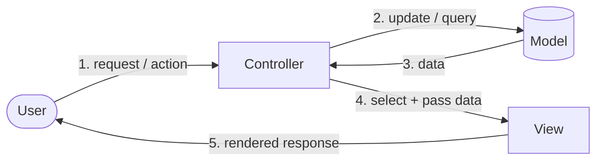
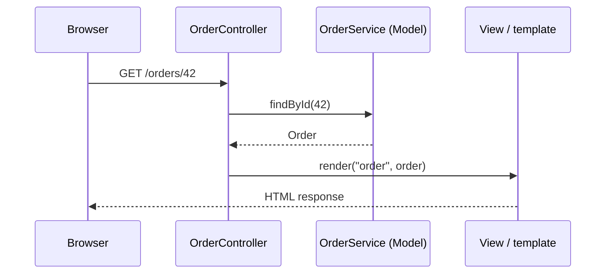
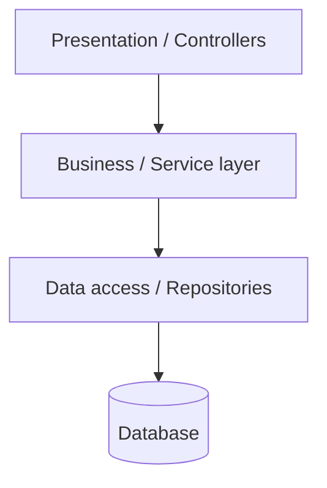
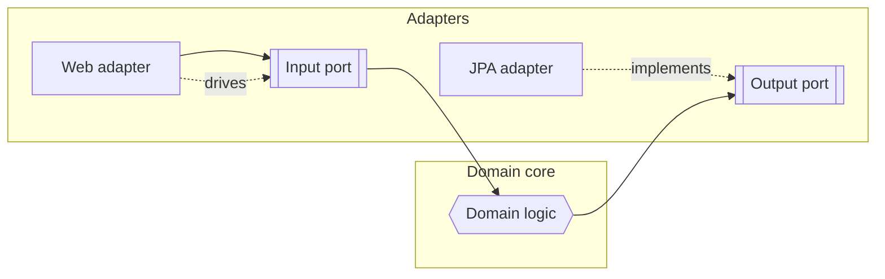

Where GoF patterns organise a few classes, **architectural patterns** organise an entire
application. They all chase one goal: keep **presentation**, **business logic**, and **data**
separated so each can change without dragging the others along.

## MVC — Model, View, Controller

- **Model** — the data and business rules. Knows nothing about the UI.
- **View** — renders the model to the user. Dumb; no business logic.
- **Controller** — receives input, updates the model, selects the next view.



A request hits the **Controller**, which drives the **Model** and then hands data to a **View**
for rendering. The user only ever interacts through the controller and sees the view.

### A request through Spring MVC



## MVC vs MVP vs MVVM

The family differs in *how the view and model talk* and *who mediates*.

| | MVC | MVP | MVVM |
|--|--|--|--|
| Mediator | Controller | Presenter | ViewModel |
| View ↔ Model | View may read the model | Fully via presenter | Via **data binding** |
| View knowledge | Knows the model | Passive, knows presenter | Binds to ViewModel props |
| Typical home | Web servers (Spring MVC, Rails) | Older desktop / Android | WPF, Android Jetpack, Vue |
| Binding | Manual | Manual | Automatic (two-way) |

:::note
**MVVM** shines when the platform offers **data binding**: the ViewModel exposes observable
state, and the framework syncs the View automatically — no manual "copy field into label" code.
:::

## Layered (n-tier) architecture

The classic enterprise stack: each layer depends **only on the one below it**.



| Layer | Responsibility |
|--|--|
| Presentation | HTTP, serialization, input validation |
| Business / Service | Use cases, transactions, orchestration |
| Data access | Persistence, queries, mapping |

Simple and familiar, but the business layer ends up **depending on** (pointing *down* at) the
database layer — infrastructure leaks upward, which is exactly what hexagonal fixes.

## Hexagonal (Ports & Adapters)

Put the **domain** in the centre. It defines **ports** (interfaces); the outside world plugs in
through **adapters**. Crucially, **all dependencies point inward** toward the domain.



The domain depends on **interfaces it owns** (output ports); the database adapter *implements*
them. This is the **Dependency Inversion Principle** at architecture scale — swap Postgres for
an in-memory store by writing a new adapter, without touching a line of domain code.

:::senior
Layered vs hexagonal comes down to **which way dependencies point**. In layered, business →
data (the domain depends on infrastructure). In hexagonal, the domain owns the interfaces and
infrastructure depends on *it*. That inversion is what keeps business rules testable in complete
isolation from frameworks and databases.
:::

:::gotcha
Architecture is not free. A three-endpoint CRUD service does not need full hexagonal layering —
you will write more adapters than logic. Match the ceremony to the complexity.
:::

## Check yourself

```quiz
title: Architectural patterns check
questions:
  - q: 'In MVC, where do business rules belong?'
    options:
      - 'The View'
      - 'The Controller'
      - text: 'The Model'
        correct: true
    explain: 'The Model holds data and business logic; the View renders and the Controller coordinates.'
  - q: 'What distinguishes MVVM from classic MVC?'
    options:
      - text: 'The ViewModel exposes observable state that the View syncs to via data binding'
        correct: true
      - 'MVVM has no model'
      - 'MVVM forbids any separation of concerns'
    explain: 'MVVM relies on (often two-way) data binding between the View and ViewModel, removing manual view-update code.'
  - q: 'What is the defining rule of hexagonal (ports & adapters) architecture?'
    options:
      - 'The database sits at the centre'
      - text: 'All dependencies point inward — the domain owns interfaces that adapters implement'
        correct: true
      - 'There are no interfaces'
    explain: 'Hexagonal inverts dependencies: infrastructure depends on domain-owned ports, keeping the core framework-free.'
```

:::key
MVC/MVP/MVVM separate **UI from logic**, differing in the mediator and whether binding is
manual or automatic. **Layered** stacks depend downward toward the database; **hexagonal**
inverts that so the domain owns its interfaces and adapters plug in — the Dependency Inversion
Principle at architecture scale.
:::
