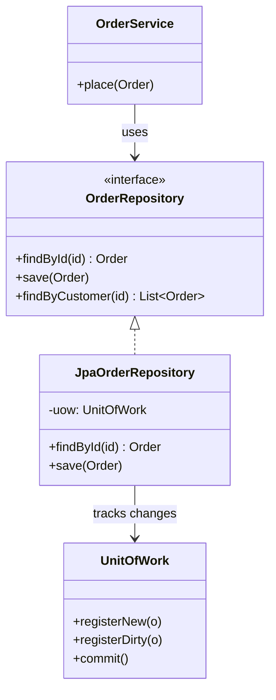

Business logic should never contain raw SQL or JDBC. Three patterns keep persistence behind a
clean seam: **DAO** hides *how* data is stored, **Repository** presents data as a domain
collection, and **Unit of Work** groups changes into a single atomic transaction.

## Structure



The service depends on the **`OrderRepository` interface** and talks in domain terms
(`findByCustomer`). The concrete `JpaOrderRepository` translates that into persistence calls and
lets a **Unit of Work** batch the writes into one commit.

## DAO vs Repository

They look similar and are often confused. The difference is the **level of abstraction** and
who the interface is designed for.

| | DAO | Repository |
|--|--|--|
| Origin | Java EE / persistence tier | Domain-Driven Design |
| Mental model | An abstraction over a **data source / table** | An in-memory **collection of domain objects** |
| Vocabulary | Data-centric: `insert`, `update`, `selectById` | Domain-centric: `save`, `findActiveCustomers` |
| Granularity | Usually **one per table/entity** | **One per aggregate root** |
| Leaks storage? | Often mirrors table structure | Hides storage entirely |
| Returns | Rows / data records | Fully-formed domain aggregates |

:::note
In practice the line blurs — Spring Data's `JpaRepository` is called a "repository" but often
behaves like a per-entity DAO. Interviewers want the *conceptual* distinction: **DAO = data
source abstraction, Repository = domain collection abstraction.**
:::

## Repository in action

```java
public interface OrderRepository {
  Optional<Order> findById(long id);
  List<Order> findByCustomer(long customerId); // domain query, no SQL leaks out
  Order save(Order order);
}

// Spring Data derives the query from the method name — you write only the interface.
public interface SpringDataOrderRepository extends JpaRepository<Order, Long> {
  List<Order> findByCustomerId(long customerId);
}
```

The service layer calls `repo.findByCustomer(id)` and never knows whether it is JPA, JDBC, or an
in-memory map behind the interface.

## Unit of Work

A **Unit of Work** tracks every object you create, modify, or delete during a business
transaction, then writes them all in **one commit** (or rolls everything back). It solves two
problems: fewer round-trips, and *all-or-nothing* consistency.

```java
@Transactional               // Spring's @Transactional IS a Unit of Work
public void transfer(long from, long to, Money amount) {
  Account a = accounts.findById(from);
  Account b = accounts.findById(to);
  a.debit(amount);
  b.credit(amount);
  // both saved together on commit; a failure rolls BOTH back
}
```

:::senior
You rarely hand-roll a Unit of Work today — JPA's `EntityManager` / Hibernate `Session` *is*
one. It tracks entity state (its **persistence context**), and `@Transactional` defines the
commit boundary. Understanding this explains "dirty checking": you mutate a managed entity and
it is saved on commit **without** an explicit `save()` call.
:::

:::gotcha
Do not build repository methods that return raw `ResultSet`s, `Map`s, or JPA entities straight to
the web layer. That defeats the pattern — persistence concerns leak back into presentation. Map
to domain objects or DTOs at the boundary.
:::

## Check yourself

```quiz
title: Repository & DAO check
questions:
  - q: 'What is the key conceptual difference between a DAO and a Repository?'
    options:
      - 'They are identical; the names are interchangeable'
      - text: 'A DAO abstracts a data source/table; a Repository models an in-memory collection of domain objects'
        correct: true
      - 'A DAO is only for NoSQL, a Repository only for SQL'
    explain: 'DAO is a data-source abstraction (data-centric); Repository is a domain-collection abstraction (domain-centric).'
  - q: 'What problem does the Unit of Work pattern solve?'
    options:
      - 'It caches query results forever'
      - text: 'It tracks changes and commits (or rolls back) them together as one atomic transaction'
        correct: true
      - 'It converts SQL to NoSQL automatically'
    explain: 'Unit of Work batches all inserts/updates/deletes of a business transaction into a single commit for consistency.'
  - q: 'Which JPA/Hibernate concept plays the role of a Unit of Work?'
    options:
      - text: 'The EntityManager / Session and its persistence context'
        correct: true
      - 'The @Entity annotation'
      - 'The JDBC DriverManager'
    explain: 'The persistence context tracks managed entities and flushes changes on transaction commit — a built-in Unit of Work.'
```

:::key
**DAO** hides the data source (data-centric, per table); **Repository** presents a domain
collection (domain-centric, per aggregate); **Unit of Work** batches changes into one atomic
commit. In Spring/JPA these are `JpaRepository`, your repository interfaces, and the
`EntityManager` + `@Transactional` boundary.
:::
