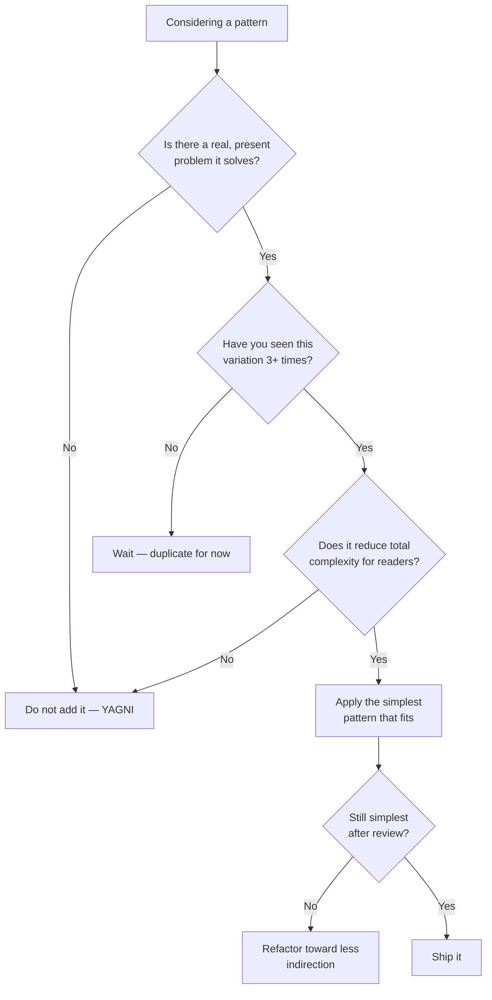

An **anti-pattern** is a common response to a recurring problem that *looks* helpful but
reliably backfires. Knowing them is as valuable as knowing patterns: half of good design is
recognising the traps — and resisting the urge to apply patterns you do not need.

## The catalog — smell → fix

| Anti-pattern | Smell | Fix |
|--|--|--|
| **God Object** | One class knows/does everything; thousands of lines, dozens of fields | Split by responsibility (SRP); extract collaborators |
| **Singleton abuse** | `getInstance()` everywhere as global mutable state | Inject dependencies; use DI-scoped beans |
| **Spaghetti Code** | Tangled control flow, no layers, deep nesting | Introduce layers/modules; extract methods; guard clauses |
| **Golden Hammer** | "I know X, so everything is an X problem" | Choose tools by fit, not familiarity |
| **Pattern Soup** | Patterns stacked for their own sake; indirection everywhere | Delete unused abstraction; inline until a real need appears |
| **Premature Abstraction** | Interfaces/generics with a single implementer | Follow the **Rule of Three**; wait for the second real case |
| **Lava Flow** | Dead code no one dares delete | Cover with tests, then remove |
| **Copy-Paste Programming** | Same logic duplicated with tweaks | Extract a shared method/class (DRY) |

## Over-engineering: the two-headed monster

**Pattern Soup** and **Premature Abstraction** are the *over*-application of good ideas.

- A factory that builds one product. An interface with one implementation. A strategy with one
  strategy. Each adds a layer of indirection that a reader must trace through — for **zero**
  current benefit.
- **YAGNI** ("You Aren't Gonna Need It") and the **Rule of Three** are the antidotes: duplicate
  twice, abstract on the third occurrence, when the shape of the real variation is finally clear.

:::warning
The most expensive abstractions are the *wrong* ones. A missing abstraction is a quick extract
method later; a wrong abstraction is baked into every call site and painful to unwind. **Prefer
a little duplication over the wrong abstraction.**
:::

## Do I actually need a pattern?



The bias is toward **not** adding structure. A pattern must earn its keep by removing more
complexity than the indirection it introduces.

:::senior
Interviewers probe anti-patterns to see if you can say **"no" to a pattern**. A senior engineer
reaches for the simplest thing that works and adds abstraction only under the pressure of real,
repeated change. Being able to name *why* a Singleton or a speculative interface is a liability
signals more maturity than reciting all 23 GoF patterns.
:::

## Anti-pattern flashcards

```flashcards
title: Anti-pattern recall
cards:
  - front: '**God Object** — the smell?'
    back: 'One class hoards data and behaviour — huge, low cohesion, high coupling. Fix: split by responsibility (SRP).'
  - front: '**Singleton abuse** — why bad?'
    back: 'Global mutable state accessed via `getInstance()` everywhere; hidden dependencies, hard to test. Fix: inject dependencies (DI).'
  - front: '**Spaghetti Code** — the smell?'
    back: 'Tangled flow with no clear structure or layers. Fix: introduce layers, extract methods, use guard clauses.'
  - front: '**Golden Hammer** — the trap?'
    back: '"If all you have is a hammer, everything looks like a nail." Overusing one familiar tool. Fix: pick tools by fit.'
  - front: '**Pattern Soup** — the smell?'
    back: 'Patterns piled on for their own sake, drowning logic in indirection. Fix: delete unused abstraction; inline it.'
  - front: '**Premature Abstraction** — the antidote?'
    back: 'Abstracting before the need is real (one implementer). Antidote: YAGNI + the Rule of Three.'
  - front: '**Rule of Three**?'
    back: 'Duplicate up to twice; extract an abstraction on the third occurrence, when the real variation is clear.'
  - front: 'Wrong abstraction vs a little duplication?'
    back: 'Prefer the duplication. A wrong abstraction is baked into every call site and costly to unwind.'
```

## Check yourself

```quiz
title: Anti-patterns check
questions:
  - q: 'A single class has 3,000 lines, 40 fields, and touches persistence, HTTP, and business rules. Which anti-pattern is this?'
    options:
      - 'Golden Hammer'
      - text: 'God Object'
        correct: true
      - 'Premature Abstraction'
    explain: 'A God Object concentrates too many responsibilities in one class. Fix by splitting along the Single Responsibility Principle.'
  - q: 'What does the "Golden Hammer" anti-pattern describe?'
    options:
      - text: 'Over-relying on one familiar tool/pattern for every problem regardless of fit'
        correct: true
      - 'A class that is too small'
      - 'Using a Unit of Work for transactions'
    explain: '"When all you have is a hammer, everything looks like a nail" — applying a known solution where it does not fit.'
  - q: 'What is the best guard against premature abstraction?'
    options:
      - 'Add an interface for every class up front'
      - text: 'YAGNI plus the Rule of Three — wait until you see the variation three times'
        correct: true
      - 'Always use the Singleton pattern'
    explain: 'Abstract only when a real, repeated need appears; a wrong early abstraction is costlier than a little duplication.'
```

:::key
Anti-patterns are backfiring habits: **God Object** (do everything), **Singleton abuse** (global
state), **Spaghetti** (no structure), **Golden Hammer** (one tool for all), and over-engineering
via **Pattern Soup** / **Premature Abstraction**. Default to the simplest thing; let **YAGNI**
and the **Rule of Three** decide when a pattern has earned its place.
:::
