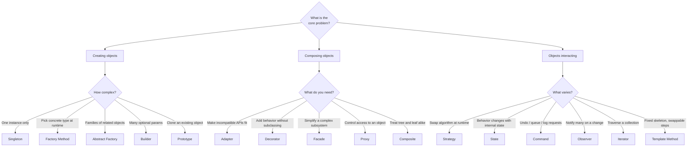

Interviewers rarely ask *"define the Decorator pattern."* They ask *"how would you design X?"* — and reward you for **naming the pattern that fits**. The skill is mapping a **problem cue** to a pattern. This page is that map.

## The decision flowchart

Start from what the problem is *asking for* and follow the branch.



## Cue → Pattern → Example

Memorize the **cue words**. In an interview, the phrasing *is* the hint.

| Problem cue (what they say) | Pattern | Real example |
|--|--|--|
| "Ensure only **one** instance" | **Singleton** | `Runtime.getRuntime()`, a logger |
| "Decide the **concrete class** at runtime" | **Factory Method** | `Calendar.getInstance()` |
| "Create **families** of related objects" | **Abstract Factory** | Cross-platform UI widget kits |
| "Object has **many optional** fields" | **Builder** | `StringBuilder`, `HttpClient.newBuilder()` |
| "**Copy** an existing object" | **Prototype** | `Object.clone()`, cell prototypes |
| "Make an **incompatible** interface fit" | **Adapter** | `Arrays.asList()`, legacy API wrappers |
| "Add behavior **without subclassing**" | **Decorator** | `BufferedReader(new FileReader(...))` |
| "**Simplify** a messy subsystem" | **Facade** | `javax.faces`, a service layer |
| "**Control / defer** access to an object" | **Proxy** | Spring AOP, Hibernate lazy loading |
| "Treat **whole and part** uniformly" | **Composite** | Swing component tree, file system |
| "**Swap the algorithm** at runtime" | **Strategy** | `Comparator`, payment methods |
| "Behavior depends on **internal state**" | **State** | TCP connection, order lifecycle |
| "**Undo/redo**, queue, or log actions" | **Command** / **Memento** | Text-editor undo, job queue |
| "**Notify many** parts on a change" | **Observer** | Event listeners, `PropertyChangeListener` |
| "**Traverse** without exposing internals" | **Iterator** | `Iterator`, enhanced `for` |
| "Fixed steps, but **some vary**" | **Template Method** | `AbstractList`, servlet lifecycle |
| "**Share** many small objects cheaply" | **Flyweight** | `Integer.valueOf()` cache, glyphs |

:::tip
When two patterns seem to fit, ask **"what is changing?"** If a *whole behavior* swaps out, it's **Strategy**. If behavior changes because the object *moved to a new mode*, it's **State**. If you're *adding to* behavior, it's **Decorator**.
:::

## Worked mini-examples

````tabs
tabs:
  - label: Payment methods
    body: |
      *"Support card, PayPal, and crypto checkout, interchangeable at runtime."*

      **Interchangeable algorithms → Strategy.**
      ```java
      interface PayStrategy { void pay(int cents); }
      class Cart { PayStrategy pay; void checkout() { pay.pay(total); } }
      ```
  - label: Coffee add-ons
    body: |
      *"A coffee with any combination of milk, sugar, whip — priced dynamically."*

      **Stack behavior without a class per combo → Decorator.**
      ```java
      Drink d = new Whip(new Milk(new Espresso()));
      d.cost(); // sums the chain
      ```
  - label: Order status
    body: |
      *"An order behaves differently when Placed vs Shipped vs Delivered."*

      **Behavior tied to internal mode → State.**
      ```java
      interface OrderState { void next(Order o); }
      // PlacedState → ShippedState → DeliveredState
      ```
  - label: Notifications
    body: |
      *"When stock price changes, update the chart, the log, and the alert."*

      **One-to-many change propagation → Observer.**
      ```java
      stock.addListener(chart);
      stock.addListener(alert); // all notified on change
      ```
````

## Drill the cues

```flashcards
title: Cue → Pattern drill
cards:
  - front: '"Swap the algorithm at runtime"'
    back: '**Strategy**'
  - front: '"Add responsibilities without subclassing"'
    back: '**Decorator**'
  - front: '"Exactly one instance, global access"'
    back: '**Singleton**'
  - front: '"Support undo / redo"'
    back: '**Command** (+ **Memento** to snapshot state)'
  - front: '"Create families of related products"'
    back: '**Abstract Factory**'
  - front: '"Decide the concrete subclass at runtime"'
    back: '**Factory Method**'
  - front: '"Object with many optional constructor params"'
    back: '**Builder**'
  - front: '"Behavior changes with internal state"'
    back: '**State**'
  - front: '"Notify many objects when one changes"'
    back: '**Observer**'
  - front: '"Make an incompatible interface fit"'
    back: '**Adapter**'
  - front: '"Simplify a complex subsystem behind one entry point"'
    back: '**Facade**'
  - front: '"Control or defer access to an object"'
    back: '**Proxy**'
```

## Check yourself

```quiz
title: Which pattern would you use?
questions:
  - q: 'You must let users **swap sorting algorithms** (quick, merge, bubble) at runtime through a common interface. Which pattern?'
    options:
      - text: 'Strategy'
        correct: true
      - 'State'
      - 'Template Method'
      - 'Decorator'
    explain: 'Interchangeable, encapsulated algorithms behind one interface is the textbook Strategy use case.'
  - q: 'A text editor needs **unlimited undo/redo** of every user action. Which pattern(s)?'
    options:
      - 'Observer'
      - text: 'Command (plus Memento for snapshots)'
        correct: true
      - 'Iterator'
      - 'Facade'
    explain: 'Encapsulating each action as a Command lets you queue, log, and reverse it; Memento captures state to restore.'
  - q: 'You want to wrap a stream so it also **buffers and counts bytes**, without creating a subclass for every combination. Which pattern?'
    options:
      - 'Adapter'
      - text: 'Decorator'
        correct: true
      - 'Proxy'
      - 'Composite'
    explain: 'Decorator stacks responsibilities at runtime by wrapping — exactly how java.io composes streams.'
  - q: 'A cross-platform app must create **matching sets** of buttons, checkboxes, and menus per OS. Which pattern?'
    options:
      - 'Factory Method'
      - text: 'Abstract Factory'
        correct: true
      - 'Builder'
      - 'Prototype'
    explain: 'Abstract Factory produces whole families of related products (a per-OS widget kit) that are meant to be used together.'
```

:::key
The interview skill is **cue recognition**, not definitions. *Creating* → Factory family / Builder / Singleton. *Composing* → Adapter / Decorator / Facade / Proxy / Composite. *Interacting* → Strategy / State / Command / Observer. Ask **"what varies?"** and follow the flowchart.
:::
