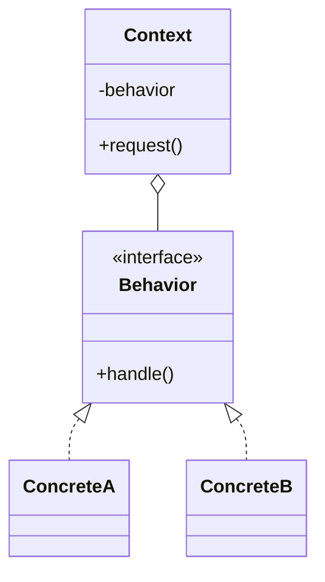
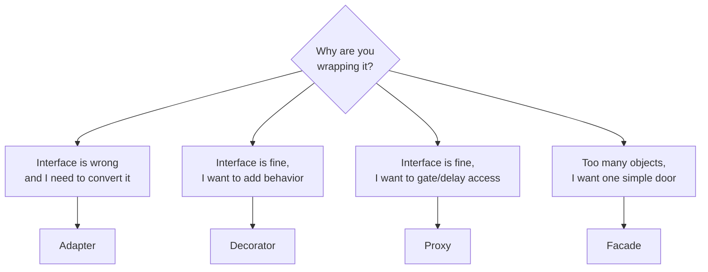

Structurally similar patterns differ by **intent**. Interviewers exploit this: two patterns can share the same UML but solve opposite problems. Learn the **one-line discriminator** for each pair.

## Strategy vs State

Same class diagram — a context delegating to an interface. The difference is *what drives the swap* and *who swaps it*.



````tabs
tabs:
  - label: Strategy
    body: |
      **Intent:** make interchangeable algorithms selectable by the client.
      - The **client picks** the strategy; it usually doesn't change afterward.
      - Strategies are **independent** and unaware of each other.
      - Answers *"how* should I do this?"*
      ```java
      Collections.sort(list, byName);   // client chose the algorithm
      Collections.sort(list, byAge);
      ```
  - label: State
    body: |
      **Intent:** let an object alter its behavior when its **internal state** changes.
      - The **object transitions itself** between states.
      - States **know about each other** (each decides the next state).
      - Answers *"what* am I right now?"*
      ```java
      // Order transitions itself
      placed.next();   // -> Shipped
      shipped.next();  // -> Delivered
      ```
````

| | Strategy | State |
|--|--|--|
| **Intent** | Swap an algorithm | Change behavior with mode |
| **Who switches** | The client | The object itself |
| **States know each other?** | No | Yes (drive transitions) |
| **Lifetime** | Usually set once | Changes repeatedly |

## Factory Method vs Abstract Factory

````tabs
tabs:
  - label: Factory Method
    body: |
      **One product**, created via a subclass-overridable method. Uses **inheritance**.
      ```java
      abstract class Dialog {
        abstract Button createButton();   // the factory method
        void render() { createButton().paint(); }
      }
      class WinDialog extends Dialog {
        Button createButton() { return new WinButton(); }
      }
      ```
  - label: Abstract Factory
    body: |
      **A family** of related products from one factory object. Uses **composition**.
      ```java
      interface GuiFactory {
        Button createButton();
        Checkbox createCheckbox();   // whole family
      }
      class WinFactory implements GuiFactory { /* Win* products */ }
      ```
````

| | Factory Method | Abstract Factory |
|--|--|--|
| **Produces** | One product | A family of related products |
| **Mechanism** | Inheritance (override a method) | Composition (a factory object) |
| **Scope** | One creation point | Multiple creation methods |
| Mnemonic | "one thing, chosen by subclass" | "a matching set, chosen by factory" |

:::tip
An **Abstract Factory is often implemented with several Factory Methods** — each `create*()` on the factory is a factory method. That's why they blur together.
:::

## The four wrappers: Adapter vs Decorator vs Proxy vs Facade

All four **wrap another object** — but for different reasons. This is the single most-tested comparison.

| Pattern | Changes the interface? | Adds behavior? | Intent |
|--|--|--|--|
| **Adapter** | **Yes** — converts it | No | Make an incompatible interface usable |
| **Decorator** | No — same interface | **Yes** — enhances | Add responsibilities dynamically |
| **Proxy** | No — same interface | No (controls access) | Control/defer/guard access |
| **Facade** | **New, simpler** interface | No | Hide a complex subsystem |



:::note
**Adapter** *changes* an interface. **Decorator** *enhances* it (same interface). **Proxy** *guards* it (same interface, same behavior — just controlled). **Facade** *simplifies* a whole set of objects behind a new interface.
:::

## Decorator vs Composite

Both build recursive object trees where wrappers/children share the component interface.

````tabs
tabs:
  - label: Decorator
    body: |
      Wraps **exactly one** component to **add behavior**. A chain, not a tree.
      ```java
      Coffee c = new Whip(new Milk(new Espresso())); // 1 wraps 1 wraps 1
      ```
      *Purpose:* augment a single object's behavior.
  - label: Composite
    body: |
      Holds **many** children to represent a **part-whole tree**; treats leaves and
      groups uniformly.
      ```java
      Group root = new Group(leaf1, leaf2, new Group(leaf3));
      root.render(); // recurses into all children
      ```
      *Purpose:* let clients treat individual and composed objects the same.
````

| | Decorator | Composite |
|--|--|--|
| Children | Exactly **one** | **Many** |
| Goal | Add behavior | Represent hierarchies |
| Shape | Linear chain | Tree |

## Observer vs Mediator

Both decouple objects that would otherwise call each other directly.

````tabs
tabs:
  - label: Observer
    body: |
      **One-to-many broadcast.** A subject notifies many observers of a change; observers
      don't talk back through the subject.
      ```java
      subject.addObserver(a);
      subject.addObserver(b);
      subject.notifyObservers(); // one -> many
      ```
      *Flow:* one publisher → many subscribers.
  - label: Mediator
    body: |
      **Many-to-many coordination.** Colleagues talk only to a central mediator, which
      routes interactions between them.
      ```java
      // Widgets notify the dialog (mediator); it updates the others
      dialog.changed(checkbox); // hub coordinates all peers
      ```
      *Flow:* every peer ↔ one hub ↔ every peer.
````

| | Observer | Mediator |
|--|--|--|
| Direction | One → many (broadcast) | Many ↔ many (via hub) |
| Central object | Subject emits events | Mediator orchestrates logic |
| Coupling removed | Publisher ↔ subscribers | Peer ↔ peer |

## Check yourself

```quiz
title: Tell the pairs apart
questions:
  - q: 'The key difference between **Strategy and State**?'
    options:
      - 'Strategy uses inheritance, State uses composition'
      - text: 'In Strategy the client picks the algorithm; in State the object transitions its own behavior as its internal state changes'
        correct: true
      - 'They are identical; the names are interchangeable'
      - 'State creates objects, Strategy destroys them'
    explain: 'They share a UML. The intent differs: Strategy = client-selected interchangeable algorithms; State = object changes behavior as it moves between states (which know each other).'
  - q: 'You wrap an object to **convert its interface** so incompatible code can use it. Which pattern?'
    options:
      - text: 'Adapter'
        correct: true
      - 'Decorator'
      - 'Proxy'
      - 'Facade'
    explain: 'Adapter changes/converts the interface. Decorator keeps the interface and adds behavior; Proxy keeps it and controls access; Facade exposes a new simpler interface over a subsystem.'
  - q: 'A wrapper keeps the **same interface** and adds no new behavior — it just **delays creation** of the real object until first use. Which pattern?'
    options:
      - 'Decorator'
      - text: 'Proxy (virtual/lazy)'
        correct: true
      - 'Adapter'
      - 'Composite'
    explain: 'Controlling or deferring access with the same interface is Proxy. A lazy-loading proxy (like Hibernate) defers creating the real object.'
  - q: 'Which distinguishes **Abstract Factory** from **Factory Method**?'
    options:
      - 'Abstract Factory produces a family of related products; Factory Method produces one'
      - 'Factory Method uses inheritance; Abstract Factory uses composition'
      - text: 'Both of the above'
        correct: true
      - 'Neither — they are the same pattern'
    explain: 'Factory Method = one product via an overridable method (inheritance). Abstract Factory = a family of related products via a factory object (composition), often built from several factory methods.'
  - q: 'A subject **broadcasts a change to many** subscribers who do not coordinate with each other. Which pattern?'
    options:
      - 'Mediator'
      - text: 'Observer'
        correct: true
      - 'Command'
      - 'Composite'
    explain: 'One-to-many broadcast is Observer. Mediator centralizes many-to-many interactions between peers through a hub.'
```

:::key
Same structure, different **intent**. Strategy = client swaps algorithm; State = object swaps its own behavior. Adapter *converts*, Decorator *enhances*, Proxy *guards*, Facade *simplifies*. Decorator wraps **one** (chain); Composite holds **many** (tree). Observer = one→many broadcast; Mediator = many↔many via a hub.
:::
