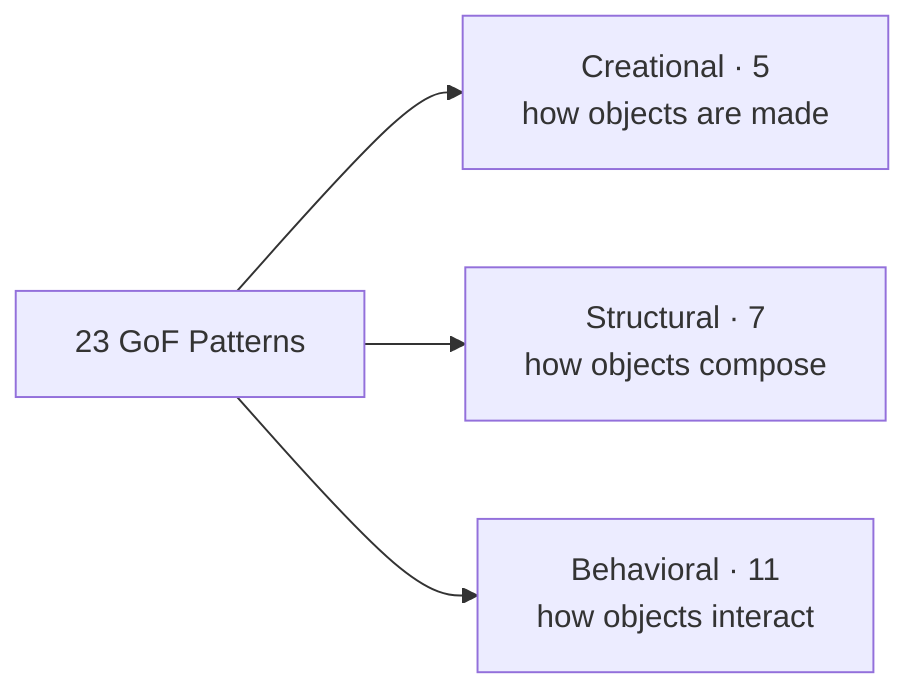

The night-before-the-interview page. Twenty-three patterns in three families, each with a **one-line intent** and a **real example** you can name out loud.



## Creational (5) — *how objects are created*

| Pattern | Intent (one line) | Real example |
|--|--|--|
| **Singleton** | One instance, one global access point | `Runtime.getRuntime()` |
| **Factory Method** | Subclass decides which concrete class to create | `Calendar.getInstance()` |
| **Abstract Factory** | Create families of related objects | Cross-platform UI kits |
| **Builder** | Build a complex object step by step | `StringBuilder`, `HttpClient.newBuilder()` |
| **Prototype** | Create by cloning an existing instance | `Object.clone()` |

## Structural (7) — *how objects are composed*

| Pattern | Intent (one line) | Real example |
|--|--|--|
| **Adapter** | Convert one interface into another | `Arrays.asList()`, `InputStreamReader` |
| **Bridge** | Split abstraction from implementation so both vary | JDBC `Driver` behind the API |
| **Composite** | Treat individual objects and trees uniformly | Swing component tree, file system |
| **Decorator** | Add behavior by wrapping, no subclassing | `BufferedReader(new FileReader(...))` |
| **Facade** | One simple entry point over a subsystem | JDBC, a service layer |
| **Flyweight** | Share many small immutable objects | `Integer.valueOf()` cache, `String` pool |
| **Proxy** | Stand-in that controls access to an object | Spring AOP, Hibernate lazy loading |

## Behavioral (11) — *how objects interact*

| Pattern | Intent (one line) | Real example |
|--|--|--|
| **Chain of Responsibility** | Pass a request along handlers until one handles it | Servlet `Filter` chain |
| **Command** | Encapsulate a request as an object (queue/undo/log) | `Runnable`, editor undo |
| **Interpreter** | Represent and evaluate a grammar | `Pattern` (regex), SpEL |
| **Iterator** | Traverse a collection without exposing internals | `java.util.Iterator` |
| **Mediator** | Centralize many-to-many interaction in one hub | `ExecutorService`, dialog controllers |
| **Memento** | Capture and restore an object's state | Undo buffers, snapshots |
| **Observer** | Notify many dependents when one changes | Event listeners, `Flow` API |
| **State** | Alter behavior when internal state changes | TCP connection, order lifecycle |
| **Strategy** | Select an interchangeable algorithm at runtime | `Comparator` |
| **Template Method** | Fixed skeleton, subclasses fill the steps | `AbstractList`, `HttpServlet` |
| **Visitor** | Add operations to a type hierarchy without editing it | AST traversal, `FileVisitor` |

:::tip
Count them on your fingers in the interview: **5 + 7 + 11 = 23**. Knowing the family sizes signals you actually studied the catalog.
:::

## Rapid-fire drill

```flashcards
title: One-line intents
cards:
  - front: '**Singleton**'
    back: 'One instance, one global access point.'
  - front: '**Factory Method**'
    back: 'Subclass decides the concrete class to instantiate.'
  - front: '**Abstract Factory**'
    back: 'Create families of related objects together.'
  - front: '**Builder**'
    back: 'Construct a complex object step by step.'
  - front: '**Prototype**'
    back: 'Create new objects by cloning existing ones.'
  - front: '**Adapter**'
    back: 'Convert one interface into another clients expect.'
  - front: '**Bridge**'
    back: 'Decouple an abstraction from its implementation.'
  - front: '**Composite**'
    back: 'Treat leaves and trees through one interface.'
  - front: '**Decorator**'
    back: 'Add behavior by wrapping, without subclassing.'
  - front: '**Facade**'
    back: 'A single simple door to a complex subsystem.'
  - front: '**Flyweight**'
    back: 'Share many small immutable objects to save memory.'
  - front: '**Proxy**'
    back: 'A stand-in that controls access to the real object.'
  - front: '**Chain of Responsibility**'
    back: 'Pass a request down handlers until one handles it.'
  - front: '**Command**'
    back: 'Wrap a request as an object to queue, log, or undo.'
  - front: '**Interpreter**'
    back: 'Represent and evaluate sentences of a grammar.'
  - front: '**Iterator**'
    back: 'Traverse a collection without exposing internals.'
  - front: '**Mediator**'
    back: 'Route many-to-many interactions through one hub.'
  - front: '**Memento**'
    back: 'Capture and later restore an object''s state.'
  - front: '**Observer**'
    back: 'Notify many dependents when one object changes.'
  - front: '**State**'
    back: 'Change behavior as internal state changes.'
  - front: '**Strategy**'
    back: 'Swap an interchangeable algorithm at runtime.'
  - front: '**Template Method**'
    back: 'Fixed algorithm skeleton; subclasses fill steps.'
  - front: '**Visitor**'
    back: 'Add operations to a hierarchy without changing it.'
```

## Recap quiz

```quiz
title: Cheat-sheet recap
questions:
  - q: 'How many GoF patterns are there, and how do they split by family?'
    options:
      - '20 — 6 creational, 6 structural, 8 behavioral'
      - text: '23 — 5 creational, 7 structural, 11 behavioral'
        correct: true
      - '25 — 5 creational, 10 structural, 10 behavioral'
      - '23 — 7 creational, 7 structural, 9 behavioral'
    explain: '23 total: 5 creational, 7 structural, 11 behavioral.'
  - q: 'Which of these is a **structural** pattern?'
    options:
      - 'Observer'
      - text: 'Decorator'
        correct: true
      - 'Strategy'
      - 'Builder'
    explain: 'Decorator is structural (how objects compose). Observer and Strategy are behavioral; Builder is creational.'
  - q: '"Add operations to a type hierarchy **without modifying** its classes" describes which pattern?'
    options:
      - text: 'Visitor'
        correct: true
      - 'Composite'
      - 'Template Method'
      - 'Bridge'
    explain: 'Visitor externalizes operations so you can add new ones without editing the element classes.'
  - q: 'Which pattern "decouples an **abstraction** from its **implementation** so the two can vary independently"?'
    options:
      - 'Adapter'
      - text: 'Bridge'
        correct: true
      - 'Proxy'
      - 'Facade'
    explain: 'That is the defining intent of Bridge — abstraction and implementation evolve on separate hierarchies.'
```

:::key
Three families, sizes **5 / 7 / 11**. Creational = *making* objects. Structural = *composing* objects. Behavioral = *how objects talk*. Memorize one-line intents and one real example each — that is enough to name any pattern on demand.
:::
