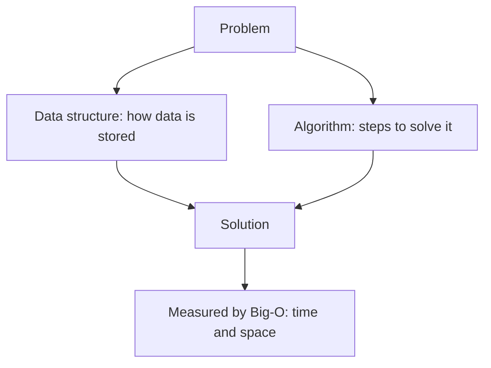
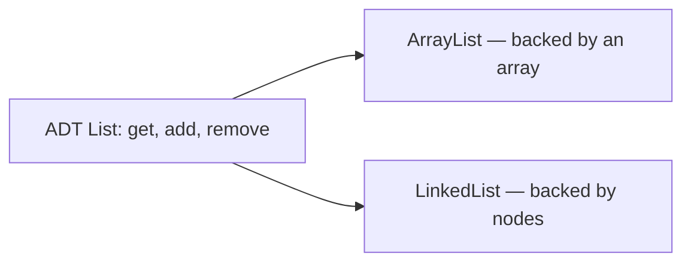

**Data structures** are ways to *store and organize* data. **Algorithms** are step-by-step
*recipes* that operate on that data. Interviews test both: you pick the right structure, then
write an efficient algorithm over it.

## The big picture



Every LeetCode problem is really this loop: **choose a structure**, **run an algorithm**,
**measure the cost**. Master the pairing and most problems collapse into a handful of patterns.

## Structures vs algorithms at a glance

| Concept | What it is | Examples | Interview question it answers |
|--|--|--|--|
| **Data structure** | A container with rules for access | array, linked list, stack, queue, hash map, tree, graph, heap | *"Where do I put the data so lookups are fast?"* |
| **Algorithm** | A procedure that transforms/queries data | binary search, BFS/DFS, sorting, two pointers, dynamic programming | *"What steps solve this within the time limit?"* |

## Abstract Data Types (ADTs)

An **ADT** describes *what* a structure does (its operations and guarantees) without saying
*how* it is built. The concrete **data structure** is the actual implementation.



| ADT (the contract) | Common implementations | Key operations |
|--|--|--|
| **List** | `ArrayList`, `LinkedList` | get, add, remove |
| **Stack** (LIFO) | array, linked list | push, pop, peek |
| **Queue** (FIFO) | array, linked list | enqueue, dequeue |
| **Map** | `HashMap`, `TreeMap` | put, get, remove |
| **Set** | `HashSet`, `TreeSet` | add, contains |

:::key
**ADT = the promise** (a `List` can `get`, `add`, `remove`). **Data structure = the machine**
that keeps the promise (`ArrayList` uses an array; `LinkedList` uses nodes). Same interface,
very different Big-O.
:::

## Why interviewers obsess over this

- **Scalability** — a solution that works for 10 items may time out at 10 million. The
  *structure* you pick decides which.
- **Pattern reuse** — ~15 patterns (two pointers, sliding window, BFS/DFS, DP…) cover the vast
  majority of interview questions. They are all built on these foundations.
- **Communication** — saying *"I'll use a hash map for O(1) lookups"* signals you think in
  trade-offs, exactly what interviewers score.

:::tip
Don't memorize solutions — learn the **structure + pattern** pairing. "Find a pair summing to
a target" is a hash-map or two-pointer problem whether the values are prices, temperatures, or
exam scores.
:::

:::gotcha
The classic silent killer: calling `list.contains(x)` inside a loop. Each call scans the whole
list — O(n) — so the loop becomes **O(n²)**. Swapping the `ArrayList` for a `HashSet` makes the
same code O(n). Interviewers plant this deliberately: the *algorithm* looked fine; the
*structure* was wrong.
:::

## Recall

```flashcards
title: DSA vocabulary
cards:
  - front: 'Data structure vs algorithm?'
    back: 'Structure = **how data is stored**; algorithm = **the steps that process it**.'
  - front: 'What is an Abstract Data Type (ADT)?'
    back: 'A **contract** of operations and guarantees, independent of implementation. E.g. a *List* promises get/add/remove; `ArrayList` and `LinkedList` both fulfill it differently.'
  - front: 'Stack ordering vs Queue ordering?'
    back: '**Stack = LIFO** (last in, first out). **Queue = FIFO** (first in, first out).'
  - front: 'Why does structure choice matter in interviews?'
    back: 'It determines **Big-O** — the same task can be O(n) or O(1) depending on whether you used a list or a hash map.'
```

## Check yourself

```quiz
title: What is DSA?
questions:
  - q: 'What is the difference between a data structure and an algorithm?'
    options:
      - text: 'A structure organizes data; an algorithm is the steps that process it'
        correct: true
      - 'They are two words for the same thing'
      - 'A structure is faster; an algorithm is slower'
    explain: 'Structures store/organize data (array, map, tree); algorithms are procedures that operate on it (search, sort).'
  - q: 'An ADT such as `List` primarily specifies:'
    options:
      - 'The exact memory layout used'
      - text: 'The operations and guarantees, not the implementation'
        correct: true
      - 'The programming language required'
    explain: 'An ADT is a contract. `ArrayList` (array-backed) and `LinkedList` (node-backed) both implement the List ADT with different Big-O.'
  - q: 'A Stack follows which ordering?'
    options:
      - 'FIFO — first in, first out'
      - text: 'LIFO — last in, first out'
        correct: true
      - 'Sorted order'
    explain: 'A stack pushes and pops from the same end, so the last item in is the first out (LIFO). A queue is FIFO.'
```

:::note
Next up: **Big-O notation** — the shared language for measuring how the structure + algorithm
you picked scale as the input grows.
:::
