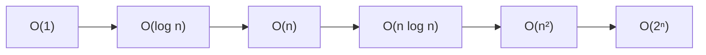

**Big-O** describes how an algorithm's cost **grows as the input `n` grows**. It ignores
constants and small terms and keeps only the *dominant* behavior — because at scale, growth
rate is the only thing that decides whether you pass or time out.

## The growth zoo, from best to worst

| Big-O | Name | Cost as `n` doubles | Typical source |
|--|--|--|--|
| **O(1)** | constant | unchanged | hash lookup, array index |
| **O(log n)** | logarithmic | +1 step | binary search, balanced tree |
| **O(n)** | linear | doubles | single loop over input |
| **O(n log n)** | linearithmic | slightly more than doubles | efficient sorts (merge, heap) |
| **O(n²)** | quadratic | ×4 | nested loops over the same data |
| **O(2ⁿ)** | exponential | squares | brute-force subsets/recursion |



## "n = 1000 feels like…"

Constants hide how brutal growth is. Here is roughly how many operations each class needs, and
what that *feels* like at everyday input sizes.

| Big-O | n = 10 | n = 1,000 | n = 1,000,000 | Feels like |
|--|--:|--:|--:|--|
| **O(1)** | 1 | 1 | 1 | instant, always |
| **O(log n)** | ~3 | ~10 | ~20 | instant |
| **O(n)** | 10 | 1,000 | 1,000,000 | a quick scan |
| **O(n log n)** | ~33 | ~10,000 | ~20,000,000 | still fine |
| **O(n²)** | 100 | 1,000,000 | 10¹² | slow at 1k, dead at 1M |
| **O(2ⁿ)** | 1,024 | 10³⁰¹ | never | hopeless past ~n=25 |

:::key
Interview inputs are often `n ≤ 10⁵` and time limits ~1 second (~10⁸ ops). That means **O(n²)
usually times out around n = 10⁴** and you need O(n log n) or better. Knowing this predicts the
required complexity *before* you code.
:::

## Watch it: how a loop's work grows with n

Below, a single loop touches every element once. Watch the operation counter track `n` exactly
— that is what **O(n)** means: work grows in lockstep with the input.

```walkthrough
title: Counting operations of a linear scan
code: |
  int count = 0;
  for (int i = 0; i < n; i++) {
    count += a[i];   // 1 operation per element
  }
  return count;
steps:
  - text: 'n = 3. The loop will run once per element. Operations so far: **0**.'
    array: [4, 2, 7]
    line: 2
  - text: 'i = 0 → add `a[0]`. Operations: **1**. We have touched 1 of 3 elements.'
    array: [4, 2, 7]
    highlight: [0]
    pointers: { 0: 'i' }
    line: 3
  - text: 'i = 1 → add `a[1]`. Operations: **2**.'
    array: [4, 2, 7]
    highlight: [1]
    sorted: [0]
    pointers: { 1: 'i' }
    line: 3
  - text: 'i = 2 → add `a[2]`. Operations: **3**. For n = 3 we did 3 units of work.'
    array: [4, 2, 7]
    highlight: [2]
    sorted: [0, 1]
    pointers: { 2: 'i' }
    line: 3
  - text: 'Done. Total = **n** operations. Double n to 6 → work doubles to 6. That linear relationship **is** O(n).'
    array: [4, 2, 7]
    sorted: [0, 1, 2]
    line: 5
```

## The three rules of Big-O

Big-O is a *simplification*. Three rules do all the work:

1. **Drop constants.** `2n + 3` → **O(n)**. A loop that runs `3n` times is still linear.
2. **Keep the dominant term.** `n² + n` → **O(n²)**. As `n` grows, the biggest term drowns out
   the rest.
3. **Different inputs, different variables.** Looping over array `a` then array `b` is
   **O(a + b)**, not O(2n) — don't merge unrelated sizes.

````tabs
tabs:
  - label: Drop constants
    body: |
      Two separate passes is still **O(n)**, not O(2n).
      ```java
      for (int x : a) sum += x;   // n steps
      for (int x : a) max = Math.max(max, x); // n steps
      // 2n → O(n)
      ```
  - label: Dominant term
    body: |
      A nested loop plus a single loop is **O(n²)**.
      ```java
      for (int i = 0; i < n; i++)
        for (int j = 0; j < n; j++) work(); // n²
      for (int i = 0; i < n; i++) work();    // + n
      // n² + n → O(n²)
      ```
  - label: Separate inputs
    body: |
      Different sizes get **different letters**.
      ```java
      for (int x : a) f(x);   // a steps
      for (int y : b) g(y);   // b steps
      // O(a + b), NOT O(n)
      ```
````

## Time vs space

Big-O measures two resources independently:

- **Time complexity** — how the number of *operations* grows.
- **Space complexity** — how the *extra memory* grows (beyond the input itself).

| Approach to "seen before?" | Time | Space | Trade-off |
|--|:--:|:--:|--|
| Re-scan the array each time | O(n²) | O(1) | slow, tiny memory |
| Use a `HashSet` of seen values | O(n) | O(n) | fast, more memory |

:::senior
Most optimization in interviews is **trading space for time** — a hash map or memo turns an
O(n²) scan into O(n). Always state both: *"O(n) time, O(n) space."* Saying only one is a red flag.
:::

## Best, average, worst

The *same* algorithm can have different costs depending on the input.

| Case | Meaning | Example: search unsorted array for `x` |
|--|--|--|
| **Best case** | luckiest input | `x` is first → O(1) |
| **Average case** | typical input | `x` in the middle → O(n) |
| **Worst case** | adversarial input | `x` absent → O(n) |

:::gotcha
In interviews, **"complexity" means worst case** unless stated otherwise. Quicksort is "O(n log
n)" in practice but its worst case is O(n²) — mention that nuance and you sound senior.
:::

## Recall

```flashcards
title: Big-O recall
cards:
  - front: 'Binary search on a sorted array'
    back: '**O(log n)** time — halves the search space each step.'
  - front: 'Hash map `get` / `put`'
    back: '**O(1)** average, O(n) worst (all keys collide).'
  - front: 'A loop nested inside another loop over the same n'
    back: '**O(n²)** time.'
  - front: 'Simplify `O(3n² + 5n + 10)`'
    back: '**O(n²)** — drop constants, keep the dominant term.'
  - front: 'What does O(2ⁿ) usually indicate?'
    back: 'Brute-forcing all **subsets/combinations** via recursion — only feasible for tiny n (~20).'
```

## Check yourself

```quiz
title: Big-O check
questions:
  - q: 'Simplify the running time `4n + 2n² + 100`.'
    options:
      - 'O(n)'
      - text: 'O(n²)'
        correct: true
      - 'O(n² + n)'
    explain: 'Drop constants and lower-order terms; keep the dominant term n². We never write "+ n" in Big-O.'
  - q: 'Which complexity does binary search on a sorted array have?'
    options:
      - 'O(n)'
      - text: 'O(log n)'
        correct: true
      - 'O(1)'
    explain: 'Each comparison discards half the remaining elements, so it takes about log₂(n) steps.'
  - q: 'You use a HashSet to detect duplicates in one pass. The complexity is:'
    options:
      - text: 'O(n) time, O(n) space'
        correct: true
      - 'O(n²) time, O(1) space'
      - 'O(log n) time, O(n) space'
    explain: 'One scan is O(n) time; storing up to n seen values is O(n) space — the classic space-for-time trade.'
  - q: 'For an unsorted array, the worst case of searching for a value that is absent is:'
    options:
      - 'O(1)'
      - 'O(log n)'
      - text: 'O(n)'
        correct: true
    explain: 'You must check every element before concluding it is not present — the worst case is a full O(n) scan.'
```

:::key
Big-O = **growth rate**, worst case, constants dropped. O(n²) dies around n = 10⁴; aim for
O(n log n) or better. Always report **both time and space**.
:::
