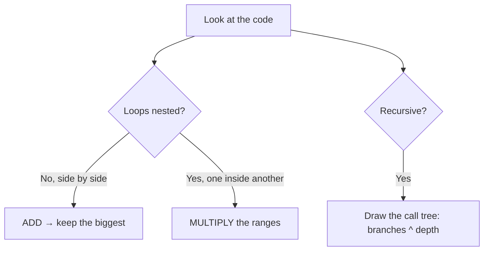
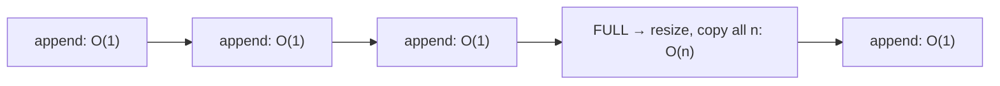

Knowing the Big-O classes is step one. The real skill is **reading code and naming its
complexity on sight**. Four rules cover almost everything you will meet in an interview.

## The four rules

| Pattern | Rule | Result |
|--|--|--|
| **Single loop** over n | count the iterations | O(n) |
| **Sequential** loops (one after another) | **add** them | O(n) + O(n) = O(n) |
| **Nested** loops (one inside another) | **multiply** them | O(n) × O(n) = O(n²) |
| **Recursion** | (branches)^(depth) | varies — build a tree |



## Sequential is addition, not multiplication

A loop *after* another loop **adds** — they don't compound.

```java
for (int i = 0; i < n; i++) sumA += a[i];   // O(n)
for (int j = 0; j < n; j++) sumB += b[j];   // O(n)
// total: O(n) + O(n) = O(2n) = O(n)
```

:::gotcha
Sequential loops trip people up. Two `O(n)` loops back-to-back are **O(n)**, not O(n²). You only
multiply when one loop is *inside* the body of another.
:::

## Watch it: why nested loops are O(n²)

The outer loop runs `n` times; for **each** of those, the inner loop runs `n` times. Watch the
operation counter climb to `n × n`.

```walkthrough
title: Counting operations of a nested loop (n = 3)
code: |
  int count = 0;
  for (int i = 0; i < n; i++) {
    for (int j = 0; j < n; j++) {
      count++;   // runs n times per outer step
    }
  }
steps:
  - text: 'n = 3. Outer i = 0 begins. Inner loop will run 3 times. Ops: **0**.'
    array: [0, 0, 0]
    pointers: { 0: 'i' }
    line: 2
  - text: 'i = 0: inner j sweeps all 3 cells → +3. Ops: **3**.'
    array: [1, 1, 1]
    highlight: [0, 1, 2]
    pointers: { 0: 'i' }
    line: 4
  - text: 'i = 1: inner j sweeps all 3 again → +3. Ops: **6**.'
    array: [2, 2, 2]
    highlight: [0, 1, 2]
    sorted: [0]
    pointers: { 1: 'i' }
    line: 4
  - text: 'i = 2: inner j sweeps all 3 once more → +3. Ops: **9**.'
    array: [3, 3, 3]
    highlight: [0, 1, 2]
    sorted: [0, 1]
    pointers: { 2: 'i' }
    line: 4
  - text: 'Done: 3 × 3 = **9 = n²** operations. Each cell counts how many times it was visited. That n × n is O(n²).'
    array: [3, 3, 3]
    sorted: [0, 1, 2]
    line: 6
```

:::note
Watch out for **triangular** loops where `j` starts at `i` (`for j = i..n`). They run
n + (n-1) + … + 1 = n(n+1)/2 ≈ n²/2 times — still **O(n²)** after dropping the constant ½.
:::

## Loops that aren't over n

The variable in the range matters, not the presence of a loop.

````tabs
tabs:
  - label: Halving → O(log n)
    body: |
      Dividing the range each step gives **O(log n)**.
      ```java
      for (int i = n; i > 1; i /= 2) work();
      // n → n/2 → n/4 → ... → 1  ≈ log₂(n) steps
      ```
  - label: Fixed count → O(1)
    body: |
      A loop that runs a constant number of times is **O(1)**.
      ```java
      for (int i = 0; i < 100; i++) work();
      // 100 is a constant, independent of n
      ```
  - label: Two different sizes → O(a·b)
    body: |
      Nested loops over **different** inputs multiply their sizes.
      ```java
      for (int i = 0; i < a; i++)
        for (int j = 0; j < b; j++) work();
      // O(a · b), not O(n²)
      ```
````

## The cost of recursion

Each recursive call adds a **stack frame** and may spawn more calls. Estimate cost as
**(work per call) × (number of calls)**; the call *tree* reveals the count.

| Recursion shape | Calls | Complexity | Example |
|--|--|--|--|
| One call, shrinks by 1 | n | O(n) | linear recursion, `factorial(n)` |
| One call, halves | log n | O(log n) | binary search |
| **Two** calls, shrinks by 1 | 2ⁿ | O(2ⁿ) | naive Fibonacci |
| Two calls, halves | n | O(n) | balanced divide-and-conquer body |

:::senior
Naive Fibonacci is O(2ⁿ) because every call spawns **two** more, doubling the tree each level.
Memoizing (caching results) collapses it to **O(n)** — the single highest-impact trick in the
recursion chapter. We build this in *Recursion*.
:::

## Amortized analysis — the dynamic array

Some operations are *usually* cheap but *occasionally* expensive. **Amortized** cost averages
the rare spike over the many cheap ops. The classic case: appending to a dynamic array
(`ArrayList`).



When the backing array fills, it **doubles** in size and copies everything — an O(n) hit. But
doubling means resizes get rarer and rarer, so across `n` appends the total copying work is
~2n. Averaged out, each append is **amortized O(1)**.

| Operation | Single worst case | Amortized (averaged) |
|--|:--:|:--:|
| `ArrayList.add` (append) | O(n) — on resize | **O(1)** |
| `HashMap.put` | O(n) — on rehash | **O(1)** |

:::key
**Amortized ≠ average case.** Average case is about lucky vs unlucky *inputs*; amortized is a
*guarantee* that a rare expensive step is paid for by many cheap ones. `ArrayList.add` is
amortized O(1) no matter the input.
:::

## Recall

```flashcards
title: Complexity-reading reflexes
cards:
  - front: 'Two loops, one AFTER the other, both over n'
    back: '**O(n)** — sequential loops add: O(n) + O(n) = O(n).'
  - front: 'Two loops, one INSIDE the other, both over n'
    back: '**O(n²)** — nested loops multiply.'
  - front: 'Loop doing `i /= 2` from n down to 1'
    back: '**O(log n)** — halving reaches 1 in log₂(n) steps.'
  - front: 'Triangular loop: inner `j` starts at `i`'
    back: 'n + (n−1) + … + 1 = n(n+1)/2 → still **O(n²)**.'
  - front: 'Recursion cost formula'
    back: '**(work per call) × (number of calls)** — count calls via the recursion tree: branches ^ depth.'
  - front: 'Amortized O(1) vs average case O(1)'
    back: 'Amortized is a **guarantee over a sequence** (rare O(n) resize paid off by many O(1) appends); average case depends on **lucky input distribution**.'
```

## Check yourself

```quiz
title: Analyzing complexity
questions:
  - q: 'Two independent loops over n run one after the other. Total complexity?'
    options:
      - 'O(n²)'
      - text: 'O(n)'
        correct: true
      - 'O(2n²)'
    explain: 'Sequential loops ADD: O(n) + O(n) = O(2n) = O(n). You only multiply when one loop is nested inside another.'
  - q: 'A loop does `i /= 2` each iteration starting from n. Its complexity is:'
    options:
      - 'O(n)'
      - text: 'O(log n)'
        correct: true
      - 'O(n log n)'
    explain: 'Halving the range each step reaches 1 in about log₂(n) iterations.'
  - q: 'Appending to an ArrayList is described as amortized O(1) because:'
    options:
      - 'Every single append is always O(1)'
      - text: 'The rare O(n) resize is spread across many cheap O(1) appends'
        correct: true
      - 'Resizing never actually copies elements'
    explain: 'Doubling makes resizes exponentially rarer; total copy work over n appends is ~2n, so each append averages O(1).'
  - q: 'A nested loop where the inner loop is `for (j = i; j < n; j++)` is:'
    options:
      - 'O(n)'
      - text: 'O(n²)'
        correct: true
      - 'O(n log n)'
    explain: 'It runs n + (n-1) + ... + 1 = n(n+1)/2 ≈ n²/2 times. Drop the ½ constant → O(n²).'
```

:::key
**Sequential adds, nested multiplies, recursion branches, amortized averages.** Name the loop
range (n? n/2? constant?) and you can read the Big-O off almost any snippet.
:::
