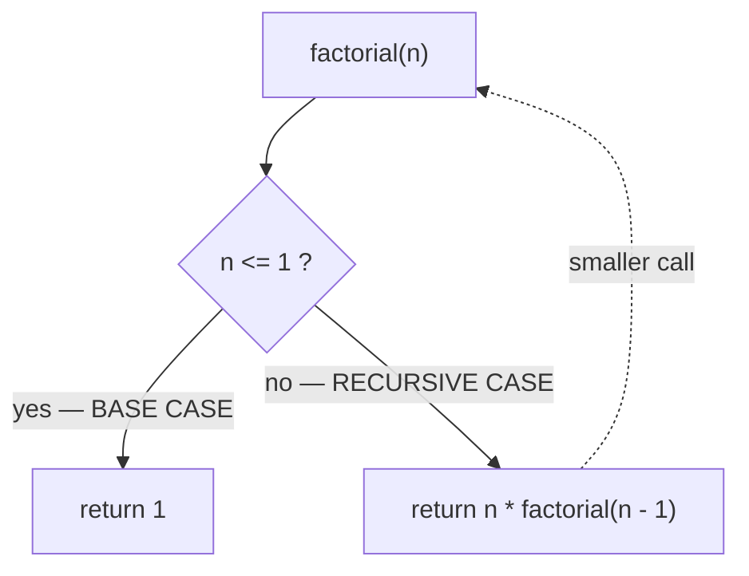
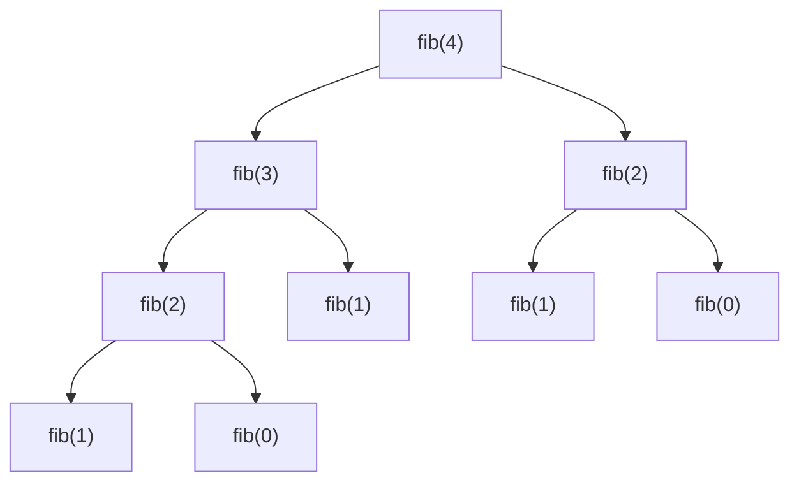

**Recursion** is a function that solves a problem by calling *itself* on a smaller version of
the same problem. Two ingredients are non-negotiable:

- **Base case** — the smallest input, solved directly, with **no** further recursion. It stops
  the descent.
- **Recursive case** — shrinks the problem and calls itself, trusting the smaller call to be
  correct.



```java
int factorial(int n) {
  if (n <= 1) return 1;          // base case — stops the recursion
  return n * factorial(n - 1);   // recursive case — shrinks toward the base
}
```

:::gotcha
**No base case = infinite recursion.** The stack fills up and the program crashes with a
`StackOverflowError`. Every recursive function must make progress *toward* a base case on each
call.
:::

## The call stack

Each call gets its own **stack frame** holding its parameters and where to resume. Calls
**push** frames as they descend, and **pop** them (returning a value) as they unwind. The
function can't finish `factorial(4)` until every deeper call returns first.

## Watch it: factorial(4) as a stack

The array below **is the call stack** — each box is a frame. Watch frames push down as we
recurse, hit the base case, then pop back up multiplying the returned values.

```walkthrough
title: factorial(4) — frames push, then pop with returns
code: |
  int factorial(int n) {
    if (n <= 1) return 1;
    return n * factorial(n - 1);
  }
steps:
  - text: 'Call `factorial(4)`. Push a frame. n = 4 is not <= 1, so it must wait for `factorial(3)`.'
    array: [4]
    highlight: [0]
    pointers: { 0: 'top' }
    line: 3
  - text: 'Push `factorial(3)`. Still not the base case — it needs `factorial(2)`.'
    array: [4, 3]
    highlight: [1]
    pointers: { 1: 'top' }
    line: 3
  - text: 'Push `factorial(2)`. Needs `factorial(1)`.'
    array: [4, 3, 2]
    highlight: [2]
    pointers: { 2: 'top' }
    line: 3
  - text: 'Push `factorial(1)`. **Base case!** n <= 1, so it returns **1** without recursing. The stack is at its deepest.'
    array: [4, 3, 2, 1]
    highlight: [3]
    pointers: { 3: 'base' }
    line: 2
  - text: 'Pop `factorial(1)` = 1. `factorial(2)` resumes: 2 * 1 = **2**. It pops next.'
    array: [4, 3, 2]
    highlight: [2]
    sorted: [3]
    pointers: { 2: 'top' }
    line: 3
  - text: 'Pop `factorial(2)` = 2. `factorial(3)` resumes: 3 * 2 = **6**.'
    array: [4, 3]
    highlight: [1]
    sorted: [2, 3]
    pointers: { 1: 'top' }
    line: 3
  - text: 'Pop `factorial(3)` = 6. `factorial(4)` resumes: 4 * 6 = **24**.'
    array: [4]
    highlight: [0]
    sorted: [1, 2, 3]
    pointers: { 0: 'top' }
    line: 3
  - text: 'Pop `factorial(4)` = **24**. Stack empty, recursion complete. The answer bubbled up as frames unwound.'
    array: []
    sorted: []
    line: 3
```

:::key
Recursion has **two phases**: the **wind-down** (calls push, shrinking toward the base) and the
**wind-up** (base returns, frames pop and combine results). The base case is the pivot between
them.
:::

## The recursion tree — branching cost

When a call makes **more than one** recursive call, the frames form a *tree*, and its size is
the complexity. Naive Fibonacci calls itself **twice**, so the tree roughly doubles each level.



That explosion is **O(2ⁿ)** — `fib(4)` recomputes `fib(2)` twice already. **Memoizing** (caching
each result the first time) collapses the tree to a line: **O(n)**.

## Recursion vs iteration

Anything recursive can be written with a loop, and vice versa. Choose by clarity and by whether
you can afford the stack.

| | Recursion | Iteration |
|--|--|--|
| **Reads like** | the problem's definition (trees, divide & conquer) | a mechanical repeat |
| **Extra memory** | O(depth) — the call stack | O(1) — no frames |
| **Risk** | `StackOverflowError` if too deep | none |
| **Best for** | trees, graphs, backtracking, D&C | linear scans, simple counting |

````tabs
tabs:
  - label: Recursive
    body: |
      Mirrors the math, but each call costs a stack frame.
      ```java
      int fact(int n) {
        if (n <= 1) return 1;
        return n * fact(n - 1);   // O(n) stack frames
      }
      ```
  - label: Iterative
    body: |
      Same result, O(1) space, no overflow risk.
      ```java
      int fact(int n) {
        int result = 1;
        for (int i = 2; i <= n; i++) result *= i;
        return result;
      }
      ```
````

:::warning
Java does **not** optimize tail recursion. Deep recursion (say > ~10,000 frames) will throw
`StackOverflowError`. For deep linear recursion, prefer a loop or an explicit stack.
:::

## Recall

```flashcards
title: Recursion recall
cards:
  - front: 'The two required parts of any recursive function?'
    back: '**Base case** (stops, no recursion) and **recursive case** (shrinks the problem and calls itself).'
  - front: 'What holds each recursive call''s local state?'
    back: 'A **stack frame** on the call stack. Frames push on the way down, pop on the way up.'
  - front: 'Space complexity of a recursion that goes n deep?'
    back: '**O(n)** — one stack frame per level, even if it returns a single value.'
  - front: 'Why is naive `fib(n)` O(2ⁿ), and the fix?'
    back: 'Each call branches into **two**, doubling the tree per level. **Memoization** caches results → O(n).'
  - front: 'What causes a StackOverflowError?'
    back: 'Recursion too deep or a **missing/unreachable base case** — frames pile up past the stack limit.'
```

## Check yourself

```quiz
title: Recursion check
questions:
  - q: 'What happens if a recursive function has no reachable base case?'
    options:
      - 'It returns 0'
      - text: 'It recurses forever and throws StackOverflowError'
        correct: true
      - 'The compiler rejects it'
    explain: 'Without a base case the stack keeps growing until it overflows. The compiler cannot catch this — it fails at runtime.'
  - q: 'In `factorial(4)`, which call returns FIRST?'
    options:
      - 'factorial(4)'
      - text: 'factorial(1) — the base case'
        correct: true
      - 'factorial(3)'
    explain: 'Calls push down to the base case first; factorial(1) hits n <= 1 and returns 1, then frames pop back up.'
  - q: 'The space complexity of a linear recursion that goes n levels deep is:'
    options:
      - 'O(1)'
      - text: 'O(n)'
        correct: true
      - 'O(log n)'
    explain: 'Each level keeps a live stack frame until it returns, so n nested calls use O(n) stack space — even the iterative version would be O(1).'
  - q: 'Naive recursive Fibonacci is O(2ⁿ). The standard fix to make it O(n) is:'
    options:
      - text: 'Memoization — cache each result the first time it is computed'
        correct: true
      - 'Adding another base case'
      - 'Making the function static'
    explain: 'The blow-up comes from recomputing the same subproblems. Caching (memoization) computes each fib(k) once, collapsing the tree to O(n).'
```

:::key
Recursion = **base case + shrinking recursive case**, bookkept on the **call stack** (O(depth)
space). One recursive call is usually linear; **two** branches into a tree — memoize to tame it.
:::
