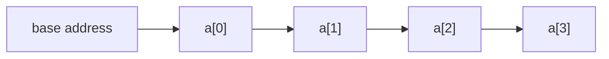

An **array** is a block of elements stored **contiguously** in memory. Because every element is
the same size and laid out back-to-back, the machine can jump straight to any index with one
multiply-and-add — that is the superpower behind **O(1) random access**.

## Contiguous memory = O(1) access

The address of `a[i]` is just `base + i * elementSize`. No searching, no walking a chain of
pointers — arithmetic. That single fact is why arrays underpin stacks, hash tables, heaps, and
dynamic arrays alike.



:::note
Contiguity also makes arrays **cache-friendly**. CPUs load memory in chunks (cache lines), so
reading `a[0]` pulls `a[1]`, `a[2]`... along for free. Iterating an array is dramatically faster
than chasing pointers scattered across the heap, even when Big-O is identical.
:::

## Fixed vs dynamic arrays

| | Fixed array (`int[]`) | Dynamic array (`ArrayList`) |
|--|--|--|
| Size | Set at creation, never changes | Grows on demand |
| Append | Not possible once full | Amortized **O(1)** |
| Under the hood | A raw contiguous block | A fixed array + a `size` counter |

A dynamic array is **not** magic — it is a fixed array plus a `size`, and a rule for what to do
when the array fills up: **allocate a bigger one and copy everything over**.

## Watch it: filling up, then doubling

The array below has **capacity 4**. We append until it is full, then a fifth append triggers a
resize: a new array of capacity 8 is allocated and every element is **copied** across.

```walkthrough
title: Dynamic array append + capacity doubling
code: |
  void add(int x) {
    if (size == capacity) {      // full — must grow
      capacity *= 2;             // double capacity
      data = copyOf(data, capacity);  // O(n) copy
    }
    data[size++] = x;            // O(1) place
  }
steps:
  - text: 'Start: capacity 4, `size = 2`. Two slots free. Append `7` — plenty of room.'
    array: [3, 5]
    highlight: [1]
    line: 6
  - text: '`7` placed at index 2. `size = 3`. Append `9` next.'
    array: [3, 5, 7]
    highlight: [2]
    line: 6
  - text: '`9` placed at index 3. Now `size == capacity == 4` — the array is **full**.'
    array: [3, 5, 7, 9]
    highlight: [3]
    sorted: [0, 1, 2]
    line: 6
  - text: 'Append `11`: `size == capacity`, so we **double** capacity to 8 and copy all 4 elements into the new block. This copy is O(n).'
    array: [3, 5, 7, 9]
    highlight: [0, 1, 2, 3]
    line: 4
  - text: 'Copy done into the larger block (now capacity 8, 4 empty slots). Place `11` at index 4.'
    array: [3, 5, 7, 9, 11]
    highlight: [4]
    sorted: [0, 1, 2, 3]
    line: 6
  - text: 'The next 3 appends are plain O(1) placements — no resize until we hit capacity 8 again.'
    array: [3, 5, 7, 9, 11, 13]
    highlight: [5]
    sorted: [0, 1, 2, 3, 4]
    line: 6
```

## Why append is *amortized* O(1)

A single append that triggers a resize costs O(n) — so how can we claim O(1)? Because resizes
are **rare and get rarer**. Doubling means that to reach size *n* you copy `1 + 2 + 4 + ... + n`
elements total, which sums to `< 2n`. Spread that cost across the *n* appends and each one pays
**≈ 2 copies on average** — a constant.

:::key
**Doubling** (not "add a constant") is what makes append amortized O(1). Growing by a fixed
amount (say +1 or +10) would make total copies O(n²). Multiplicative growth is the whole trick.
:::

:::gotcha
Amortized O(1) is an **average over many appends**, not a per-call guarantee. Any *individual*
append can still stall for O(n) while it copies. In latency-sensitive code, pre-size the list
(`new ArrayList<>(expectedSize)`) to skip the growth spikes entirely.
:::

## Complexity

| Operation | Time | Why |
|--|:--:|--|
| Access `a[i]` | **O(1)** | Address arithmetic |
| Append at end | **O(1)** amortized | Rare doubling copies |
| Insert / delete at front or middle | **O(n)** | Must shift every later element |
| Search (unsorted) | **O(n)** | Scan every element |

## Check yourself

```quiz
title: Dynamic array check
questions:
  - q: 'What makes `a[i]` an O(1) operation on an array?'
    options:
      - text: 'Elements are contiguous, so the address is `base + i * size`'
        correct: true
      - 'The array is always sorted'
      - 'The JVM caches every index'
    explain: 'Contiguous, equal-size elements let the CPU compute any address with one multiply-and-add — no scanning.'
  - q: 'A dynamic array doubles capacity on overflow. A single append is:'
    options:
      - 'Always O(1)'
      - text: 'O(n) worst case, but O(1) amortized'
        correct: true
      - 'Always O(n)'
    explain: 'The resize copy is O(n), but doubling makes copies rare — total work across n appends is < 2n, so each is O(1) amortized.'
  - q: 'Why double capacity instead of growing by a fixed +1 each time?'
    options:
      - 'To save memory'
      - text: 'Fixed growth makes total copying O(n²); doubling keeps it O(n)'
        correct: true
      - 'The language requires it'
    explain: 'Adding a constant forces a copy on nearly every append (O(n²) total). Multiplicative growth spreads copies so append stays amortized O(1).'
  - q: 'Inserting at the FRONT of a dynamic array of size n costs:'
    options:
      - 'O(1)'
      - text: 'O(n) — every existing element shifts right one slot'
        correct: true
      - 'O(log n)'
    explain: 'Only the end is cheap. Front/middle inserts and deletes must shift all following elements.'
```

:::senior
When you see an `ArrayList`/`vector` grow in a hot loop, reach for a pre-sized constructor. And
remember the flip side of contiguity: appends are cheap, but **front inserts and middle deletes
are O(n)**. If you need cheap ends-and-middle edits, that is a signal for a linked list or deque.
:::
