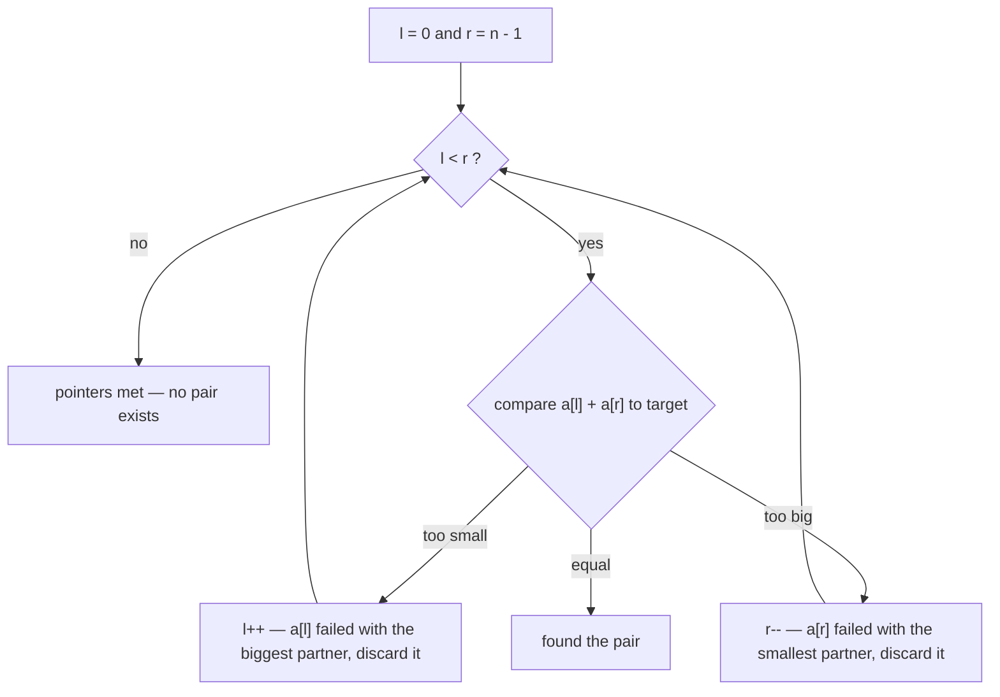

The **two-pointer** technique moves two indices over an array — often from opposite ends — to
solve in **O(n)** what a nested loop does in O(n²). It is the highest-ROI array pattern to master.

## Two flavors

| Flavor | Pointers | Great for |
|--|--|--|
| **Opposite ends** | `left = 0`, `right = n-1`, converge | sorted-array pair sums, palindromes, reversing, container-with-most-water |
| **Fast / slow** | both start left, move at different speeds | in-place dedup, cycle detection, window kin |

## Watch it: pair sum on a sorted array

Goal: find two numbers that add to **18**. Brute force checks every pair (O(n²)); two pointers
does it in a single pass.

```walkthrough
title: Two-sum on a sorted array (target = 18)
code: |
  int l = 0, r = n - 1;
  while (l < r) {
    int sum = a[l] + a[r];
    if (sum == target) return new int[]{l, r};
    if (sum < target) l++;   // too small -> grow the sum
    else r--;                // too big  -> shrink the sum
  }
steps:
  - text: 'Put `l` on the smallest value and `r` on the largest. The array is **sorted** — that is what makes this work.'
    array: [2, 7, 11, 15]
    pointers: { 0: 'L', 3: 'R' }
    line: 1
  - text: '`sum = 2 + 15 = 17`, which is **< 18**. To grow the sum, move `l` right to a bigger value.'
    array: [2, 7, 11, 15]
    highlight: [0, 3]
    pointers: { 0: 'L', 3: 'R' }
    line: 5
  - text: '`sum = 7 + 15 = 22`, which is **> 18**. To shrink the sum, move `r` left.'
    array: [2, 7, 11, 15]
    highlight: [1, 3]
    pointers: { 1: 'L', 3: 'R' }
    line: 6
  - text: '`sum = 7 + 11 = 18` — **match!** Return indices `[1, 2]`. One pass, no nested loop.'
    array: [2, 7, 11, 15]
    sorted: [1, 2]
    pointers: { 1: 'L', 2: 'R' }
    line: 4
```

## Why nothing gets missed

The one question interviewers push on: *how do you know skipping pairs is safe?* Each move is a
**proof of elimination**. When `sum < target`, the pair `(a[l], a[r])` failed with the **largest
possible partner** for `a[l]` — so `a[l]` can never be part of a valid pair and is discarded for
good. Symmetrically for `r--`. Every iteration permanently eliminates one element, which is why
the loop terminates in at most n − 1 steps.



## Opposite ends vs fast / slow

````tabs
tabs:
  - label: Opposite ends
    body: |
      Converge from both sides — pair sums, palindromes, reversing in place.
      ```java
      int l = 0, r = n - 1;
      while (l < r) {
        // decide: move l++ or r-- based on a[l], a[r]
      }
      ```
  - label: Fast / slow
    body: |
      Two speeds — remove duplicates in place, or detect a cycle.
      ```java
      int slow = 0;
      for (int fast = 1; fast < n; fast++) {
        if (a[fast] != a[slow]) a[++slow] = a[fast];
      }
      // slow + 1 = length of the deduped prefix
      ```
````

:::gotcha
Opposite-ends two pointers **requires a sorted array** (or some monotonic property): moving `l`
right must reliably grow the value and `r` left must shrink it. On unsorted data, sort first
(O(n log n)) or use a hash set instead.
:::

:::senior
Many "hard" array problems are two pointers in disguise: **container with most water**,
**3-sum** (fix one index, two-pointer the rest), **trapping rain water**, **merge two sorted
arrays**. Spotting the pattern is the actual interview skill.
:::

## Classic interview variations

- **3-sum** — sort, fix index `i`, run opposite-ends on the suffix. O(n²) total. The trap is
  **duplicate triplets**: skip repeated values at `i`, and after a match advance `l`/`r` past
  their duplicates too.
- **Container with most water** — always move the **shorter** wall inward. Keeping it can never
  help: width only shrinks and the height is capped by the shorter wall, so its best pairing was
  the one you just measured.
- **Merge two sorted arrays in place** — walk **backwards** with three pointers, filling from
  the end of the larger buffer. Forward merging would overwrite unread elements.
- **Valid palindrome II** (delete at most one char) — converge normally; on the first mismatch,
  branch: check `(l+1, r)` and `(l, r-1)` — if either sub-range is a palindrome, answer is yes.

## Off-by-one traps

- Pair-sum uses `while (l < r)` — a pair needs **two distinct indices**; `l <= r` would let an
  element pair with itself.
- Palindrome check also stops at `l < r`: when they meet on the middle character there is
  nothing left to compare.
- In-place dedup returns `slow + 1` (a **length**), not `slow` (the last kept **index**) —
  the classic off-by-one in the fast/slow flavor.

## Complexity

| Approach | Time | Space |
|--|:--:|:--:|
| Brute force (nested loop) | O(n²) | O(1) |
| **Two pointers** (sorted) | **O(n)** | **O(1)** |
| Hash set (unsorted) | O(n) | O(n) |

## Check yourself

```quiz
title: Two-pointer check
questions:
  - q: 'What precondition does the opposite-ends pair-sum rely on?'
    options:
      - text: 'The array is sorted'
        correct: true
      - 'The array has unique values'
      - 'The array length is even'
    explain: 'Moving `l` right always grows the sum and `r` left always shrinks it — that monotonic behavior only holds on a **sorted** array.'
  - q: 'Brute-force pair sum is O(n²). Two pointers make it:'
    options:
      - 'O(log n)'
      - text: 'O(n)'
        correct: true
      - 'O(n log n)'
    explain: 'Each pointer moves at most n steps total, so the scan is one O(n) pass using O(1) extra space.'
  - q: 'On an UNSORTED array, the usual O(n) way to find a pair summing to a target is:'
    options:
      - 'Two pointers from both ends'
      - text: 'A hash set of values seen so far'
        correct: true
      - 'Binary search'
    explain: 'Without sorting, two pointers do not apply. A hash set finds `target - x` in O(n) time at O(n) space.'
```

:::key
Two pointers turns many O(n²) scans into O(n): **opposite ends** (converge — needs sorted) for
pair sums and palindromes; **fast/slow** for in-place edits and cycles. Unsorted and need pairs?
Sort first or use a hash set.
:::
