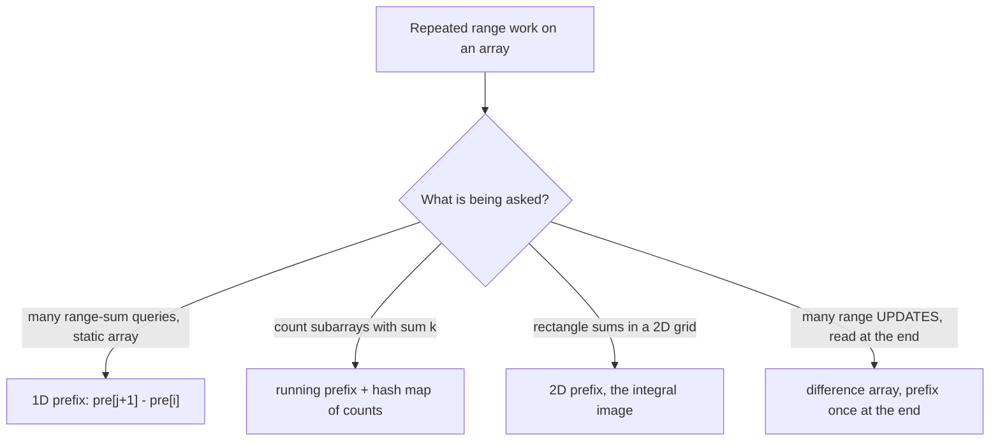

A **prefix sum** array stores the running total up to each index. Build it once in O(n) and every
**range-sum query** collapses to a single subtraction — O(1) instead of O(n) per query. It is the
"precompute, then answer instantly" pattern for arrays.

## The core identity

Let `pre[i]` = sum of the first `i` elements (so `pre[0] = 0`). Then the sum of any range
`a[i..j]` (inclusive) is just:

```text
sum(i..j) = pre[j + 1] - pre[i]
```

The prefix up to `j` minus everything before `i` leaves exactly the middle. One subtraction, any
range, O(1).

## Watch it: building the prefix array

We use a **1-based** prefix array with a leading `0`, so `pre[k]` = sum of the first `k` elements.
Each cell is the previous prefix plus the next input value.

```walkthrough
title: Build prefix sums for a = [3, 1, 4, 1, 5]
code: |
  int[] pre = new int[n + 1];   // pre[0] = 0
  for (int i = 0; i < n; i++)
    pre[i + 1] = pre[i] + a[i];
  // range sum a[i..j] = pre[j+1] - pre[i]
steps:
  - text: 'Start with the sentinel `pre[0] = 0`. It represents "sum of zero elements".'
    array: [0]
    highlight: [0]
    line: 1
  - text: '`pre[1] = pre[0] + a[0] = 0 + 3 = 3`.'
    array: [0, 3]
    highlight: [1]
    line: 3
  - text: '`pre[2] = pre[1] + a[1] = 3 + 1 = 4`.'
    array: [0, 3, 4]
    highlight: [2]
    line: 3
  - text: '`pre[3] = pre[2] + a[2] = 4 + 4 = 8`.'
    array: [0, 3, 4, 8]
    highlight: [3]
    line: 3
  - text: '`pre[4] = pre[3] + a[3] = 8 + 1 = 9`.'
    array: [0, 3, 4, 8, 9]
    highlight: [4]
    line: 3
  - text: '`pre[5] = pre[4] + a[4] = 9 + 5 = 14`. Build complete in one O(n) pass.'
    array: [0, 3, 4, 8, 9, 14]
    sorted: [0, 1, 2, 3]
    highlight: [5]
    line: 3
```

Now query `sum(a[1..3]) = 1 + 4 + 1 = 6`. Using the identity: `pre[4] - pre[1] = 9 - 3 = 6`. ✅
No re-scan — every future query is one subtraction.

## Complexity

| Operation | Naive per query | With prefix sums |
|--|:--:|:--:|
| Build | — | **O(n)** once |
| Single range-sum query | O(n) | **O(1)** |
| **q** queries | O(n·q) | **O(n + q)** |
| Extra space | O(1) | O(n) |

## Level up: subarray sum equals k (hashing prefixes)

The real interview move: **how many contiguous subarrays sum to exactly k?** A subarray
`a[i..j]` sums to `k` when `pre[j+1] - pre[i] = k`, i.e. `pre[i] = pre[j+1] - k`. So as we sweep
and compute the running prefix, we ask a hash map: **"how many earlier prefixes equal
`current - k`?"** Each match is a valid subarray ending here.

```java
Map<Integer, Integer> count = new HashMap<>();
count.put(0, 1);            // empty prefix — enables subarrays starting at index 0
int running = 0, answer = 0;
for (int x : a) {
    running += x;
    answer += count.getOrDefault(running - k, 0);  // subarrays ending here that sum to k
    count.merge(running, 1, Integer::sum);
}
```

:::key
`pre[j] - pre[i] = k`  ⇒  `pre[i] = pre[j] - k`. Storing prefix **counts** in a hash map turns
"count subarrays summing to k" into a single O(n) pass. This one rearrangement powers a whole
family of problems (subarray sum = k, divisible-by-k, binary-array balance).
:::

:::gotcha
Seed the map with `count.put(0, 1)` **before** the loop. That phantom empty-prefix entry is what
lets a subarray starting at index 0 be counted. Forgetting it silently undercounts — a classic
off-by-one that passes small tests and fails the edge cases.
:::

## Which prefix tool?

The family has four members; interviews mostly test the first two, but naming the others is an
easy senior signal:



The **difference array** is the inverse trick: to add `v` to every element of `a[i..j]`, do
`diff[i] += v; diff[j + 1] -= v` — O(1) per update — then one prefix pass materializes all
updates at once. Classic uses: flight bookings, meeting-room load, "car pooling".

```java
int[] diff = new int[n + 1];
for (int[] u : updates) {          // u = {i, j, v}
    diff[u[0]] += u[2];
    diff[u[1] + 1] -= u[2];        // cancel after the range ends
}
for (int i = 1; i < n; i++) diff[i] += diff[i - 1];  // materialize
```

## Check yourself

```quiz
title: Prefix sums check
questions:
  - q: 'With a 1-based prefix array, the sum of `a[i..j]` (inclusive) is:'
    options:
      - 'pre[j] - pre[i]'
      - text: 'pre[j + 1] - pre[i]'
        correct: true
      - 'pre[j] - pre[i - 1]'
    explain: 'pre[j+1] is the sum through index j; subtracting pre[i] removes everything before i, leaving a[i..j].'
  - q: 'After an O(n) build, answering q range-sum queries costs:'
    options:
      - 'O(n·q)'
      - text: 'O(q) — each query is one O(1) subtraction'
        correct: true
      - 'O(q log n)'
    explain: 'The precompute pays the O(n) cost once; every query afterward is a single subtraction.'
  - q: 'For "count subarrays summing to k", why store prefix sums in a hash map?'
    options:
      - 'To keep them sorted'
      - text: 'To look up, in O(1), how many earlier prefixes equal `current - k`'
        correct: true
      - 'To avoid recomputing the array'
    explain: 'Since pre[i] = current - k marks a valid subarray end, a hashmap of prefix counts answers each step in O(1), giving an O(n) total.'
  - q: 'Why initialize the map with `{0: 1}` before scanning?'
    options:
      - 'To avoid null pointers'
      - text: 'So subarrays that start at index 0 (whose prefix equals k) are counted'
        correct: true
      - 'To store the array length'
    explain: 'The empty prefix (sum 0) must exist so that a running prefix equal to k matches it and counts the subarray from the very start.'
```

:::senior
Prefix sums generalize: a **2D prefix (integral image)** answers rectangle sums in O(1);
**difference arrays** are the inverse, applying many range *updates* in O(1) each. When you see
repeated range queries or "count subarrays with property X", prefix sums (often + a hash map)
should be the first tool you reach for.
:::
