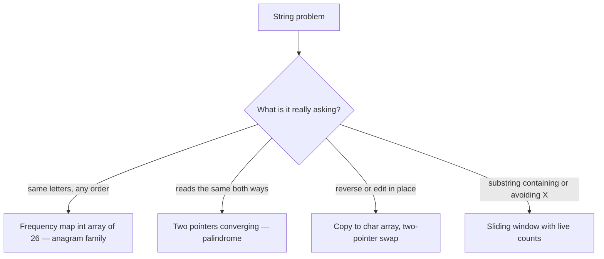

Strings are just **arrays of characters**, so every array technique applies — plus a few
patterns that come up so often they are worth memorizing: **frequency maps**, **two-pointer
scans**, and **in-place reversal**. Master these three and most string questions fall quickly.

The phrasing of the problem points straight at the tool:



## Frequency maps: the anagram workhorse

A **frequency map** counts how many times each character appears. Two strings are **anagrams**
exactly when their frequency maps are identical. For lowercase ASCII, a plain `int[26]` is faster
and simpler than a `HashMap`.

````tabs
tabs:
  - label: int[26] (ASCII)
    body: |
      Fastest for lowercase a–z. Add for one string, subtract for the other — all zeros ⇒ anagram.
      ```java
      boolean isAnagram(String s, String t) {
        if (s.length() != t.length()) return false;
        int[] freq = new int[26];
        for (int i = 0; i < s.length(); i++) {
          freq[s.charAt(i) - 'a']++;   // count s
          freq[t.charAt(i) - 'a']--;   // uncount t
        }
        for (int f : freq) if (f != 0) return false;
        return true;
      }
      ```
  - label: HashMap (Unicode)
    body: |
      Works for any character set (Unicode, mixed case) at the cost of hashing overhead.
      ```java
      boolean isAnagram(String s, String t) {
        if (s.length() != t.length()) return false;
        Map<Character, Integer> freq = new HashMap<>();
        for (char c : s.toCharArray()) freq.merge(c, 1, Integer::sum);
        for (char c : t.toCharArray())
          if (freq.merge(c, -1, Integer::sum) < 0) return false;
        return true;
      }
      ```
  - label: Sorting
    body: |
      Simplest to write, but O(n log n) — slower than counting. Fine when clarity beats speed.
      ```java
      boolean isAnagram(String s, String t) {
        char[] a = s.toCharArray(), b = t.toCharArray();
        Arrays.sort(a); Arrays.sort(b);
        return Arrays.equals(a, b);
      }
      ```
````

:::tip
Counting anagrams is **O(n)**; sorting them is **O(n log n)**. In an interview, reach for the
`int[26]` counter first for lowercase input — it is the expected "optimal" answer.
:::

## Palindromes & reversal: two pointers in action

A **palindrome** reads the same forward and backward. Check it (or reverse in place) by walking
two pointers from the ends toward the middle — the same converge pattern from
[Two Pointers](/dsa/topic/arrays-strings/two-pointers). In-place reversal **swaps** `L` and `R`,
then steps both inward.

```walkthrough
title: In-place reverse with two pointers — "DEATH"
code: |
  int L = 0, R = s.length - 1;
  while (L < R) {
    swap(s, L, R);   // exchange the ends
    L++;             // step inward
    R--;
  }
steps:
  - text: 'Place `L` at the first char and `R` at the last. They will swap and march toward the center.'
    array: [D, E, A, T, H]
    pointers: { 0: 'L', 4: 'R' }
    line: 1
  - text: 'Swap `s[L]` and `s[R]`: `D` ↔ `H`. The ends are now settled.'
    array: [H, E, A, T, D]
    highlight: [0, 4]
    pointers: { 0: 'L', 4: 'R' }
    line: 3
  - text: 'Step inward: `L=1`, `R=3`. Swap `E` ↔ `T`.'
    array: [H, T, A, E, D]
    highlight: [1, 3]
    sorted: [0, 4]
    pointers: { 1: 'L', 3: 'R' }
    line: 3
  - text: 'Step inward: `L=2`, `R=2`. Now `L == R` — the middle char stays put, loop ends.'
    array: [H, T, A, E, D]
    sorted: [0, 1, 3, 4]
    pointers: { 2: 'L=R' }
    line: 2
  - text: 'Reversed in place: `HTAED`. **O(n)** time, **O(1)** extra space — only ⌊n/2⌋ swaps.'
    array: [H, T, A, E, D]
    sorted: [0, 1, 2, 3, 4]
    line: 2
```

For a **palindrome check**, use the identical loop but *compare* instead of swap: if any
`s[L] != s[R]`, return `false`; survive the loop and it is a palindrome.

```java
boolean isPalindrome(char[] s) {
    int L = 0, R = s.length - 1;
    while (L < R) {
        if (s[L] != s[R]) return false;
        L++; R--;
    }
    return true;
}
```

:::gotcha
In Java, `String` is **immutable** — you cannot swap characters in place. Convert to a
`char[]` (or `StringBuilder`) first, mutate that, then rebuild the string. Trying to "modify" a
`String` directly just creates a new object each time — O(n²) if done in a loop.
:::

## Complexity

| Task | Time | Space | Technique |
|--|:--:|:--:|--|
| Anagram (count) | **O(n)** | O(1) | `int[26]` frequency map |
| Anagram (sort) | O(n log n) | O(n) | sort + compare |
| Palindrome check | **O(n)** | O(1) | two pointers |
| In-place reverse | **O(n)** | O(1) | two-pointer swap |

## Check yourself

```quiz
title: String techniques check
questions:
  - q: 'The fastest way to test if two lowercase strings are anagrams is:'
    options:
      - 'Sort both and compare — O(n log n)'
      - text: 'A frequency count (int[26]) — O(n)'
        correct: true
      - 'Compare them character by character in order'
    explain: 'Counting each letter is O(n); sorting is O(n log n). For a–z, an int[26] counter is the optimal answer.'
  - q: 'Reversing a char array with two pointers uses how much extra space?'
    options:
      - 'O(n) for a copy'
      - text: 'O(1) — it swaps ends in place'
        correct: true
      - 'O(log n)'
    explain: 'Two pointers swap the outer pair and move inward, mutating the array directly — no auxiliary array needed.'
  - q: 'Why must you convert a Java `String` to `char[]` before reversing in place?'
    options:
      - 'char[] is faster to print'
      - text: 'String is immutable — its characters cannot be reassigned'
        correct: true
      - 'Strings do not support indexing'
    explain: 'Java Strings cannot be mutated. Work on a char[] (or StringBuilder), then build a new String from the result.'
  - q: 'A two-pointer palindrome check returns false as soon as:'
    options:
      - text: 's[L] != s[R] for some pair converging from the ends'
        correct: true
      - 'L reaches the middle'
      - 'the string length is odd'
    explain: 'If the mirrored characters ever differ, it cannot be a palindrome — bail immediately. Odd length is fine; the middle char has no partner.'
```

:::key
Three moves cover most string problems: **frequency map** (anagrams, "contains all chars",
grouping), **two pointers** (palindromes, reversal, in-place edits), and remembering Java
**strings are immutable** so mutation happens on a `char[]`/`StringBuilder`.
:::

:::senior
Frequency maps also power sliding-window string problems — "smallest window containing all of T",
"find all anagrams in S" — by maintaining a live count as the window moves. The `int[26]` (or
`int[128]` for ASCII) counter is the shared engine behind that whole problem family.
:::
