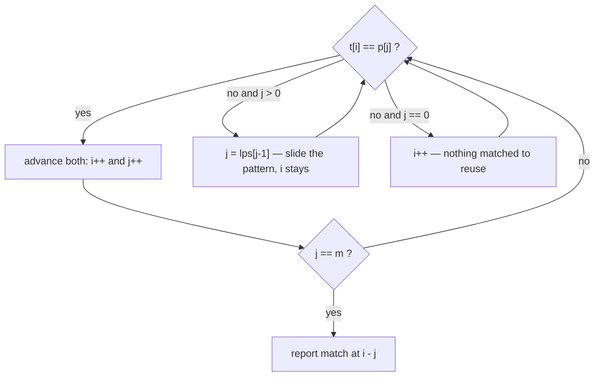

*"Does pattern `P` occur in text `T`, and where?"* The brute-force answer re-compares from scratch at every position — **O(n·m)**. Two classic algorithms cut that to **O(n + m)** by never re-examining a character they've already ruled out.

## The naive baseline

```java
for (int i = 0; i + m <= n; i++) {
    int j = 0;
    while (j < m && text.charAt(i + j) == pat.charAt(j)) j++;
    if (j == m) return i;                 // match at i
}
```

On `T = "aaaaab"`, `P = "aaab"` this re-scans the same `a`s over and over — the worst case that KMP and Rabin-Karp fix.

## Rabin-Karp — rolling hash

Hash the pattern once, then roll a fixed-width hash across the text: dropping the leading char and adding the trailing one is **O(1)** per shift. Compare hashes first; only verify character-by-character on a hash **match** (to rule out collisions).

```java
long H = 0, P = 0, pow = 1;               // base-B, mod a large prime
for (int i = 0; i < m; i++) {             // hash P and first window
    P = (P * B + pat.charAt(i)) % MOD;
    H = (H * B + text.charAt(i)) % MOD;
    if (i > 0) pow = (pow * B) % MOD;
}
for (int i = 0; ; i++) {
    if (H == P && text.startsWith(pat, i)) return i;   // verify on hash hit
    if (i + m >= n) break;
    H = ((H - text.charAt(i) * pow % MOD + MOD) * B     // roll: drop left...
         + text.charAt(i + m)) % MOD;                   // ...add right
}
```

- **Average O(n + m)**; worst case O(n·m) if hashes collide adversarially.
- **Shines for multi-pattern search** (hash a whole set of patterns of equal length) and 2-D pattern matching.

## KMP — never look back

KMP precomputes, for the pattern, the **LPS array** (`lps[i]` = length of the longest proper prefix of `P[0..i]` that is also a suffix). On a mismatch it jumps the pattern forward by that much instead of restarting — so the **text pointer never moves backward**.

```java
int[] lps(String p) {
    int[] lps = new int[p.length()];
    int len = 0, i = 1;
    while (i < p.length()) {
        if (p.charAt(i) == p.charAt(len)) lps[i++] = ++len;
        else if (len > 0)                len = lps[len - 1];  // fall back
        else                             lps[i++] = 0;
    }
    return lps;
}

int kmp(String t, String p) {
    int[] lps = lps(p);
    int i = 0, j = 0;                     // i over text, j over pattern
    while (i < t.length()) {
        if (t.charAt(i) == p.charAt(j)) { i++; j++;
            if (j == p.length()) return i - j;               // full match
        } else if (j > 0) j = lps[j - 1]; // reuse the matched prefix
        else i++;
    }
    return -1;
}
```

The search loop is a tiny state machine — every character of the text is consumed exactly once:



## Watch it: the fallback in action

Pattern `P = "abab"` has `lps = [0, 0, 1, 2]`. Search it in `T = "abacabab"` and watch what
happens at the mismatch — the text pointer `i` **never moves backward**.

```walkthrough
title: KMP search — P = "abab" in T = "abacabab"
code: |
  int i = 0, j = 0;               // i over text, j over pattern
  while (i < n) {
    if (t[i] == p[j]) {
      i++; j++;
      if (j == m) return i - j;   // full match
    }
    else if (j > 0) j = lps[j-1]; // fall back — i stays put
    else i++;                     // j == 0: just move on
  }
steps:
  - text: '`t[0] = a` matches `p[0] = a`. Both pointers advance. j = 1.'
    array: [a, b, a, c, a, b, a, b]
    highlight: [0]
    pointers: { 0: 'i' }
    line: 4
  - text: '`t[1] = b` and `t[2] = a` match `p[1]` and `p[2]` too. Three pattern chars are live: j = 3.'
    array: [a, b, a, c, a, b, a, b]
    sorted: [0, 1]
    highlight: [2]
    pointers: { 2: 'i' }
    line: 4
  - text: '**Mismatch**: `t[3] = c` vs `p[3] = b`. Naive search would restart from text index 1. KMP instead reuses the matched prefix: `j = lps[2] = 1`. Note `i` did not move.'
    array: [a, b, a, c, a, b, a, b]
    highlight: [3]
    pointers: { 3: 'i' }
    line: 7
  - text: 'Still mismatched: `c` vs `p[1] = b` → fall back again, `j = lps[0] = 0`. Then `c` vs `p[0] = a` fails with j = 0, so finally `i++`. Forward only.'
    array: [a, b, a, c, a, b, a, b]
    highlight: [3]
    pointers: { 3: 'i' }
    line: 8
  - text: 'Fresh alignment from i = 4: `a`, `b`, `a` all match — j = 3 again.'
    array: [a, b, a, c, a, b, a, b]
    sorted: [4, 5]
    highlight: [6]
    pointers: { 6: 'i' }
    line: 4
  - text: '`t[7] = b` matches `p[3]` → j = 4 = m. **Match at i − j = 4.** Every text char was consumed once — that is the O(n + m) guarantee.'
    array: [a, b, a, c, a, b, a, b]
    sorted: [4, 5, 6, 7]
    pointers: { 7: 'i' }
    line: 5
```

:::gotcha
The subtle line is the fallback `j = lps[j - 1]` on mismatch — **not** `j = 0`. Resetting to 0 would re-scan characters KMP already knows match, collapsing back to O(n·m). The LPS array is precisely the memory that lets it skip.
:::

:::senior
Know the map: **KMP** for a single pattern with guaranteed O(n+m); **Rabin-Karp** when you're matching *many* patterns or need rolling-hash tricks (plagiarism, 2-D search); the **Z-algorithm** as a simpler alternative to KMP (the Z-array gives, for each index, the longest substring starting there that matches a prefix). For *many queries against one fixed text*, preprocess it into a **suffix automaton / suffix array** instead.
:::

## At a glance

| Algorithm | Preprocess | Search | Best for |
|--|:--:|:--:|--|
| Naive | — | O(n·m) | tiny inputs |
| **Rabin-Karp** | O(m) | O(n+m) avg | multi-pattern, 2-D |
| **KMP** | O(m) | O(n+m) worst | single pattern, guaranteed linear |
| Z-algorithm | O(n+m) | O(n+m) | prefix-matching, simpler to derive |

## Check yourself

```quiz
title: String matching check
questions:
  - q: 'In KMP, what does `lps[i]` store?'
    options:
      - 'The index of the last match'
      - text: 'The length of the longest proper prefix of P[0..i] that is also a suffix'
        correct: true
      - 'The hash of the prefix up to i'
    explain: 'That prefix-suffix length is how far the pattern can shift on a mismatch without missing a match — letting the text pointer never move backward.'
  - q: 'Why does Rabin-Karp still compare characters after a hash match?'
    options:
      - 'To update the rolling hash'
      - text: 'Different substrings can share a hash (a collision); verification confirms a true match'
        correct: true
      - 'It does not — a hash match is always a real match'
    explain: 'Hashing maps many strings to the same value, so a hash equality must be confirmed with a direct comparison to avoid false positives.'
  - q: 'What makes the naive search O(n·m) in the worst case?'
    options:
      - text: 'On a mismatch it restarts the comparison from scratch, re-scanning characters it already checked'
        correct: true
      - 'Sorting the text first'
      - 'It uses recursion'
    explain: 'Patterns like "aaab" against "aaaa...ab" force a near-full re-scan at every start position; KMP avoids this by reusing the matched prefix.'
```

:::key
Beat the naive O(n·m) rescan two ways. **Rabin-Karp** rolls a hash across the text in O(1) per shift (verify on a hash hit) — great for multi-pattern search. **KMP** precomputes the **LPS/failure array** so on a mismatch it shifts the pattern by the longest prefix-that-is-a-suffix and the text pointer never backtracks — guaranteed O(n+m).
:::
