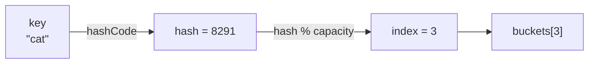
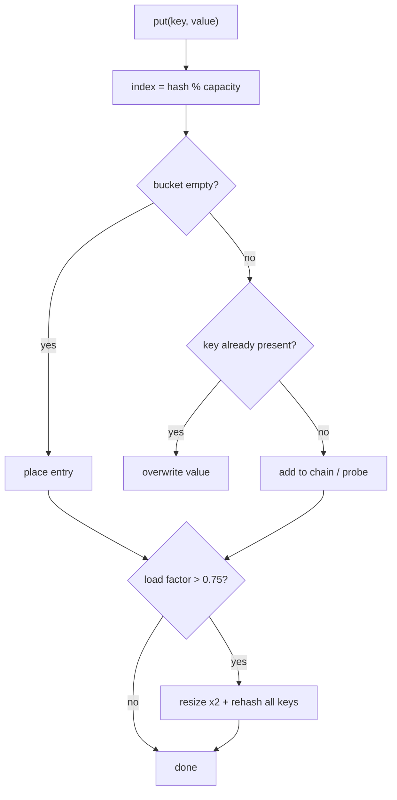

A **hash table** is just an array plus a **hash function**. The hash function maps a key to an
array index, so `get`, `put`, and `contains` all become "compute an index, look at one slot" —
**O(1) on average**. This is the machinery behind `HashMap`, `HashSet`, and Python `dict`.

## The core idea: key → index



Two steps every operation performs:

1. **Hash** the key to a big integer (`"cat".hashCode()`).
2. **Compress** that integer into a valid slot: `index = hash % capacity`.

A good hash function spreads keys **uniformly** across the array so slots fill evenly. A bad one
(e.g. one that returns the same value for many keys) clumps everything into a few slots and
destroys performance.

## Watch it: inserting keys into buckets

We insert keys into a table with **8 buckets**. The index is `hash % 8`. Watch what happens when
two keys land on the **same** bucket — that is a **collision**.

```walkthrough
title: Insert keys into an array of buckets (capacity = 8)
code: |
  int index = hash(key) % capacity;   // compress to a slot
  if (buckets[index] == null)
    buckets[index] = new Entry(key);   // empty -> place it
  else
    buckets[index].append(key);        // occupied -> collision, chain it
steps:
  - text: 'Empty table, 8 buckets. Insert `"cat"` — `hash % 8 = 3`. Bucket 3 is empty, drop it in.'
    array: ['', '', '', '', '', '', '', '']
    highlight: [3]
    pointers: { 3: 'cat->3' }
    line: 3
  - text: '`"cat"` now lives in bucket 3.'
    array: ['', '', '', 'cat', '', '', '', '']
    sorted: [3]
    line: 3
  - text: 'Insert `"dog"` — `hash % 8 = 6`. Bucket 6 is empty, place it. No collision.'
    array: ['', '', '', 'cat', '', '', '', '']
    highlight: [6]
    pointers: { 6: 'dog->6' }
    line: 3
  - text: 'Insert `"bird"` — `hash % 8 = 3`. But bucket 3 is **already taken by `cat`** — collision!'
    array: ['', '', '', 'cat', '', '', 'dog', '']
    highlight: [3]
    pointers: { 3: 'bird->3' }
    line: 5
  - text: 'Resolve by **chaining**: `bird` joins a little list hanging off bucket 3. Both keys coexist.'
    array: ['', '', '', 'cat,bird', '', '', 'dog', '']
    sorted: [3, 6]
    pointers: { 3: 'chain' }
    line: 5
```

## Collisions are guaranteed

By the **pigeonhole principle**, once you have more keys than buckets, collisions are certain —
and thanks to the [birthday paradox](https://en.wikipedia.org/wiki/Birthday_problem) they show up
far sooner than you would guess. So every hash table needs a **collision resolution** strategy.

````tabs
tabs:
  - label: Separate chaining
    body: |
      Each bucket holds a **list** (or tree) of entries that hashed there. Collisions append to
      the list. This is what Java `HashMap` uses — and since Java 8 a bucket **converts a long
      chain into a balanced tree** (O(log n)) once it passes ~8 entries.
      ```java
      // conceptually
      buckets[index] = [Entry("cat"), Entry("bird")];  // both hashed to 3
      ```
  - label: Open addressing
    body: |
      Keep everything **in the array itself**. On a collision, **probe** for the next free slot.
      With *linear probing* you try `index+1, index+2, ...`; other schemes use quadratic probing
      or double hashing. No linked lists, better cache locality, but clustering can hurt.
      ```java
      int i = hash(key) % capacity;
      while (buckets[i] != null && !buckets[i].key.equals(key))
        i = (i + 1) % capacity;   // probe forward
      ```
````

:::gotcha
`equals` and `hashCode` are a package deal. If two keys are `equals`, they **must** return the
same `hashCode`, or the map stores duplicates and lookups silently fail. Override both together —
and never mutate a field used in `hashCode` while the key sits in a map.
:::

## Load factor and resizing

The **load factor** measures how full the table is — `entries / buckets`:

```text
load factor = number of entries / number of buckets
```

As it climbs, chains get longer and lookups slow toward O(n). To fight this, the table **resizes**
once the load factor crosses a threshold (Java `HashMap` uses **0.75**): it allocates a bigger
array (usually **double**) and **rehashes** every existing key into the new, larger space.



:::note
A single resize is **O(n)** because it rehashes everything. But it happens rarely — only when the
table doubles — so the cost is **amortized O(1)** per insert. If you know the final size, pass an
initial capacity (`new HashMap<>((int)(expectedSize / 0.75f) + 1)`, allowing for the 0.75 load factor) to skip the resizes entirely.
:::

## Complexity

| Operation | Average | Worst case | When worst happens |
|--|:--:|:--:|--|
| `insert` / `put` | **O(1)** | O(n) | every key collides into one bucket |
| `search` / `get` | **O(1)** | O(n) | same — one giant chain |
| `delete` / `remove` | **O(1)** | O(n) | same |
| Space | O(n) | O(n) | — |

The O(1) average assumes a **good hash function** and a bounded load factor. The O(n) worst case is
a degenerate table where every key hashes to the same slot. Java 8+ softens that worst case to
**O(log n)** by treeifying oversized buckets.

:::senior
In an interview, say "**O(1) average**" for hash operations, never a flat "O(1)". Then show you
know the worst case (all collisions → O(n)) and the amortized cost of resizing. That nuance is
what separates a memorized answer from real understanding.
:::

## Check yourself

```quiz
title: Hash table check
questions:
  - q: 'What is a hash **collision**?'
    options:
      - text: 'Two different keys hash to the same bucket index'
        correct: true
      - 'The table runs out of memory'
      - 'A key equals its own hash code'
    explain: 'A collision is when distinct keys map to the same slot. It is resolved by chaining or open addressing — not an error, just expected.'
  - q: 'Why does a hash table **resize** when the load factor gets high?'
    options:
      - 'To free unused memory'
      - text: 'To keep chains short so operations stay near O(1)'
        correct: true
      - 'To re-sort the keys'
    explain: 'A high load factor means long chains and lookups drifting toward O(n). Doubling the array and rehashing spreads keys out again.'
  - q: 'What is the **worst-case** time for a hash table lookup?'
    options:
      - 'O(1)'
      - 'O(log n)'
      - text: 'O(n)'
        correct: true
    explain: 'If every key collides into one bucket, a lookup scans the whole chain — O(n). Average case with a good hash function is O(1).'
  - q: 'Two keys are `equals` but return **different** `hashCode` values. What breaks?'
    options:
      - 'Nothing — hashCode is only for sorting'
      - text: 'They may land in different buckets, so the map stores duplicates and lookups miss'
        correct: true
      - 'The program fails to compile'
    explain: 'The equals/hashCode contract requires equal objects to share a hashCode. Break it and the map cannot find keys reliably.'
```

:::key
A hash table = array + hash function: `index = hash(key) % capacity`. Collisions are inevitable and
resolved by **chaining** or **open addressing**. Keep the **load factor** bounded by **resizing** to
hold operations at **O(1) average** (O(n) worst case, when everything collides).
:::
