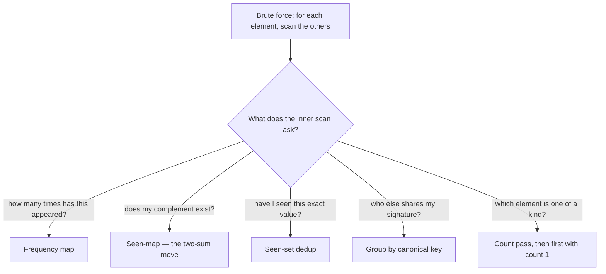

Once you trust hash lookups are **O(1) average**, a whole family of problems collapses from O(n²)
to a **single O(n) pass**. The trick is almost always the same: *as you scan, remember what you have
already seen in a map or set, then ask a cheap question about the current element.*

## The five patterns

| Pattern | Structure | Question you ask each element | Classic problem |
|--|--|--|--|
| **Frequency count** | `Map<key,int>` | "how many times have I seen this?" | majority element, valid anagram |
| **Seen-map (complement)** | `Map<value,index>` | "have I seen what I *need*?" | **two-sum** |
| **Dedup / seen-set** | `Set<value>` | "have I seen this exact value?" | contains-duplicate |
| **Grouping** | `Map<signature,List>` | "what bucket does this belong to?" | group anagrams |
| **First unique** | `Map<char,int>` | "which one appeared exactly once?" | first unique character |

Picking the pattern is one question: *what does the brute force's inner loop ask?*



## Watch it: two-sum with a hash map

The star pattern. Goal: find two indices whose values sum to **target = 9**. Brute force checks all
pairs (O(n²)). Instead, we scan once and keep a **map of value → index we have already seen**. At each
element `x` we ask: *have I already seen `target - x`?*

```walkthrough
title: Two-sum with a seen-map (target = 9)
code: |
  Map<Integer,Integer> seen = new HashMap<>();
  for (int i = 0; i < n; i++) {
    int need = target - nums[i];
    if (seen.containsKey(need))
      return new int[]{ seen.get(need), i };
    seen.put(nums[i], i);   // remember value -> index
  }
steps:
  - text: 'i=0, `x=2`. We need `9 - 2 = 7`. Map is empty — not seen. Store `2 -> 0`.'
    array: [2, 7, 11, 15]
    highlight: [0]
    pointers: { 0: 'i' }
    line: 6
  - text: 'seen = {2:0}. Move on.'
    array: [2, 7, 11, 15]
    sorted: [0]
    line: 2
  - text: 'i=1, `x=7`. We need `9 - 7 = 2`. Is `2` in the map? **Yes — at index 0!**'
    array: [2, 7, 11, 15]
    highlight: [1]
    pointers: { 1: 'i', 0: 'need=2' }
    line: 4
  - text: 'Match! Return `[0, 1]`. One pass, no nested loop — O(n) time, O(n) space.'
    array: [2, 7, 11, 15]
    sorted: [0, 1]
    pointers: { 0: 'ans', 1: 'ans' }
    line: 5
```

:::key
Two-sum is the template for the whole family: **store as you go, then query the complement**. Notice
we store *after* checking — so an element never matches itself, and we return the earlier index first.
:::

## The other four, in code

````tabs
tabs:
  - label: Frequency count
    body: |
      Count occurrences in one pass, then read the map. Foundation for anagrams, majority element,
      top-k, and more.
      ```java
      Map<Character,Integer> freq = new HashMap<>();
      for (char c : s.toCharArray())
        freq.merge(c, 1, Integer::sum);   // count++ (0 if absent)
      // freq now maps each char to its count
      ```
  - label: Dedup / seen-set
    body: |
      A `Set` answers "have I seen this before?" in O(1). Detect duplicates or filter to uniques
      without sorting.
      ```java
      Set<Integer> seen = new HashSet<>();
      for (int x : nums)
        if (!seen.add(x))       // add returns false if already present
          return true;          // duplicate found
      return false;
      ```
  - label: Group anagrams
    body: |
      Give each item a **canonical signature** and bucket by it. Anagrams share a sorted-letter key.
      ```java
      Map<String,List<String>> groups = new HashMap<>();
      for (String w : words) {
        char[] c = w.toCharArray();
        Arrays.sort(c);
        String key = new String(c);   // "eat","tea" -> "aet"
        groups.computeIfAbsent(key, k -> new ArrayList<>()).add(w);
      }
      ```
  - label: First unique char
    body: |
      Two passes over a frequency map: count, then find the first char whose count is 1.
      ```java
      Map<Character,Integer> freq = new HashMap<>();
      for (char c : s.toCharArray()) freq.merge(c, 1, Integer::sum);
      for (int i = 0; i < s.length(); i++)
        if (freq.get(s.charAt(i)) == 1) return i;
      return -1;
      ```
````

:::senior
The universal tell: whenever a brute force says *"for each element, look through the others"*, ask
**"can a map remember the others for me?"** That swap — nested loop for a hash lookup — is the single
most common O(n²) → O(n) optimization in interviews. It trades O(n) space for the speedup.
:::

:::gotcha
Two-sum via hashing does **not** need a sorted array (unlike two pointers). But if the interviewer
asks for **all** pairs or the array has duplicates, be careful — a plain value→index map keeps only
the last index for a repeated value. Track a list of indices, or clarify the exact requirement.
:::

## Complexity

| Pattern | Time | Space | Brute force it beats |
|--|:--:|:--:|:--:|
| Frequency count | O(n) | O(k) | — |
| Two-sum (seen-map) | O(n) | O(n) | O(n²) |
| Dedup (seen-set) | O(n) | O(n) | O(n log n) sort |
| Group anagrams | O(n · k log k) | O(n · k) | — |
| First unique char | O(n) | O(k) | O(n²) |

`n` = number of elements, `k` = alphabet size or string length. The recurring theme: **spend O(n)
space to buy back a factor of n in time.**

## Check yourself

```quiz
title: Hashing patterns check
questions:
  - q: 'In the two-sum seen-map, what do you look up for the current value `x`?'
    options:
      - 'x itself'
      - text: 'target - x (the complement)'
        correct: true
      - 'x + target'
    explain: 'You need two values summing to target, so for x you check whether its complement `target - x` has already been seen.'
  - q: 'Why store the current element in the map **after** checking, not before?'
    options:
      - 'To save memory'
      - text: 'So an element cannot pair with itself and you return the earlier index'
        correct: true
      - 'It makes no difference'
    explain: 'Checking first guarantees the match is a *different* earlier element; storing after keeps the map holding only prior indices.'
  - q: 'Which structure groups anagrams together most directly?'
    options:
      - 'A set of the original words'
      - text: 'A map from sorted-letters signature to a list of words'
        correct: true
      - 'A frequency map of the whole input'
    explain: 'Anagrams share the same multiset of letters, so their sorted form is an identical key — perfect for bucketing in a Map<String,List<String>>.'
  - q: 'What is the main trade-off of these hashing patterns versus brute force?'
    options:
      - text: 'They use O(n) extra space to cut time from O(n²) to O(n)'
        correct: true
      - 'They are slower but use less memory'
      - 'They require the input to be sorted'
    explain: 'Hashing buys speed with space: a map/set of what you have seen replaces a nested scan, turning O(n²) into O(n) at O(n) space.'
```

:::key
Every pattern here is the same move: **scan once, remember what you have seen in a map or set,
ask a cheap question about the current element.** Frequency (count), two-sum (complement), dedup
(seen), grouping (signature), first-unique (count then scan). O(n) time for O(n) space.
:::
