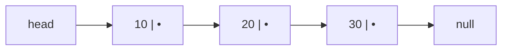
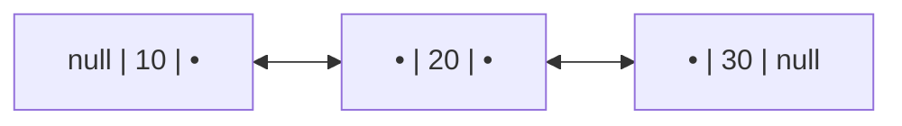

An **array** stores elements in one contiguous block, so it can jump to index `i` instantly.
A **linked list** scatters elements as separate **nodes**, each holding a value plus a
**pointer** to the next node. You give up random access, but you gain **O(1)** insert and
delete once you are standing at the right spot — no shifting.

## The shape of a chain

Each node is a tiny object: `{ value, next }`. The list only remembers the **head**; you reach
everything else by following `next` until you hit `null` (the tail's `next`).



```java
class Node {
    int val;
    Node next;
    Node(int val) { this.val = val; }
}
```

## Singly vs doubly linked

````tabs
tabs:
  - label: Singly linked
    body: |
      One pointer per node (`next`). Lean on memory, but you can only walk **forward** — to
      delete a node you need its **previous** node.
      ```java
      class Node {
          int val;
          Node next;
      }
      ```
  - label: Doubly linked
    body: |
      Two pointers (`next` and `prev`). Costs an extra reference per node, but you can walk
      **both ways** and delete a node in O(1) given only that node.
      ```java
      class Node {
          int val;
          Node prev, next;
      }
      ```
````



## Watch it: insert 25 after node 20

Inserting into a linked list is pure **pointer rewiring** — no elements move. Walk `prev` to the
node you want to insert *after*, point the new node's `next` at what follows, then relink `prev`.
We draw each node as an array cell so you can track the pointers.

```walkthrough
title: Insert 25 after the node holding 20
code: |
  Node node = new Node(25);   // 1: make the new node
  node.next = prev.next;      // 2: new node points to prev's successor
  prev.next = node;           // 3: prev now points to the new node
steps:
  - text: 'Start with the chain 10 → 20 → 30. We want to insert **25** right after **20**. Walk `prev` to the 20 node; `curr` is the node that currently follows it.'
    array: [10, 20, 30]
    pointers: { 1: 'prev', 2: 'curr' }
    line: 1
  - text: 'Create the new node **25**. It is not wired in yet — it dangles beside the list.'
    array: [10, 20, 25, 30]
    highlight: [2]
    pointers: { 1: 'prev', 3: 'curr' }
    line: 1
  - text: 'Point the new node''s `next` at `prev.next` — that is the 30 node (`curr`). Now **25 → 30** exists, but nothing points to 25 yet.'
    array: [10, 20, 25, 30]
    highlight: [2, 3]
    pointers: { 1: 'prev', 3: 'curr' }
    line: 2
  - text: 'Relink `prev.next` to the new node. Now **20 → 25 → 30**. The insert is done — one node created, two pointers changed, nothing shifted.'
    array: [10, 20, 25, 30]
    sorted: [1, 2, 3]
    pointers: { 1: 'prev', 2: 'new' }
    line: 3
```

:::gotcha
Order matters. If you set `prev.next = node` **before** `node.next = prev.next`, you lose the
rest of the list — `node.next` would just point back at itself. Always wire the new node's
`next` **first**, then relink `prev`.
:::

## Insert & delete at each position

````tabs
tabs:
  - label: At head
    body: |
      Cheapest operation — no walking needed. New node points at the old head, head moves.
      ```java
      node.next = head;   // point at current front
      head = node;        // O(1)
      ```
  - label: At tail (singly)
    body: |
      Without a tail pointer you must **walk to the end** first — O(n). Keep a cached `tail`
      reference to make it O(1).
      ```java
      Node cur = head;
      while (cur.next != null) cur = cur.next; // O(n)
      cur.next = node;
      ```
  - label: In the middle
    body: |
      Walk `prev` to the position, then rewire — O(k) to reach index k, O(1) to splice.
      ```java
      node.next = prev.next;
      prev.next = node;     // delete: prev.next = prev.next.next;
      ```
````

## Arrays vs linked lists

| Operation | Array / ArrayList | Linked List |
|--|:--:|:--:|
| Access by index `get(i)` | **O(1)** | O(n) |
| Insert / delete at head | O(n) (shift) | **O(1)** |
| Insert / delete at tail | O(1) amortized | O(1)\* |
| Insert / delete in middle | O(n) (shift) | O(1)\*\* |
| Search by value | O(n) | O(n) |
| Extra memory per element | none | pointer(s) per node |
| Cache locality | **excellent** (contiguous) | poor (scattered) |

\* insert-at-tail is O(1) with a cached tail pointer; delete-at-tail is O(1) only for a **doubly**-linked list (singly-linked needs O(n) to find the new tail) &nbsp;&nbsp; \*\* once you are already at the node

:::senior
On paper the linked list wins at inserts, but in practice `ArrayList` often beats `LinkedList`
even there: contiguous memory means CPU cache prefetching, and no per-node object overhead. The
linked list's real edge is **O(1) splicing when you already hold the node** — the backbone of
LRU caches and adjacency lists. Default to arrays; reach for linked lists when the pointer
manipulation itself is the feature.
:::

## Recall

```flashcards
title: Linked list costs
cards:
  - front: '`get(i)` on a linked list'
    back: '**O(n)** — walk `i` pointers from the head. No address arithmetic possible.'
  - front: 'Insert at head'
    back: '**O(1)** — new node points at old head, `head` moves. The list''s cheapest op.'
  - front: 'Delete the tail: singly vs doubly linked'
    back: 'Singly: **O(n)** (must walk to the second-to-last node). Doubly: **O(1)** via `tail.prev`.'
  - front: 'Delete a node you already hold a reference to'
    back: 'Doubly: **O(1)** — `prev`/`next` are one hop away. Singly: O(n) to find the predecessor.'
  - front: 'Why does `ArrayList` often beat `LinkedList` even at inserts?'
    back: '**Cache locality + no per-node objects.** The linked list only wins when you splice at a node you already hold — LRU caches, adjacency lists.'
```

## Check yourself

```quiz
title: Linked list basics check
questions:
  - q: 'Why is `get(i)` O(n) on a singly linked list but O(1) on an array?'
    options:
      - text: 'The list must follow `next` pointers one node at a time from the head'
        correct: true
      - 'The list re-sorts itself on every access'
      - 'Arrays cache every index in a hash map'
    explain: 'Nodes are scattered in memory, so the only way to reach index `i` is to walk `i` pointers from the head. Arrays compute the address directly: `base + i × size`.'
  - q: 'You hold a reference to `prev`. What is the correct order to insert a new node after it?'
    options:
      - 'prev.next = node; then node.next = prev.next;'
      - text: 'node.next = prev.next; then prev.next = node;'
        correct: true
      - 'Either order works'
    explain: 'Wire the new node''s `next` to the old successor **first**. If you relink `prev` first, `prev.next` already points at `node`, so you lose the rest of the list.'
  - q: 'Which operation is genuinely O(1) on a singly linked list *with a head pointer*?'
    options:
      - 'Deleting the last node'
      - text: 'Inserting a new node at the head'
        correct: true
      - 'Accessing the middle element'
    explain: 'Head insert just points the new node at the old head and moves `head` — no walking. Deleting the tail needs the second-to-last node (O(n) without a doubly link).'
  - q: 'What extra power does a **doubly** linked list give you?'
    options:
      - 'O(1) random access by index'
      - text: 'Delete a node in O(1) given only that node, and traverse backward'
        correct: true
      - 'It removes the pointer overhead'
    explain: 'The `prev` pointer lets you find the predecessor instantly, so you can unlink a node in O(1) without walking from the head — at the cost of one extra pointer per node.'
```

:::key
A linked list trades **random access** (O(n) to reach index `i`) for **O(1) splicing** once you
are at a node. Singly = one `next` pointer, forward only; doubly = `prev` + `next`, both ways
and O(1) delete-by-node. Insert = wire the new node's `next` first, then relink `prev`.
:::
