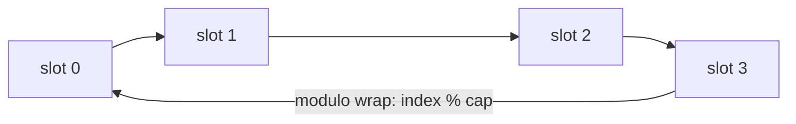

A **queue** is a First-In-First-Out (**FIFO**) collection — like a checkout line. You **enqueue**
at the **rear** and **dequeue** from the **front**. The opposite discipline to a stack: here the
*oldest* item leaves first.

| Operation | Meaning | Time |
|--|--|:--:|
| `enqueue(x)` / `offer(x)` | add `x` at the rear | O(1) |
| `dequeue()` / `poll()` | remove & return the front | O(1) |
| `peek()` / `front()` | look at the front | O(1) |
| `isEmpty()` | anything waiting? | O(1) |

## Watch it: enqueue and dequeue with `front` / `rear`

Track two indices. `enqueue` writes at `rear` and advances it; `dequeue` reads at `front` and
advances it. Both pointers march **rightward** — the live queue is the window between them.

```walkthrough
title: Queue — enqueue A, B, C, then dequeue
code: |
  enqueue(x): q[rear++] = x;
  dequeue():  return q[front++];
  // live elements: indices [front, rear)
steps:
  - text: '`enqueue(A)`: write A at `rear`, advance `rear`. Front and rear both frame the single item.'
    array: ['A']
    highlight: [0]
    pointers: { 0: 'front/rear-1' }
    line: 1
  - text: '`enqueue(B)`: write B at `rear = 1`, advance. Front still on A (the oldest), rear past B.'
    array: ['A', 'B']
    highlight: [1]
    pointers: { 0: 'front', 1: 'rear-1' }
    line: 1
  - text: '`enqueue(C)`: write C at index 2. The queue holds A, B, C — A is next to leave.'
    array: ['A', 'B', 'C']
    highlight: [2]
    pointers: { 0: 'front', 2: 'rear-1' }
    line: 1
  - text: '`dequeue()`: read `q[front] = A`, advance `front` to 1. A leaves — **FIFO**, the oldest goes first.'
    array: ['A', 'B', 'C']
    highlight: [0]
    pointers: { 1: 'front', 2: 'rear-1' }
    line: 2
  - text: 'Now the live queue is `[front, rear) = [1, 3)` → B, C. Index 0 is dead space.'
    array: ['A', 'B', 'C']
    sorted: [0]
    pointers: { 1: 'front', 2: 'rear-1' }
    line: 3
```

:::gotcha
With plain advancing indices, `front` keeps crawling right and leaves **dead space** behind it.
On a fixed array you would "run off the end" even with room at the start. The fix is the
**circular queue** below.
:::

## The circular queue (ring buffer)

Wrap the indices around with **modulo** so freed slots at the front get reused. The array behaves
like a ring: after the last index, you come back to 0. `front` and `rear` chase each other around
it forever — no slot is ever abandoned.



```java
class CircularQueue {
  int[] q; int front = 0, size = 0, cap;
  CircularQueue(int cap) { this.cap = cap; q = new int[cap]; }

  boolean enqueue(int x) {
    if (size == cap) return false;          // full
    q[(front + size) % cap] = x;            // rear index, wrapped
    size++;
    return true;
  }
  int dequeue() {
    int x = q[front];
    front = (front + 1) % cap;              // wrap the front
    size--;
    return x;
  }
}
```

:::tip
Track `size` explicitly rather than trying to tell "full" from "empty" by comparing `front` and
`rear` — when they wrap, both conditions look identical (`front == rear`). A `size` counter
sidesteps the ambiguity entirely.
:::

## Deque — a double-ended queue

A **deque** ("deck") lets you add and remove at **both** ends in O(1). It generalizes both the
stack and the queue, and it is the workhorse behind sliding-window and monotonic-queue problems.

````tabs
tabs:
  - label: Queue (FIFO)
    body: |
      Add at the rear, remove from the front.
      ```java
      Deque<Integer> q = new ArrayDeque<>();
      q.offer(1); q.offer(2);   // rear
      int f = q.poll();          // 1, from the front
      ```
  - label: Stack (LIFO)
    body: |
      The same `ArrayDeque`, using one end only.
      ```java
      Deque<Integer> st = new ArrayDeque<>();
      st.push(1); st.push(2);    // head
      int t = st.pop();          // 2, from the head
      ```
  - label: Deque (both ends)
    body: |
      All four ends-operations, each O(1).
      ```java
      Deque<Integer> d = new ArrayDeque<>();
      d.offerFirst(1);  d.offerLast(2);
      int a = d.pollFirst();     // 1
      int b = d.pollLast();      // 2
      ```
````

:::senior
`ArrayDeque` is the one class you need for stacks, queues, and deques — it is faster than
`LinkedList` for all of them (contiguous memory, no per-node object). Reserve `LinkedList` for
when you need list-index operations, and reach for `Queue`/`Deque` **interfaces**, not `Stack`.
:::

## Complexity

| Operation | Array (circular) | Linked list |
|--|:--:|:--:|
| enqueue / offer | O(1) | O(1) |
| dequeue / poll | O(1) | O(1) |
| peek front | O(1) | O(1) |
| Space for `n` items | O(n) | O(n) (+ node overhead) |

## Check yourself

```quiz
title: Queue & deque check
questions:
  - q: 'A queue removes elements in what order?'
    options:
      - text: 'First-In-First-Out — the oldest waiting element leaves first'
        correct: true
      - 'Last-In-First-Out — the newest first'
      - 'Largest value first'
    explain: 'A queue is FIFO: `dequeue` returns the element that has been waiting longest (the front).'
  - q: 'Why use a *circular* queue instead of plain advancing indices?'
    options:
      - 'It sorts the elements as they arrive'
      - text: 'Modulo wrapping reuses the dead space that `front` leaves behind, so a fixed array does not fill up prematurely'
        correct: true
      - 'It makes dequeue O(log n)'
    explain: 'Without wrapping, `front` crawls right and abandons slots. `% cap` recycles them, so all `cap` slots stay usable.'
  - q: 'In a circular queue, why track `size` separately from `front` and `rear`?'
    options:
      - 'It is required by the compiler'
      - text: 'When indices wrap, `front == rear` can mean either full or empty — `size` disambiguates'
        correct: true
      - 'To make peek O(1)'
    explain: 'A separate `size` counter removes the full-vs-empty ambiguity that arises when the two indices coincide after wrapping.'
  - q: 'What extra power does a deque have over a plain queue?'
    options:
      - text: 'Add and remove at BOTH ends in O(1)'
        correct: true
      - 'Automatic sorting'
      - 'O(1) random access by index'
    explain: 'A double-ended queue supports `offerFirst/offerLast` and `pollFirst/pollLast`, all O(1) — it generalizes both stack and queue.'
```

:::key
A queue is **FIFO** (rear in, front out) with O(1) ops; wrap indices with **modulo** for a
circular ring buffer and track `size` to tell full from empty. A **deque** does both ends in
O(1). Use `ArrayDeque` for all three.
:::
