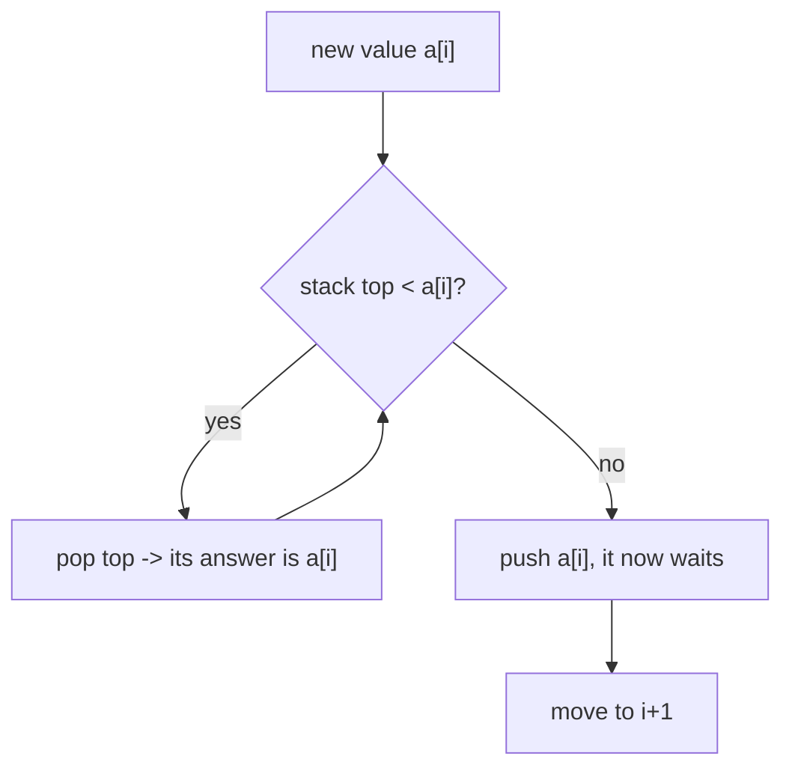

A **monotonic stack** is an ordinary stack with one rule: before you push a new element, **pop
everything that would break the ordering**. Keep it *decreasing* (or *increasing*) and it can
answer, in a single **O(n)** pass, a whole family of "nearest bigger / smaller element" questions
that look like they need O(n²) nested loops.

## The pattern it unlocks: next greater element

For each element, find the **first larger value to its right**. Brute force scans right from
every index — O(n²). A monotonic stack does it in O(n) by keeping a **decreasing** stack of
*indices still waiting for their answer*.

The insight: when a new value arrives, it is the "next greater element" for **every** waiting
value it exceeds. Pop them all and record the answer as you go.

```walkthrough
title: Next greater element of [2, 1, 3] (stack holds waiting VALUES)
code: |
  for (int i = 0; i < n; i++) {
    while (!st.isEmpty() && a[i] > st.peek())
      ans[popped] = a[i];      // a[i] resolves the popped value
    st.push(a[i]);
  }
  // anything left in the stack has no greater element -> -1
steps:
  - text: 'i = 0, value **2**. Stack empty, nothing to resolve. Push 2. Stack (top→): `2`.'
    array: [2, 1, 3]
    highlight: [0]
    pointers: { 0: 'i', 2: 'top=2' }
    line: 4
  - text: 'i = 1, value **1**. Is 1 > top (2)? No — 1 does not resolve 2. Push 1. Stack: `1, 2`.'
    array: [2, 1, 3]
    highlight: [1]
    pointers: { 1: 'i, top=1' }
    line: 4
  - text: 'i = 2, value **3**. Is 3 > top (1)? **Yes** → 1 is resolved: `NGE(1) = 3`. Pop 1.'
    array: [2, 1, 3]
    highlight: [2]
    pointers: { 2: 'i', 1: 'popped=1' }
    line: 3
  - text: 'Still scanning: is 3 > new top (2)? **Yes** → 2 is resolved: `NGE(2) = 3`. Pop 2.'
    array: [2, 1, 3]
    highlight: [2]
    pointers: { 2: 'i', 0: 'popped=2' }
    line: 3
  - text: 'Stack empty now. Push 3. Stack: `3`.'
    array: [2, 1, 3]
    highlight: [2]
    pointers: { 2: 'i, top=3' }
    line: 4
  - text: 'Scan done. 3 is still on the stack → no greater element, `NGE(3) = -1`. Result: `[3, 3, -1]`.'
    array: [2, 1, 3]
    sorted: [0, 1, 2]
    line: 6
```

:::key
The magic: **each element is pushed once and popped at most once**, so the inner `while` loop
runs O(n) times *total* across the whole scan — not O(n) per element. That is why the pattern
is O(n) despite the nested-looking `for`/`while`.
:::

## Why it stays monotonic

Because we pop every element smaller than the incoming value *before* pushing, the stack (top to
bottom) is always **increasing** in value — equivalently, the values still waiting are in
**decreasing** order from bottom to top. Any element that a newcomer "jumps over" is gone
forever, which is exactly why the total work is linear.



## Increasing vs decreasing — pick by the question

````tabs
tabs:
  - label: Next GREATER (decreasing stack)
    body: |
      Pop while the top is **smaller** than the current value. Stack values decrease bottom→top.
      ```java
      for (int i = 0; i < n; i++) {
        while (!st.isEmpty() && a[st.peek()] < a[i])
          ans[st.pop()] = a[i];    // store indices for distance too
        st.push(i);
      }
      ```
  - label: Next SMALLER (increasing stack)
    body: |
      Flip the comparison: pop while the top is **larger**. Stack values increase bottom→top.
      ```java
      for (int i = 0; i < n; i++) {
        while (!st.isEmpty() && a[st.peek()] > a[i])
          ans[st.pop()] = a[i];
        st.push(i);
      }
      ```
  - label: Previous greater/smaller
    body: |
      Same loop, but read the answer from what's **left on the stack** when you push `i`
      (that surviving top is the nearest bigger/smaller element on the LEFT).
      ```java
      for (int i = 0; i < n; i++) {
        while (!st.isEmpty() && a[st.peek()] <= a[i]) st.pop();
        prevGreater[i] = st.isEmpty() ? -1 : st.peek();
        st.push(i);
      }
      ```
````

:::tip
Push **indices**, not values, and you get distances for free (`i - st.peek()`), plus you can look
up the value with `a[st.peek()]`. Problems like *Daily Temperatures* ("how many days until
warmer?") are exactly this.
:::

:::gotcha
**Equal elements are where monotonic stacks go wrong.** Choosing `<` vs `<=` in the pop condition
decides whether duplicates resolve each other — for *next greater*, pop on `<` only (an equal
value is not greater); for *largest rectangle in a histogram*, the choice controls whether
equal-height bars double-count or under-count width. Decide deliberately per problem, and test
with an input like `[2, 2, 2]`.
:::

## The cousin: monotonic queue (sliding-window max)

Keep a **deque** of indices whose values are decreasing. Pop from the **back** any value smaller
than the incoming one (they can never be the max while it's around); pop from the **front** any
index that has slid out of the window. The front is always the current window maximum — the whole
sliding-window-maximum problem in O(n).

```java
Deque<Integer> dq = new ArrayDeque<>();   // holds indices, values decreasing
for (int i = 0; i < n; i++) {
  while (!dq.isEmpty() && a[dq.peekLast()] <= a[i]) dq.pollLast();  // back
  dq.offerLast(i);
  if (dq.peekFirst() <= i - k) dq.pollFirst();                      // front, out of window
  if (i >= k - 1) result.add(a[dq.peekFirst()]);                    // window max
}
```

:::senior
The tell for a monotonic stack in an interview: **"nearest / next / previous element that is
bigger or smaller"**, *stock span*, *daily temperatures*, *largest rectangle in a histogram*,
*trapping rain water*. If a brute force scans left or right from each index looking for the first
element beating a condition, a monotonic stack collapses it to O(n).
:::

## Complexity

| Approach | Time | Space |
|--|:--:|:--:|
| Brute force (scan right per element) | O(n²) | O(1) |
| **Monotonic stack** | **O(n)** | O(n) |
| Monotonic deque (sliding-window max) | **O(n)** | O(k) |

Each element is pushed and popped **at most once**, so the amortized cost per element is O(1).

## Check yourself

```quiz
title: Monotonic stack check
questions:
  - q: 'For "next greater element", what invariant does the stack maintain?'
    options:
      - text: 'Values still waiting for an answer, in decreasing order (each newcomer resolves everything smaller than it)'
        correct: true
      - 'The elements in fully sorted order at all times'
      - 'Only the single largest element seen so far'
    explain: 'It is a decreasing stack of unresolved elements; a larger incoming value pops and answers all the smaller ones it exceeds.'
  - q: 'The algorithm has a `for` loop with an inner `while`. Why is it still O(n), not O(n²)?'
    options:
      - 'The while loop runs at most twice per element'
      - text: 'Each element is pushed once and popped at most once, so total inner-loop work is O(n) across the whole scan'
        correct: true
      - 'Because the input is assumed sorted'
    explain: 'Amortized analysis: n pushes and at most n pops overall, so the combined loop work is linear regardless of the nesting.'
  - q: 'To find the next SMALLER element instead of the next greater, you:'
    options:
      - text: 'Flip the comparison — pop while the stack top is LARGER than the current value'
        correct: true
      - 'Reverse the array first'
      - 'Sort the array'
    explain: 'Same skeleton, opposite comparison: popping while the top is larger keeps an increasing stack and yields next-smaller.'
  - q: 'Elements left on the stack after the scan finishes have:'
    options:
      - 'The largest value in the array as their answer'
      - text: 'No qualifying element to their right, so their answer is the sentinel (e.g. -1)'
        correct: true
      - 'Been counted twice'
    explain: 'Survivors were never popped, meaning nothing to the right beat them — their next-greater is -1.'
```

:::key
A **monotonic stack** pops everything that breaks its order before each push, keeping unresolved
elements sorted. It answers next/previous greater/smaller in **O(n)** because every element is
pushed and popped at most once. Its deque cousin nails sliding-window maximum.
:::
