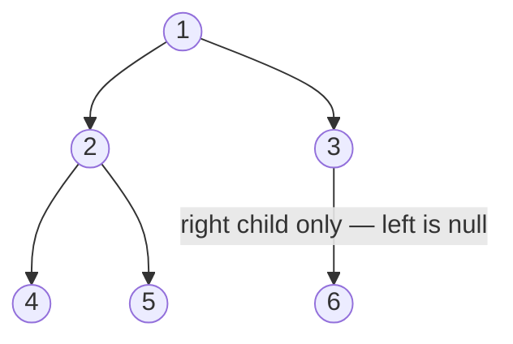

A **binary tree** is a set of **nodes**, each holding a value and up to **two children** —
a `left` and a `right`. One node is the **root**; nodes with no children are **leaves**.
Almost every interview tree problem reduces to *visiting the nodes in the right order*, so
traversals are the foundation for everything that follows.

## Anatomy of a binary tree

Here is the tree we will traverse for the rest of this page. Read it top-down: `1` is the
root, `4`, `5`, and `6` are leaves.



A `Node` is a tiny recursive record — a value plus two references that may be `null`:

```java
class Node {
    int val;
    Node left, right;
    Node(int val) { this.val = val; }
}
```

### Depth, height, and size

| Term | Meaning | For node `5` above |
|--|--|--|
| **Depth** of a node | edges from the **root** down to it | `2` (1 → 2 → 5) |
| **Height** of a node | edges on the **longest path down to a leaf** | `0` (it is a leaf) |
| **Height of the tree** | height of the root | `2` |
| **Size** | total number of nodes | `6` |

:::key
A tree of height `h` that is **full** holds up to `2^(h+1) - 1` nodes. Flip that around: `n`
nodes packed into a **balanced** tree give height `≈ log₂ n`. That logarithm is the entire
reason balanced trees are fast — more on that in *Balanced Trees & Tries*.
:::

## The two families of traversal

Every traversal is either **depth-first** (go deep down one branch before backing up) or
**breadth-first** (sweep the tree one level at a time).

- **DFS** — natural to write with **recursion** (the call stack does the bookkeeping). Its
  three flavors differ only in **when you visit the node** relative to its children.
- **BFS / level-order** — uses an explicit **queue**: enqueue the root, then repeatedly
  dequeue a node and enqueue its children.

## Watch it: in-order traversal

**In-order** = recurse **left**, *then* **visit the node**, *then* recurse **right**. Watch the
output list build up. Notice how we dive to the leftmost node (`4`) before emitting anything —
for the sample tree the result is `4, 2, 5, 1, 3, 6`.

```walkthrough
title: In-order traversal — building the visit order
code: |
  void inorder(Node node) {
    if (node == null) return;
    inorder(node.left);   // 1. go left first
    visit(node);          // 2. record this value
    inorder(node.right);  // 3. then go right
  }
steps:
  - text: 'Descend `left` as far as possible: `1 → 2 → 4`. Node **4** has no left child, so it is the first node we actually visit.'
    array: [4]
    highlight: [0]
    pointers: { 0: 'visit 4' }
    line: 4
  - text: 'Back up to **2**: its left subtree is done, so visit `2`. Output so far `[4, 2]`.'
    array: [4, 2]
    sorted: [0]
    pointers: { 1: 'visit 2' }
    line: 4
  - text: 'Now `2`''s right child **5** (a leaf) — visit it. The whole left subtree of the root is finished.'
    array: [4, 2, 5]
    sorted: [0, 1]
    pointers: { 2: 'visit 5' }
    line: 4
  - text: 'Left subtree of the root complete → visit the **root** `1`. This is why in-order on a BST comes out **sorted**.'
    array: [4, 2, 5, 1]
    sorted: [0, 1, 2]
    pointers: { 3: 'visit 1' }
    line: 4
  - text: 'Into the right subtree. Node **3** has no left child, so visit `3` immediately.'
    array: [4, 2, 5, 1, 3]
    sorted: [0, 1, 2, 3]
    pointers: { 4: 'visit 3' }
    line: 4
  - text: 'Finally `3`''s right child **6**. Visit it — traversal complete: `[4, 2, 5, 1, 3, 6]`.'
    array: [4, 2, 5, 1, 3, 6]
    sorted: [0, 1, 2, 3, 4]
    pointers: { 5: 'visit 6' }
    line: 6
```

## The four traversals side by side

Same tree, four orders. The only thing that changes for DFS is **where `visit(node)` sits**.

| Traversal | Rule | Order on our tree | Classic use |
|--|--|--|--|
| **Pre-order** | **node**, left, right | `1, 2, 4, 5, 3, 6` | copy/serialize a tree, prefix expression |
| **In-order** | left, **node**, right | `4, 2, 5, 1, 3, 6` | **sorted** output of a BST |
| **Post-order** | left, right, **node** | `4, 5, 2, 6, 3, 1` | delete/free a tree, evaluate expression |
| **Level-order** (BFS) | top to bottom, left to right | `1, 2, 3, 4, 5, 6` | shortest path, level-by-level work |

````tabs
tabs:
  - label: DFS (recursive)
    body: |
      Move the `visit` line to choose pre- / in- / post-order. The call stack remembers where to return.
      ```java
      void preorder(Node n) {
          if (n == null) return;
          visit(n);            // pre-order
          preorder(n.left);
          preorder(n.right);
      }
      ```
  - label: BFS (queue)
    body: |
      Level-order is *not* recursive — it needs an explicit FIFO queue.
      ```java
      void levelOrder(Node root) {
          Queue<Node> q = new LinkedList<>();
          if (root != null) q.add(root);
          while (!q.isEmpty()) {
              Node n = q.poll();
              visit(n);
              if (n.left  != null) q.add(n.left);
              if (n.right != null) q.add(n.right);
          }
      }
      ```
````

:::gotcha
Recursive DFS uses **O(h)** stack space where `h` is the height. On a **skewed** tree (height
`n`) that recursion can blow the stack. BFS uses **O(w)** space where `w` is the widest level —
up to `n/2` for the bottom row of a full tree. Neither is free; pick based on the tree's shape.
:::

## Complexity

Every node is visited exactly once, so time is always linear. Space is what differs.

| Traversal | Time | Extra space |
|--|:--:|:--:|
| Pre / In / Post (recursive DFS) | O(n) | O(h) — call stack |
| Level-order (BFS) | O(n) | O(w) — queue width |

:::senior
"Serialize and deserialize a binary tree", "construct a tree from pre-order + in-order", and
"validate a BST" are all just traversals with a twist. If you can write the four traversals
from memory, you have already solved the *mechanics* of most tree interviews — what's left is
choosing **which** order exposes the property you need.
:::

## Check yourself

```quiz
title: Traversal check
questions:
  - q: 'Which traversal of a **binary search tree** produces values in **sorted ascending** order?'
    options:
      - 'Pre-order'
      - text: 'In-order'
        correct: true
      - 'Post-order'
      - 'Level-order'
    explain: 'In-order visits left subtree, then node, then right subtree — for a BST that emits keys smallest-to-largest.'
  - q: 'You want to visit the tree **one level at a time, top to bottom**. Which approach?'
    options:
      - 'Recursive DFS'
      - text: 'BFS with a queue'
        correct: true
      - 'In-order traversal'
    explain: 'Level-order is breadth-first: a FIFO queue dequeues a node and enqueues its children, naturally sweeping level by level.'
  - q: 'To safely **free/delete** every node of a tree, which order should you visit them in?'
    options:
      - 'Pre-order (node before children)'
      - text: 'Post-order (children before node)'
        correct: true
      - 'Level-order'
    explain: 'Post-order deletes both children *before* the node, so you never free a parent while its children still reference nothing valid.'
  - q: 'What is the time complexity of any full traversal of an `n`-node tree?'
    options:
      - 'O(log n)'
      - text: 'O(n)'
        correct: true
      - 'O(n log n)'
    explain: 'Each node is visited exactly once, so work is proportional to the number of nodes.'
```

```flashcards
title: Traversal recall
cards:
  - front: 'Pre-order visit rule'
    back: '**Node**, then left, then right. Great for copying/serializing.'
  - front: 'In-order visit rule'
    back: 'Left, **node**, right. On a BST this yields **sorted** output.'
  - front: 'Post-order visit rule'
    back: 'Left, right, **node**. Great for deleting a tree or evaluating expressions.'
  - front: 'Level-order needs which data structure?'
    back: 'A **queue** (FIFO) — it is BFS, not recursion.'
  - front: 'Height of a balanced tree with n nodes'
    back: '**O(log n)** — the reason balanced trees are fast.'
```

:::key
A binary tree is nodes with a `left` and `right` child. **DFS** (pre/in/post-order) differs
only in *when* you visit the node and rides the recursion stack — O(h) space. **BFS**
(level-order) uses a queue — O(w) space. All four are O(n) time. In-order on a **BST** is
sorted.
:::
