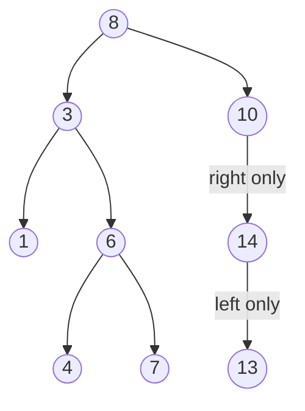

A **binary search tree (BST)** adds one rule to a binary tree, and that rule unlocks fast
lookup. For **every** node:

> all keys in its **left** subtree are **smaller**, and all keys in its **right** subtree are
> **larger**.

That single invariant means at each node you can throw away **half** the remaining tree — the
same idea as binary search on a sorted array, but on a linked structure you can also cheaply
insert into and delete from.

## The BST invariant



Check the rule anywhere: under `8`, everything on the left (`3, 1, 6, 4, 7`) is `< 8` and
everything on the right (`10, 14, 13`) is `> 8`. The same holds recursively under `3`, under
`6`, and so on.

:::key
An **in-order** traversal of a BST prints its keys in **sorted ascending** order — here
`1, 3, 4, 6, 7, 8, 10, 13, 14`. This is the fastest sanity check that a tree really is a valid
BST.
:::

## Watch it: searching for a key

To find **7**, compare with the current node and walk **left** if the target is smaller,
**right** if larger. Every comparison discards an entire subtree, so we touch just one node per
level.

```walkthrough
title: BST search for key = 7
code: |
  Node search(Node node, int key) {
    while (node != null) {
      if (key == node.val) return node;
      if (key < node.val) node = node.left;
      else                node = node.right;
    }
    return null; // not found
  }
steps:
  - text: 'Start at the root **8**. `7 < 8`, so the target can only be in the **left** subtree — ignore everything on the right.'
    array: [8]
    highlight: [0]
    pointers: { 0: 'node' }
    line: 4
  - text: 'Move to **3**. `7 > 3`, so go **right**. Two comparisons and we have already discarded most of the tree.'
    array: [8, 3]
    sorted: [0]
    pointers: { 1: 'node' }
    line: 5
  - text: 'Now at **6**. `7 > 6`, go **right** once more.'
    array: [8, 3, 6]
    sorted: [0, 1]
    pointers: { 2: 'node' }
    line: 5
  - text: 'Node **7** equals the key — **found!** The whole search touched 4 nodes on a path of length 3.'
    array: [8, 3, 6, 7]
    sorted: [0, 1, 2, 3]
    pointers: { 3: 'match' }
    line: 3
```

## Search, insert, delete

All three follow the *same descent* to the spot the key belongs.

````tabs
tabs:
  - label: Search
    body: |
      Walk down comparing keys until you match or fall off the tree.
      ```java
      Node search(Node n, int key) {
          while (n != null && n.val != key)
              n = key < n.val ? n.left : n.right;
          return n; // node or null
      }
      ```
  - label: Insert
    body: |
      Descend to the empty spot where the key *would* be found, then attach a new leaf.
      ```java
      Node insert(Node n, int key) {
          if (n == null) return new Node(key);
          if (key < n.val) n.left  = insert(n.left,  key);
          else if (key > n.val) n.right = insert(n.right, key);
          return n; // duplicates ignored
      }
      ```
  - label: Delete
    body: |
      Three cases. The tricky one — two children — swaps in the **in-order successor**.
      ```java
      Node delete(Node n, int key) {
          if (n == null) return null;
          if (key < n.val)      n.left  = delete(n.left,  key);
          else if (key > n.val) n.right = delete(n.right, key);
          else {
              if (n.left == null)  return n.right;   // 0 or 1 child
              if (n.right == null) return n.left;
              Node succ = min(n.right);              // smallest on the right
              n.val = succ.val;
              n.right = delete(n.right, succ.val);
          }
          return n;
      }
      ```
````

:::note
**Delete** has three shapes: a **leaf** just vanishes; a node with **one child** is replaced by
that child; a node with **two children** is overwritten by its **in-order successor** (the
smallest key in its right subtree), which is then deleted from below. The successor keeps the
sorted invariant intact.
:::

## Why balance is everything

The BST invariant does not promise a *bushy* tree. Insert keys in **sorted order**
(`1, 3, 4, 6, 7, …`) and every node hangs off the right — you get a **degenerate** tree that is
really a linked list, and search degrades to O(n).


| Shape | Height | Search / Insert / Delete |
|--|:--:|:--:|
| **Balanced** BST | O(log n) | **O(log n)** |
| **Skewed** BST (worst case) | O(n) | **O(n)** — no better than a list |

:::gotcha
A plain BST gives O(log n) **only if the data arrives in a lucky order**. Feeding it sorted or
nearly-sorted input produces the skewed worst case. **Self-balancing** trees (AVL, red-black)
fix this by rotating after each update — the subject of the next topic.
:::

## Complexity

| Operation | Balanced | Skewed (worst) |
|--|:--:|:--:|
| Search | O(log n) | O(n) |
| Insert | O(log n) | O(n) |
| Delete | O(log n) | O(n) |
| In-order (sorted) traversal | O(n) | O(n) |

:::senior
The classic BST interview trap is **"validate a BST"**: checking only `left.val < node.val <
right.val` at each node is wrong — a grandchild can violate the invariant while every local check
passes. The correct approach passes a **(min, max) range** down the recursion, tightening one
bound per side. And in production Java you rarely hand-roll a BST: `TreeMap`/`TreeSet` are
red-black trees giving you `floor`, `ceiling`, `firstKey`, and range views in guaranteed
O(log n).
:::

## Check yourself

```quiz
title: BST check
questions:
  - q: 'In a valid BST, where do all keys **smaller** than a node live?'
    options:
      - text: 'In its left subtree'
        correct: true
      - 'In its right subtree'
      - 'In the sibling subtree'
    explain: 'The BST invariant: left subtree < node < right subtree, applied recursively at every node.'
  - q: 'Searching a **balanced** BST of n nodes costs:'
    options:
      - 'O(1)'
      - text: 'O(log n)'
        correct: true
      - 'O(n)'
    explain: 'Each comparison discards half the tree; a balanced tree has height ≈ log₂ n, so you make about log₂ n comparisons.'
  - q: 'You insert the keys 1, 2, 3, 4, 5 in that order into an empty **plain** BST. What shape results?'
    options:
      - 'A perfectly balanced tree'
      - text: 'A right-skewed chain (effectively a linked list)'
        correct: true
      - 'A tree of height 2'
    explain: 'Each new key is larger than all before it, so it attaches to the right — height grows to n and search becomes O(n).'
  - q: 'When deleting a node that has **two children**, what replaces it?'
    options:
      - 'Its parent'
      - text: 'Its in-order successor (smallest key in the right subtree)'
        correct: true
      - 'Always its left child'
    explain: 'The in-order successor is the next-larger key; swapping it in preserves the sorted invariant, and it has at most one child so removing it is easy.'
```

:::key
A BST keeps **left < node < right** everywhere, so search/insert/delete each *descend one path*
in **O(log n)** — **if balanced**. In-order traversal yields sorted keys. Insert data in sorted
order and it degenerates into an O(n) chain; that failure is exactly what balanced trees fix.
:::
