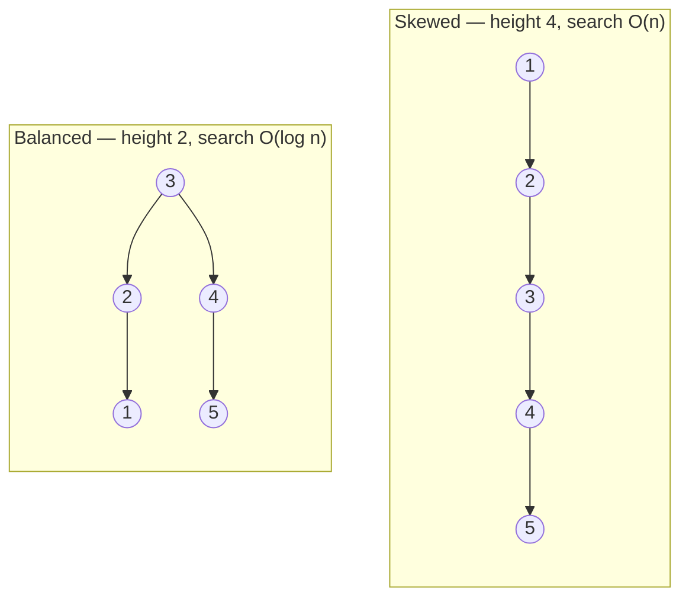
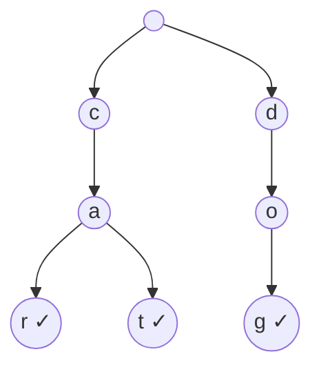

A plain BST is O(log n) *only when it happens to stay bushy*. Two ideas fix the shape problem
from opposite directions: **self-balancing trees** actively rebalance after every update, and
**tries** abandon key comparison altogether and branch on the **characters** of the key.

## Why balancing matters

Recall the failure mode: insert `1, 2, 3, 4, 5` into a plain BST and it degenerates into a
right-leaning chain. The two trees below hold the **same five keys** — but only one gives fast
lookups.



A **self-balancing BST** guarantees the height stays **O(log n)** no matter what order keys
arrive in. It does this with **rotations** — local, O(1) pointer rearrangements that reduce
height while preserving the BST invariant.

### AVL vs red-black — the concept

You do **not** need to memorize rotation cases for most interviews; you need to know *what they
guarantee and how they trade off*.

| Tree | Balance rule | Feel |
|--|--|--|
| **AVL** | heights of a node's two subtrees differ by **≤ 1** | **strictly** balanced → faster *lookups*, more rotations on write |
| **Red-black** | color rules keep the longest path **≤ 2×** the shortest | **loosely** balanced → fewer rotations on write, slightly taller |

:::senior
Red-black trees win in practice for **general-purpose** ordered maps because updates rotate
less — that is why Java's `TreeMap`/`TreeSet` and C++'s `std::map` use them. AVL's tighter
balance pays off only when reads massively dominate writes. Both are **O(log n)** for search,
insert, and delete; the constant factors differ.
:::

:::note
A **rotation** re-hangs three nodes to lower the tree's height while keeping left < node <
right. It touches O(1) nodes, so rebalancing adds only O(log n) work along the insert path — the
guarantee is essentially free.
:::

## Tries — the prefix tree

A **trie** (prefix tree) stores strings by **branching on each character**. The path from the
root to a node *spells a prefix*; a flag marks where a complete word ends. Below is a trie
holding `car`, `cat`, and `dog`.



`car` and `cat` **share** the `c → a` path and only diverge at the last letter — that shared
structure is the whole point. The `✓` nodes are marked "end of word".

```java
class TrieNode {
    TrieNode[] next = new TrieNode[26]; // one slot per letter
    boolean isWord;
}

void insert(TrieNode root, String w) {
    TrieNode n = root;
    for (char c : w.toCharArray()) {
        int i = c - 'a';
        if (n.next[i] == null) n.next[i] = new TrieNode();
        n = n.next[i];
    }
    n.isWord = true;               // mark the end
}
```

## Watch it: inserting a word that shares a prefix

Insert `car` into a trie that already holds `cat`. The array below is the word being consumed —
watch how the first two characters ride the **existing** path and only the last one allocates.

```walkthrough
title: Trie insert — "car" into a trie holding "cat"
code: |
  TrieNode n = root;
  for (char c : w.toCharArray()) {
    int i = c - 'a';
    if (n.next[i] == null)
      n.next[i] = new TrieNode();  // create the missing branch
    n = n.next[i];                 // descend one level
  }
  n.isWord = true;                 // mark the complete word
steps:
  - text: 'Character `c`: the root already has a `c` branch (created by `cat`). No allocation — just descend.'
    array: [c, a, r]
    highlight: [0]
    pointers: { 0: 'cur' }
    line: 6
  - text: 'Character `a`: also present on the shared `c → a` path. Descend again — still zero new nodes.'
    array: [c, a, r]
    sorted: [0]
    highlight: [1]
    pointers: { 1: 'cur' }
    line: 6
  - text: 'Character `r`: here the words diverge — `cat` went through `t`, so `next[r]` is **null**. Allocate one new node.'
    array: [c, a, r]
    sorted: [0, 1]
    highlight: [2]
    pointers: { 2: 'new' }
    line: 5
  - text: 'Mark the `r` node `isWord = true`. Total cost: 3 steps, **1 allocation** — `car` and `cat` share two-thirds of their storage. Insert is O(L) no matter how many words are stored.'
    array: [c, a, r]
    sorted: [0, 1, 2]
    line: 8
```

The killer feature is **prefix queries**: "does any stored word start with `ca`?" is just a
walk of 2 nodes — independent of how many words the trie holds. A hash set can test *whole-word*
membership but cannot answer prefix questions without scanning everything.

| Structure | Lookup a word | Prefix search | Notes |
|--|:--:|:--:|--|
| **Trie** | O(L) | **O(L)** | L = key length; cost is independent of dataset size |
| **Hash set** | O(L) average | ✗ not supported | great for exact membership only |
| **Balanced BST** | O(L·log n) | O(L·log n) | ordered, but every compare rescans the string |

:::gotcha
Tries can be **memory hungry**: a fixed `TrieNode[26]` per node wastes space when branches are
sparse. Production tries use a `HashMap<Character, TrieNode>` per node, or compress single-child
chains (a **radix / Patricia trie**) to cut node count.
:::

:::senior
Reach for a trie on the classic set: **autocomplete**, **spell-check**, **longest common
prefix**, **word-search / Boggle** boards, and **IP routing** tables. The tell-tale sign is a
problem about **prefixes** or streaming characters — that is a trie in disguise.
:::

## Check yourself

```quiz
title: Balancing & tries check
questions:
  - q: 'What does a self-balancing BST guarantee that a plain BST does not?'
    options:
      - 'O(1) search'
      - text: 'Height stays O(log n) regardless of insertion order'
        correct: true
      - 'Sorted output on in-order traversal'
    explain: 'Both give sorted in-order output; only the self-balancing tree *rotates* to keep height logarithmic even for adversarial (e.g. sorted) input.'
  - q: 'Why do Java''s TreeMap and C++''s std::map use **red-black** trees rather than AVL?'
    options:
      - 'Red-black trees allow duplicate keys'
      - text: 'Red-black trees need fewer rotations per update, so writes are cheaper'
        correct: true
      - 'AVL trees are not O(log n)'
    explain: 'Both are O(log n). Red-black balancing is looser, so updates rebalance less — a better all-round trade-off for general maps.'
  - q: 'Looking up a word of length L in a trie holding n words costs about:'
    options:
      - text: 'O(L)'
        correct: true
      - 'O(n)'
      - 'O(L · log n)'
    explain: 'You walk one node per character of the query, so cost depends on the key length L, not on how many words are stored.'
  - q: 'Which task is a **trie** uniquely good at compared with a hash set?'
    options:
      - 'Exact whole-word membership'
      - text: 'Finding all words that share a given prefix (autocomplete)'
        correct: true
      - 'Counting distinct words'
    explain: 'A hash scatters keys, so prefixes are meaningless in it. A trie stores shared prefixes as shared paths, making prefix queries a short walk.'
```

```flashcards
title: Balancing & trie recall
cards:
  - front: 'What is a rotation?'
    back: 'An O(1) re-hang of a few nodes that lowers tree height while keeping the BST order intact.'
  - front: 'AVL vs red-black balance'
    back: '**AVL**: strict (subtree heights differ ≤ 1) → faster reads. **Red-black**: looser (longest ≤ 2× shortest) → cheaper writes.'
  - front: 'Trie word-lookup cost'
    back: '**O(L)** where L = length of the key — independent of dataset size.'
  - front: 'When to use a trie'
    back: 'Prefix problems: autocomplete, spell-check, longest common prefix, word search, IP routing.'
```

:::key
Self-balancing trees (**AVL**, **red-black**) rotate after updates to force **O(log n)** height
no matter the input order — plain BSTs only get lucky. **Tries** branch on characters, so word
and **prefix** lookups cost **O(L)** in the key length, not the dataset size.
:::
