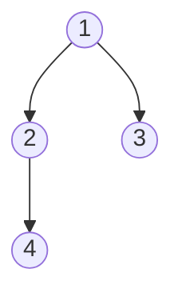

Almost every tree problem is solved by one move: **recurse on the children, then combine their
answers at the current node.** Once you internalize that "**solve for `left`, solve for `right`,
merge here**" template, height, diameter, lowest common ancestor, and path sum all fall out of
it. This page is the pattern catalogue.

## The core recursion template

```java
Result solve(Node node) {
    if (node == null) return BASE_CASE;   // empty subtree
    Result l = solve(node.left);          // trust the recursion
    Result r = solve(node.right);         // trust it again
    return combine(l, r, node);           // do the local work here
}
```

The whole art is choosing (1) the **base case** for `null` and (2) the **combine** step. Change
just those two and the same skeleton computes almost anything about a tree.

## Watch it: max depth via recursion

**Max depth** = `1 + max(depth(left), depth(right))`, with empty subtrees contributing `0`.
Watch the **call stack** grow as we dive to the deepest leaf, then shrink as each frame returns
its answer up to its parent. Tree used:



```walkthrough
title: maxDepth — the call stack in action
code: |
  int maxDepth(Node node) {
    if (node == null) return 0;
    int l = maxDepth(node.left);
    int r = maxDepth(node.right);
    return 1 + Math.max(l, r);
  }
steps:
  - text: 'Call `maxDepth(1)`. Push frame **1** onto the stack, then recurse into its left child.'
    array: ['1']
    highlight: [0]
    pointers: { 0: 'active' }
    line: 3
  - text: 'Recurse into **2**. Push it. The stack now holds the path `1 → 2` from the root.'
    array: ['1', '2']
    highlight: [1]
    pointers: { 1: 'active' }
    line: 3
  - text: 'Recurse into **4**. Push it — this is the deepest node on this branch.'
    array: ['1', '2', '4']
    highlight: [2]
    pointers: { 2: 'active' }
    line: 3
  - text: '**4** has no children: both recursive calls hit `null` and return `0`. So `4` returns `1 + max(0,0) = 1`. **Pop 4.**'
    array: ['1', '2']
    sorted: [0, 1]
    pointers: { 1: 'returns to' }
    line: 5
  - text: 'Back in **2**: left returned `1`, right child is `null` → `0`. `2` returns `1 + max(1,0) = 2`. **Pop 2.**'
    array: ['1']
    sorted: [0]
    pointers: { 0: 'returns to' }
    line: 5
  - text: 'Back in the root **1**: recurse right into **3** (a leaf) → returns `1`. So left = `2`, right = `1`.'
    array: ['1', '3']
    highlight: [1]
    pointers: { 1: 'leaf → 1' }
    line: 4
  - text: 'Root **1** returns `1 + max(2, 1) = 3`. Stack empties — the tree''s max depth is **3** (path `1 → 2 → 4`).'
    array: ['1']
    sorted: [0]
    pointers: { 0: 'answer = 3' }
    line: 5
```

:::note
Notice the stack never held more than **3** frames — its depth equals the tree's height. That
is why recursive DFS costs **O(h)** space: the frames on the stack *are* the current root-to-node
path.
:::

## DFS or BFS? Choosing deliberately

| Question the problem asks | Prefer | Why |
|--|--|--|
| Something about a **root-to-leaf path** (height, path sum, diameter) | **DFS** | recursion naturally carries state down one path |
| **Shortest** path / **minimum depth** / nearest level | **BFS** | the first time you reach a target, it is via the fewest edges |
| **Level-by-level** output or "right side view" | **BFS** | the queue processes one full level per outer iteration |
| Whole-subtree aggregate (count, sum, validate) | **DFS** | combine children's results at each node |

:::gotcha
For **minimum depth**, DFS must still explore *every* branch to be sure, but BFS can **stop at
the first leaf it dequeues** — often far less work. Match the traversal to whether the answer is
about *depth of a path* (DFS) or *distance to the nearest something* (BFS).
:::

## The pattern catalogue

Each of these is the core template with a different **combine** step.

````tabs
tabs:
  - label: Height / Depth
    body: |
      Combine = `1 + max(left, right)`. Base case `0`.
      ```java
      int height(Node n) {
          if (n == null) return 0;
          return 1 + Math.max(height(n.left), height(n.right));
      }
      ```
  - label: Diameter
    body: |
      Longest path between *any* two nodes. At each node the path *through* it is
      `leftHeight + rightHeight`; track the max as a side effect of computing height.
      ```java
      int best = 0;
      int height(Node n) {
          if (n == null) return 0;
          int l = height(n.left), r = height(n.right);
          best = Math.max(best, l + r);   // path through n
          return 1 + Math.max(l, r);
      }
      ```
  - label: Path sum
    body: |
      Does a root-to-leaf path add up to `target`? Subtract as you descend.
      ```java
      boolean hasPathSum(Node n, int target) {
          if (n == null) return false;
          if (n.left == null && n.right == null)   // leaf
              return target == n.val;
          int rest = target - n.val;
          return hasPathSum(n.left, rest) || hasPathSum(n.right, rest);
      }
      ```
  - label: Lowest common ancestor
    body: |
      The deepest node with `p` on one side and `q` on the other. If a node *is* p or q, return it;
      the node where left and right both come back non-null is the LCA.
      ```java
      Node lca(Node n, Node p, Node q) {
          if (n == null || n == p || n == q) return n;
          Node l = lca(n.left,  p, q);
          Node r = lca(n.right, p, q);
          if (l != null && r != null) return n;   // split point
          return l != null ? l : r;
      }
      ```
````

:::senior
See the pattern: **diameter** is height with a side-effect, **path sum** is a downward
accumulator, **LCA** is "which side did each target come back on". Interviewers rarely want a
novel algorithm — they want to see you reach for the recurse-and-combine template and identify
the base case and combine step cleanly. Say that structure out loud.
:::

## Complexity

| Pattern | Time | Space |
|--|:--:|:--:|
| Height / depth | O(n) | O(h) stack |
| Diameter | O(n) | O(h) stack |
| Path sum (root-to-leaf) | O(n) | O(h) stack |
| Lowest common ancestor | O(n) | O(h) stack |
| Level-order / min-depth (BFS) | O(n) | O(w) queue |

## Check yourself

```quiz
title: Tree patterns check
questions:
  - q: 'The core recursive tree template does its real work in which step?'
    options:
      - 'The base case for null'
      - text: 'The combine step, after the left and right calls return'
        correct: true
      - 'Before recursing into the children'
    explain: 'You trust the recursion to solve the subtrees, then combine their results at the current node — that combine step is what varies between problems.'
  - q: 'You must find the **minimum depth** to any leaf. Which traversal can finish soonest?'
    options:
      - 'DFS'
      - text: 'BFS — stop at the first leaf dequeued'
        correct: true
      - 'In-order DFS'
    explain: 'BFS reaches nodes in increasing distance from the root, so the first leaf it pops is at the minimum depth — no need to explore deeper branches.'
  - q: 'For the diameter of a tree, the longest path *through* a given node equals:'
    options:
      - text: 'height(left) + height(right)'
        correct: true
      - 'max(height(left), height(right))'
      - '1 + height(left) + height(right)'
    explain: 'A path through the node goes down the left subtree and down the right subtree; its edge count is the sum of the two subtree heights.'
  - q: 'In the LCA algorithm, a node is the lowest common ancestor when:'
    options:
      - 'It equals p or q'
      - text: 'The recursive calls return non-null from **both** its left and right subtrees'
        correct: true
      - 'Its value is between p and q'
    explain: 'If one target is found on the left and the other on the right, the current node is exactly where they split — the lowest node containing both.'
```

:::key
Nearly every tree problem is **recurse on children, then combine at the node** — pick the base
case and combine step. Use **DFS** for path/subtree questions (O(h) stack) and **BFS** for
nearest-level / shortest questions (O(w) queue). Height, diameter, path sum, and LCA are all the
same template with a different merge.
:::
