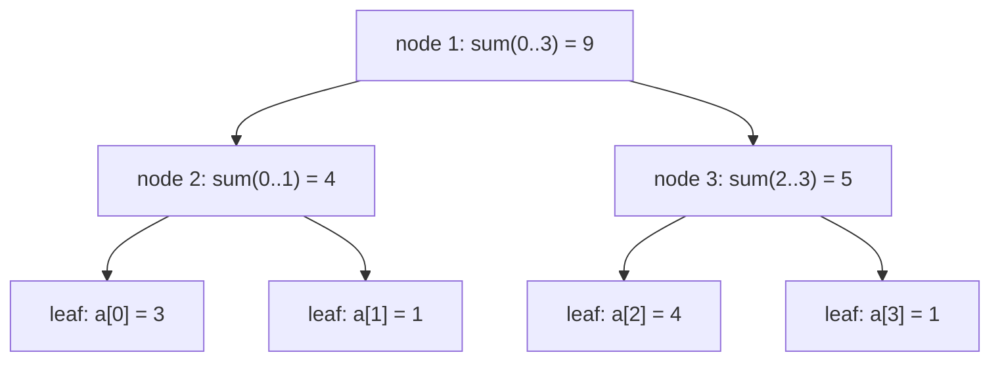

A plain **prefix-sum array** answers "sum of `a[l..r]`" in O(1) — but a single element update forces an O(n) rebuild. When queries **and** updates interleave, you need a structure that does *both* in **O(log n)**: the Fenwick tree or the segment tree.

## Why prefix sums aren't enough

| Structure | Range query | Point update | Range update |
|--|:--:|:--:|:--:|
| Prefix-sum array | O(1) | **O(n)** ❌ | O(n) |
| **Fenwick (BIT)** | O(log n) | O(log n) | O(log n)† |
| **Segment tree** | O(log n) | O(log n) | O(log n) with lazy |

†Fenwick handles range updates only with a second tree (the "range-update/range-query" trick). The segment tree is the general tool.

## Fenwick / Binary Indexed Tree

The BIT is a compact array where index `i` is responsible for a block of size `i & -i` (its lowest set bit — the same [bit trick](/dsa/topic/bit-manipulation/bitwise-basics) again). Walking by that low bit climbs the implicit tree in O(log n).

```java
int[] bit; int n;                         // 1-indexed

void update(int i, int delta) {           // a[i] += delta
    for (; i <= n; i += i & -i) bit[i] += delta;
}
int prefix(int i) {                       // sum of a[1..i]
    int s = 0;
    for (; i > 0; i -= i & -i) s += bit[i];
    return s;
}
int range(int l, int r) { return prefix(r) - prefix(l - 1); }
```

## Watch it: a Fenwick query climbs by lowbit

For `a = [3, 1, 4, 1, 5, 9]` the BIT stores block sums: `bit[6]` covers `a[5..6]`, `bit[4]`
covers `a[1..4]` (each block's size is the index's lowest set bit). Query `prefix(6)` and count
the reads.

```walkthrough
title: prefix(6) on the BIT of [3, 1, 4, 1, 5, 9]
code: |
  int prefix(int i) {          // sum of a[1..i]
    int s = 0;
    for (; i > 0; i -= i & -i)
      s += bit[i];             // add this block, strip the lowbit
    return s;
  }
steps:
  - text: 'The BIT array (slot 0 unused — Fenwick is 1-indexed). Each slot holds the sum of the block ending there: `bit[6] = a[5]+a[6] = 14`, `bit[4] = a[1..4] = 9`. Start the query with `i = 6`.'
    array: [0, 3, 4, 4, 9, 5, 14]
    pointers: { 6: 'i' }
    line: 2
  - text: 'i = 6 (binary 110, lowbit 2): add `bit[6] = 14` — that block covers a[5..6]. s = 14. Strip the lowbit: i = 6 − 2 = 4.'
    array: [0, 3, 4, 4, 9, 5, 14]
    highlight: [6]
    pointers: { 6: 'i' }
    line: 4
  - text: 'i = 4 (binary 100, lowbit 4): add `bit[4] = 9` — that block covers a[1..4]. s = 23. Strip: i = 4 − 4 = 0.'
    array: [0, 3, 4, 4, 9, 5, 14]
    sorted: [6]
    highlight: [4]
    pointers: { 4: 'i' }
    line: 4
  - text: 'i = 0 → loop ends. `prefix(6) = 23` in **two array reads** instead of six — one read per set bit of the index. That is the O(log n).'
    array: [0, 3, 4, 4, 9, 5, 14]
    sorted: [4, 6]
    line: 5
```

:::gotcha
Fenwick trees are **strictly 1-indexed**. Call `update(0, d)` and the loop `i += i & -i` adds
zero forever — an infinite loop, because `0 & -0 == 0`. Always shift external 0-based indices up
by one, and remember `range(l, r) = prefix(r) - prefix(l - 1)` requires `l ≥ 1`.
:::

:::tip
The Fenwick tree is the interviewer's favorite for *"count of smaller elements to the right"* / inversion counting: compress values to ranks, then sweep right-to-left doing `prefix(rank - 1)` before `update(rank, 1)`. It's less code and less memory than a segment tree when you only need **prefix** aggregates of an invertible operation (sum, xor).
:::

## Segment tree — any associative operation

The segment tree stores each node's aggregate over a contiguous range; a query splits into O(log n) node ranges. It works for **any associative merge** — sum, min, max, gcd — not just invertible ones. For `a = [3, 1, 4, 1]` with sum as the merge:



A query like `sum(1..3)` stitches together the fewest covering nodes — here `a[1]` plus
`node 3` — touching O(log n) nodes instead of every leaf. A point update walks one root-to-leaf
path and refreshes the aggregates on the way back up.

```java
int[] tree; int n;                        // size 4n

void build(int[] a, int node, int l, int r) {
    if (l == r) { tree[node] = a[l]; return; }
    int mid = (l + r) >>> 1;
    build(a, 2*node, l, mid);
    build(a, 2*node + 1, mid + 1, r);
    tree[node] = tree[2*node] + tree[2*node + 1];   // merge = sum (or min/max/gcd)
}

int query(int node, int l, int r, int ql, int qr) {
    if (qr < l || r < ql) return 0;                 // disjoint → identity
    if (ql <= l && r <= qr) return tree[node];      // fully inside
    int mid = (l + r) >>> 1;
    return query(2*node, l, mid, ql, qr)
         + query(2*node + 1, mid + 1, r, ql, qr);
}

void update(int node, int l, int r, int i, int val) {
    if (l == r) { tree[node] = val; return; }
    int mid = (l + r) >>> 1;
    if (i <= mid) update(2*node, l, mid, i, val);
    else          update(2*node + 1, mid + 1, r, i, val);
    tree[node] = tree[2*node] + tree[2*node + 1];
}
```

:::senior
Two upgrades separate "knows it" from "used it": **(1) lazy propagation** — to add a value to a whole range in O(log n), store a pending delta on each node and push it down only when you next descend, instead of touching every leaf. **(2) the identity element** — the `return 0` for a disjoint node must be the merge's identity: `0` for sum, `+∞` for min, `-∞` for max, `0` for gcd. Getting the identity wrong is the classic segment-tree bug.
:::

## Which to reach for

- **Fenwick** — you only need prefix aggregates of an *invertible* op (sum, xor) and want minimal code/memory.
- **Segment tree** — you need range min/max/gcd, or **range updates** (with lazy), or non-invertible merges.
- **Neither** — the array is static (no updates): a plain **prefix-sum** array is simpler and O(1).

## Check yourself

```quiz
title: Range-query structures check
questions:
  - q: 'Why can''t a prefix-sum array handle interleaved updates efficiently?'
    options:
      - text: 'A single element change invalidates every later prefix, forcing an O(n) rebuild'
        correct: true
      - 'It cannot represent negative numbers'
      - 'Prefix sums are always O(log n)'
    explain: 'Prefix[k] depends on all earlier elements, so updating one element requires fixing all prefixes after it — O(n). Fenwick/segment trees localize updates to O(log n) nodes.'
  - q: 'The Fenwick tree walks its implicit tree using which expression?'
    options:
      - text: '`i & -i` — the lowest set bit'
        correct: true
      - '`i / 2`'
      - '`i % n`'
    explain: 'Each index covers a block whose size is its lowest set bit; adding/subtracting `i & -i` moves between responsible nodes in O(log n) steps.'
  - q: 'A segment tree can compute range minimum but a plain Fenwick tree (sum-style) cannot, because:'
    options:
      - 'Minimum is not associative'
      - text: 'Minimum is not invertible — you cannot "subtract" a prefix min to get a range min'
        correct: true
      - 'Fenwick trees only store even indices'
    explain: 'Fenwick relies on prefix(r) − prefix(l−1), which needs an inverse. Min has no inverse, so range-min needs a segment tree (or a specialized BIT).'
```

:::key
When range **queries and updates interleave**, prefix sums (O(n) update) are out. Use a **Fenwick/BIT** — `i & -i` gives O(log n) prefix sums for invertible ops with minimal code. Use a **segment tree** for any associative merge (min/max/gcd) and, with **lazy propagation**, O(log n) range updates. The disjoint-node return value must be the merge's **identity**.
:::
