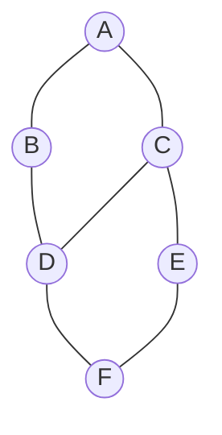
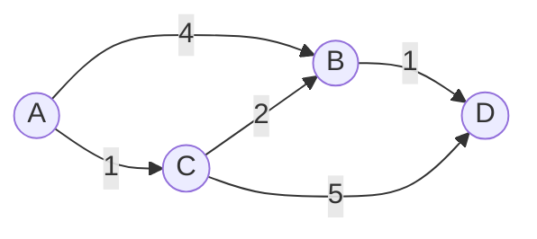

A **graph** is the most general data structure: a set of **vertices** (nodes) connected by
**edges** (links). Trees and linked lists are just graphs with extra rules. Maps, social
networks, course prerequisites, web pages, and dependency systems are all graphs.

## The vocabulary, drawn

Here is an **undirected** graph with 6 vertices. An edge `A — B` means you can travel both ways.



| Term | Meaning |
|--|--|
| **Vertex** (node) | A point in the graph — `A`, `B`, ... |
| **Edge** | A connection between two vertices |
| **Degree** | How many edges touch a vertex (`C` has degree 3) |
| **Path** | A sequence of edges from one vertex to another |
| **Cycle** | A path that returns to its start |
| **Connected** | Every vertex is reachable from every other |

## Directed vs undirected, weighted vs unweighted

In a **directed** graph (digraph) edges have a direction — `A → B` does **not** imply `B → A`.
Think one-way streets, Twitter follows, or task dependencies. A **weighted** graph attaches a
cost to each edge — distance, time, or price.



:::note
An **undirected** edge is just a pair of directed edges pointing both ways. That is why most
graph code stores neighbors and simply adds each edge twice for undirected graphs.
:::

## The two ways to store a graph

Everything comes down to answering *"who are `v`'s neighbors?"* fast. There are two classic layouts.

````tabs
tabs:
  - label: Adjacency list
    body: |
      Each vertex maps to a **list of its neighbors**. Compact for sparse graphs (few edges) —
      the standard choice for interviews.
      ```java
      // V vertices, edges added both ways for undirected
      List<List<Integer>> adj = new ArrayList<>();
      for (int i = 0; i < V; i++) adj.add(new ArrayList<>());

      void addEdge(int u, int v) {
        adj.get(u).add(v);
        adj.get(v).add(u); // omit this line for a directed graph
      }
      ```
  - label: Adjacency matrix
    body: |
      A `V x V` grid where `m[u][v] = 1` (or the weight) if an edge exists. Instant edge lookup,
      but always O(V^2) space even when the graph is sparse.
      ```java
      int[][] m = new int[V][V];

      void addEdge(int u, int v) {
        m[u][v] = 1;
        m[v][u] = 1; // omit for a directed graph
      }
      ```
````

## Which one? A cost comparison

Let `V` = number of vertices and `E` = number of edges.

| Operation | Adjacency list | Adjacency matrix |
|--|:--:|:--:|
| **Space** | O(V + E) | O(V^2) |
| **Add edge** | O(1) | O(1) |
| **Check edge `u–v`** | O(degree of u) | **O(1)** |
| **Iterate `u`'s neighbors** | **O(degree of u)** | O(V) |
| Best when | graph is **sparse** (E ≪ V^2) | graph is **dense**, or you query edges constantly |

:::key
Default to the **adjacency list**. Real graphs are sparse (`E` is far smaller than `V^2`), and
almost every algorithm — BFS, DFS, Dijkstra — spends its time *iterating a vertex's neighbors*,
which the list does in O(degree). Reach for a **matrix** only for dense graphs or when you need
O(1) "is there an edge?" checks.
:::

:::senior
For **weighted** graphs, the adjacency list stores `(neighbor, weight)` pairs instead of bare
neighbors, and the matrix stores the weight in place of `1` (using infinity or a sentinel for
"no edge"). Same layouts, one extra field.
:::

## Check yourself

```quiz
title: Representation check
questions:
  - q: 'For a **sparse** graph (few edges), which representation uses less memory?'
    options:
      - text: 'Adjacency list — O(V + E)'
        correct: true
      - 'Adjacency matrix — O(V^2)'
      - 'They use the same amount'
    explain: 'The list stores only edges that exist (O(V + E)); the matrix always reserves a full V x V grid regardless of how few edges there are.'
  - q: 'In a **directed** graph, an edge `A -> B` means:'
    options:
      - 'You can travel from A to B and from B to A'
      - text: 'You can travel from A to B, but not necessarily back'
        correct: true
      - 'A and B are the same vertex'
    explain: 'Direction matters. B -> A only exists if it was added separately.'
  - q: 'You need to answer "is there an edge between u and v?" millions of times on a dense graph. Best structure?'
    options:
      - 'Adjacency list'
      - text: 'Adjacency matrix — O(1) lookup'
        correct: true
      - 'A plain array of vertices'
    explain: 'The matrix answers edge existence in O(1); on a list you would scan u''s neighbor list, which is O(degree).'
```

```flashcards
title: Graph terms recall
cards:
  - front: 'Space of an adjacency **list**'
    back: '**O(V + E)** — one entry per vertex plus one per edge.'
  - front: 'Space of an adjacency **matrix**'
    back: '**O(V^2)** — a full grid, independent of edge count.'
  - front: 'Degree of a vertex'
    back: 'The number of edges touching it.'
  - front: 'Undirected edge, stored as an adjacency list'
    back: 'Added **twice** — u lists v, and v lists u.'
```
